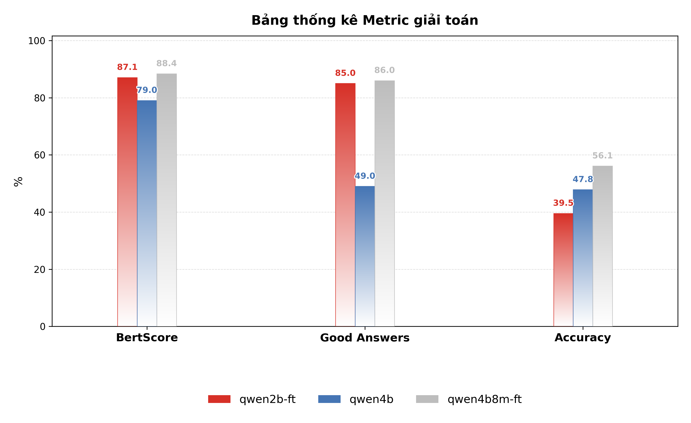
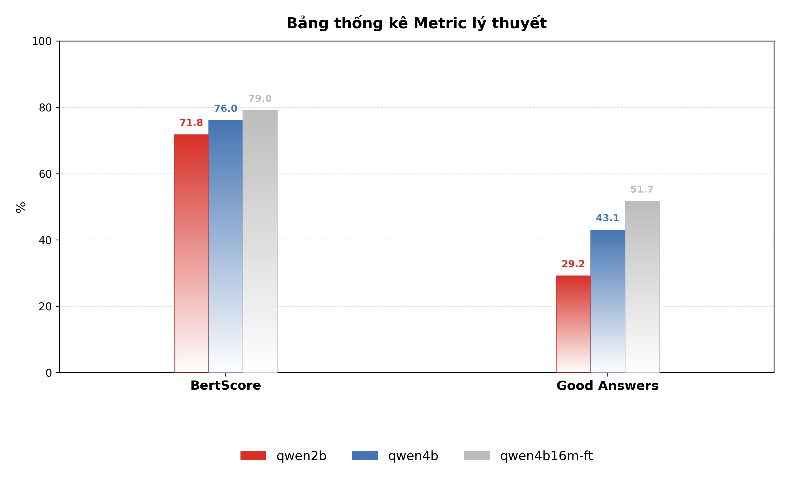

# RAG-Solve-Math


## Mô tả dự án
RAG-Solve-Math là hệ thống đánh giá và so sánh hiệu quả các mô hình AI trong việc giải toán tự động bằng phương pháp Retrieval-Augmented Generation (RAG). Dự án tập trung vào các bài toán đại số và giải tích, hỗ trợ cả đánh giá tự động và chấm tay, đồng thời cung cấp các công cụ trực quan hóa kết quả.

## Cấu trúc thư mục
- `app.py`: Ứng dụng chính, khởi tạo và điều phối các chức năng của hệ thống.
- `README.md`: Tài liệu hướng dẫn sử dụng và mô tả dự án.
- `Requirements.txt`: Danh sách các thư viện Python cần thiết.
- `chroma_db/`: Cơ sở dữ liệu vector dùng cho truy vấn ngữ nghĩa.
- `data/`: Dữ liệu đầu vào, bao gồm các file markdown, json, notebook xử lý dữ liệu, và các tập tin nguồn PDF.
    - `cleaned/`: Dữ liệu đã được làm sạch, phân chia thành train/test.
    - `extracted/`: Dữ liệu trích xuất từ nguồn PDF.
    - `source/`: File PDF gốc.
- `diagram/`: Sơ đồ workflow hệ thống (PlantUML).
- `evaluate/`: Các script, notebook và kết quả đánh giá mô hình.
    - `Answer/`: Kết quả đầu ra của các mô hình.
    - `Result/`: File tổng hợp kết quả đánh giá (CSV).
    - `Result_api/`: Kết quả đánh giá qua API.
    - `baitap_final.png`, `lythuyet_final.png`: Biểu đồ trực quan hóa kết quả đánh giá bài tập và lý thuyết.
- `model/`: Các module quản lý mô hình, truy xuất, và chức năng AI.
- `static/`, `templates/`: Tài nguyên giao diện web (HTML, CSS, JS).

## Hướng dẫn sử dụng

### 1. Cài đặt môi trường
```bash
pip install -r Requirements.txt
```

### 2. Chuẩn bị dữ liệu
- Đặt các file dữ liệu vào đúng thư mục như cấu trúc trên.
- Đảm bảo các file JSON, markdown, và PDF đã được xử lý phù hợp.

### 3. Chạy ứng dụng chính
```bash
python app.py
```

### 4. Đánh giá mô hình
- Sử dụng các notebook trong `evaluate/` để chấm điểm tự động và trực quan hóa kết quả.
- Kết quả được lưu tại `evaluate/Result/` và có thể so sánh giữa các mô hình.

### 5. Trực quan hóa
- Các notebook như `metric.ipynb` hỗ trợ vẽ biểu đồ, so sánh độ chính xác giữa các mô hình và chấm tay.
- Biểu đồ kết quả:

  
  

## Công nghệ sử dụng
- Python 3.x
- Pandas, Numpy, Matplotlib, Seaborn
- SentenceTransformers (SBERT)
- ChromaDB
- PlantUML
- Flask


