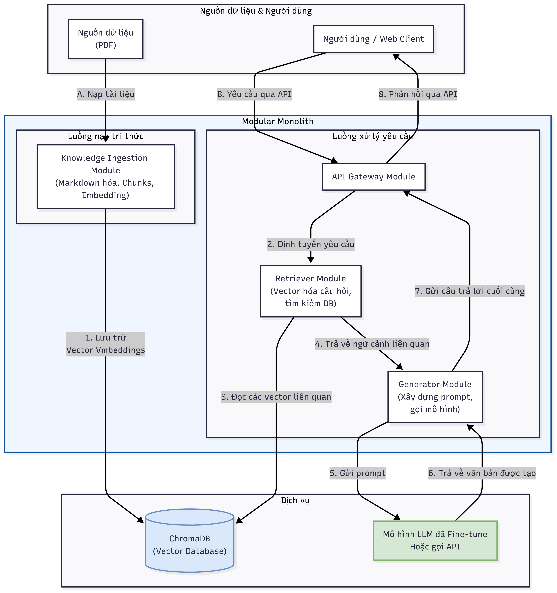

# RAG-Solve-Math


## Mô tả dự án
RAG-Solve-Math là hệ thống đánh giá và so sánh hiệu quả các mô hình AI trong việc giải toán tự động bằng phương pháp Retrieval-Augmented Generation (RAG). Dự án tập trung vào các bài toán đại số và giải tích 1

## Cấu trúc thư mục
- `app.py`: Ứng dụng chính, khởi tạo và điều phối các chức năng của hệ thống.
- `README.md`: Tài liệu hướng dẫn sử dụng và mô tả dự án.
- `Requirements.txt`: Danh sách các thư viện Python cần thiết.
- `chroma_db/`: Cơ sở dữ liệu vector dùng cho truy vấn ngữ nghĩa.
- `data/`: Dữ liệu đầu vào, bao gồm các file markdown, json, notebook xử lý dữ liệu, và các tập tin nguồn PDF.
    - `cleaned/`: Dữ liệu đã được làm sạch, phân chia thành train/test.
    - `extracted/`: Dữ liệu trích xuất từ nguồn PDF.
    - `source/`: File PDF gốc.
- `diagram/`: Sơ đồ workflow hệ thống (PlantUML).
- `evaluate/`: Các script, notebook và kết quả đánh giá mô hình.
    - `Answer/`: Kết quả đầu ra của các mô hình.
    - `Result/`: File tổng hợp kết quả đánh giá (CSV).
    - `Result_api/`: Kết quả đánh giá qua API.
    - `baitap_final.png`, `lythuyet_final.png`: Biểu đồ trực quan hóa kết quả đánh giá bài tập và lý thuyết.
- `model/`: Các module quản lý mô hình, truy xuất, và chức năng AI.
- `static/`, `templates/`: Tài nguyên giao diện web (HTML, CSS, JS).

## Kiến trúc hệ thống



## Hướng dẫn sử dụng

### 1. Cài đặt môi trường
```bash
pip install -r Requirements.txt
```

### 2. Chuẩn bị dữ liệu
- Đặt các file dữ liệu vào đúng thư mục như cấu trúc trên.
- Đảm bảo các file JSON, markdown, và PDF đã được xử lý phù hợp.

### 3. Chạy ứng dụng chính
```bash
python app.py
```

### 4. Đánh giá mô hình
- Sử dụng các notebook trong `evaluate/` để chấm điểm tự động và trực quan hóa kết quả.
- Kết quả được lưu tại `evaluate/Result/` và có thể so sánh giữa các mô hình.

### 5. Trực quan hóa
- Các notebook như `metric.ipynb` hỗ trợ vẽ biểu đồ, so sánh độ chính xác giữa các mô hình và chấm tay.
- Biểu đồ kết quả:

  
  

## Hướng dẫn sử dụng ngrok_kaggle.ipynb để chạy model Qwen4b và Qwen2b

Notebook `ngrok_kaggle.ipynb` giúp triển khai và truy cập các mô hình AI (Qwen4b, Qwen2b) trên môi trường Kaggle thông qua ngrok tunnel.

### Các bước thực hiện:

1. **Mở notebook ngrok_kaggle.ipynb trên Kaggle**
   - Upload notebook vào Kaggle hoặc mở trực tiếp nếu đã có sẵn.

2. **Cài đặt các thư viện cần thiết**
   - Chạy cell đầu tiên để cài đặt các package.

3. **Thiết lập ngrok**
   - Đăng ký tài khoản ngrok và lấy token tại https://dashboard.ngrok.com/get-started/your-authtoken
   - Dán token vào cell cấu hình ngrok trong notebook.
   - Chạy cell để khởi tạo tunnel, nhận đường dẫn truy cập từ xa.

4. **Chạy mô hình Qwen4b hoặc Qwen2b**
   - Cài đặt ADAPTER_PATH, chọn mô hình đã được finetune trong [drive](https://drive.google.com/drive/folders/1AgNbhbTnCqR7NM57nvkKvkSKJ0vQk3CP)
   - Chọn mô hình cần chạy (Qwen4b hoặc 2b) bằng cách chỉnh tên model
   - Chạy các cell liên quan để khởi động server phục vụ mô hình.

5. **Truy cập và kiểm tra**
   - Sử dụng đường link ngrok sinh ra để dán vào NGROK_URL trong file .env

## Công nghệ sử dụng
- Python 3.x
- Pandas, Numpy, Matplotlib, Seaborn
- SentenceTransformers (SBERT)
- ChromaDB
- PlantUML
- Flask


