# CHƯƠNG 1: HÀM SỐ MỘT BIẾN SỐ

## §1. SƠ LƯỢC VỀ CÁC YẾU TỐ LÔGIC; CÁC TẬP SỐ: $ \mathbb{N}, \mathbb{Z}, \mathbb{Q}, \mathbb{R} $

1. Phần lôgic không dạy trực tiếp (phần này Đại số đã dạy) mà chỉ nhắc lại những phép suy luận cơ bản thông qua bài giảng các nội dung khác nếu thấy cần thiết.

  
2. Giới thiệu các tập số; cần nói rõ tập $ \mathbb{Q} $ tuy đã rộng hơn $ \mathbb{Z} $ nhưng vẫn chưa lấp đầy trục số, còn tập $ \mathbb{R} $ đã lấp đầy trục số và chứa tất cả các giới hạn của các dãy số hội tụ; ta có chuỗi bao hàm 
$$ \mathbb{N} \subset \mathbb{Z} \subset \mathbb{Q} \subset \mathbb{R} $$

## §2. TRỊ TUYỆT ĐỐI VÀ TÍNH CHẤT

#### Định nghĩa: Với mọi $ x \in \mathbb{R} $, $ |x| = x $ nếu $ x \ge 0 $ và $ |x| = -x $ nếu $ x < 0 $.

#### Tính chất:
- $ |x| \ge 0 $, $ |x| = 0 \iff x = 0 $, $ |x + y| \le |x| + |y| $.

  
- $ |x - y| \ge ||x| - |y|| $, $ |x| \ge A \iff x \ge A $ hoặc $ x \le -A $ với $ A \ge 0 $.

  
- $ |x| \le B \Longleftrightarrow -B \le x \le B $ với $ B \ge 0 $.

## §3. HÀM SỐ

### 3.1 Định nghĩa hàm số

#### Định nghĩa 1.1
Một hàm số đi từ tập $ X $ vào tập $ Y $ là một quy tắc cho tương ứng mỗi phần tử $ x \in X $ với một và chỉ một phần tử $ y \in Y $.

Một hàm số có thể được cho dưới dạng biểu thức giải tích $ y = f(x) $, chẳng hạn như hàm số $ y = x^2 $. Khi đó, cần phải xác định rõ miền xác định (hay tập xác định) của hàm số, tức là tập hợp tất cả các phần tử $ x \in X $ sao cho biểu thức $ f(x) $ được xác định.

  
Tập giá trị của hàm số: là tập tất cả các phần tử $ y \in Y $ sao cho tồn tại $ x \in X $ với $ f(x) = y $.

### 3.2 Hàm số đơn điệu

• Một hàm số $f(x)$ được gọi là đơn điệu tăng trên khoảng $(a,b)$ nếu $ \forall x_1, x_2 \in (a,b),\ x_1 < x_2 \Rightarrow f(x_1) < f(x_2) $.

  
• Một hàm số $f(x)$ được gọi là đơn điệu giảm trên khoảng $(a,b)$ nếu $ \forall x_1, x_2 \in (a,b),\ x_1 < x_2 \Rightarrow f(x_1) > f(x_2) $.

  
#### Chú ý: 
Trong bài giảng này, ta chỉ xét tính đơn điệu của hàm số trên mỗi khoảng mà hàm số đó xác định. Chẳng hạn, hàm số $f(x) = \frac{1}{x}$ có $f'(x) = -\frac{1}{x^2} < 0$ với mọi $x \in \text{TXĐ} = \mathbb{R} \setminus \{0\}$, nhưng nếu nói $f(x)$ đơn điệu giảm trên $\mathbb{R} \setminus \{0\}$ thì mâu thuẫn với việc $-1 < 1$ nhưng $f(-1) = -1 < f(1) = 1$. Thay vào đó, ta nói $f(x)$ đơn điệu giảm trên mỗi khoảng $(-\infty,0)$ và $(0,+\infty)$.

### 3.3 Hàm số bị chặn

• Một hàm số $f(x)$ được gọi là bị chặn trên nếu tồn tại số $M \in \mathbb{R}$ sao cho $f(x) \le M$ với mọi $x \in \text{TXĐ}$.

  
• Một hàm số $f(x)$ được gọi là bị chặn dưới nếu tồn tại số $m \in \mathbb{R}$ sao cho $f(x) \ge m$ với mọi $x \in \text{TXĐ}$.

  
• Một hàm số $f(x)$ được gọi là bị chặn nếu nó vừa bị chặn trên, vừa bị chặn dưới.

### 3.4 Hàm số chẵn, hàm số lẻ

• Một hàm số $f(x)$ được gọi là chẵn nếu $x \in \text{TXĐ} \Rightarrow -x \in \text{TXĐ}$ và $f(-x) = f(x)$. Đồ thị của hàm số chẵn nhận trục tung làm trục đối xứng.

  
• Một hàm số $f(x)$ được gọi là lẻ nếu $x \in \text{TXĐ} \Rightarrow -x \in \text{TXĐ}$ và $f(-x) = -f(x)$. Đồ thị của hàm số lẻ nhận gốc tọa độ làm tâm đối xứng.

### 3.5 Hàm số tuần hoàn

#### Định nghĩa 1.2: Một hàm số $f(x)$ được gọi là tuần hoàn nếu tồn tại số thực $T > 0$ sao cho $f(x) = f(x + T)$ với mọi $x \in \text{TXĐ}$.

Ví dụ quen thuộc: các hàm lượng giác $y = \sin x$, $y = \cos x$, $y = \tan x$, $y = \cot x$ đều là các hàm số tuần hoàn. Trong phạm vi bài giảng này, ta chủ yếu quan tâm đến việc có tồn tại $T > 0$ sao cho $f(x + T) = f(x)$, còn việc tìm chu kì nhỏ nhất không phải là trọng tâm.

Các câu hỏi gợi mở:

- Tổng (hoặc hiệu) của hai hàm số tuần hoàn có tuần hoàn không?

  
- Tích của hai hàm số tuần hoàn có tuần hoàn không?

  
- Thương của hai hàm số tuần hoàn có tuần hoàn không?

  
- Đạo hàm của một hàm số tuần hoàn (nếu tồn tại) có tuần hoàn không?

  
- Nếu hàm số $F(x)$ có đạo hàm trên $\mathbb{R}$ và $F'(x)$ là một hàm số tuần hoàn thì $F(x)$ có tuần hoàn không? Nói cách khác, nếu $f(x)$ là một hàm số tuần hoàn thì $F(x) = \int_{0}^{x} f(t)\,dt$ có tuần hoàn không?

### 3.6 Hàm hợp

Cho hai hàm số $f, g$. Hàm hợp của $f$ và $g$, kí hiệu $f \circ g$, được định nghĩa bởi $ (f \circ g)(x) = f(g(x)) $.

### 3.7 Hàm ngược

#### Định nghĩa 1.3
Một hàm số $f: X \to Y$ được gọi là ánh xạ 1-1 (đơn ánh) nếu $x_1 \ne x_2 \Rightarrow f(x_1) \ne f(x_2)$.

  
#### Định nghĩa 1.4
Cho $f$ là một đơn ánh với miền xác định $A$ và miền giá trị $B$. Hàm ngược $f^{-1}$ có miền xác định $B$ và miền giá trị $A$, được định nghĩa bởi $ f^{-1}(y) = x \Leftrightarrow f(x) = y $.

- $ \text{TXĐ}(f) = \text{Tập giá trị}(f^{-1}) $

  
- $ \text{Tập giá trị}(f) = \text{TXĐ}(f^{-1}) $

  
#### Chú ý
Đồ thị của hàm ngược đối xứng với đồ thị của $y = f(x)$ qua đường thẳng $y = x$ (đường phân giác của góc phần tư thứ nhất).

Cách tìm hàm số ngược của $y = f(x)$:

- Viết $y = f(x)$.

  
- Giải phương trình này theo $x$ theo biến $y$, giả sử được $x = g(y)$.

  
- Đổi vai trò của $x$ và $y$ để được hàm số ngược $f^{-1}(x) = g(x)$.
  
#### Định lý 1.1
Nếu hàm số $f(x)$ đơn điệu tăng hoặc đơn điệu giảm trên khoảng $(a,b)$ thì tồn tại hàm số ngược $f^{-1}$ của $f$ trên khoảng đó.

### 3.8 Hàm số sơ cấp

Năm loại hàm số sơ cấp cơ bản:

#### Hàm lũy thừa 
$y = x^{\alpha}$, TXĐ phụ thuộc vào $\alpha$.

- Nếu $\alpha$ nguyên dương, ví dụ $y = x^2$, thì xác định với mọi $x \in \mathbb{R}$.

  
- Nếu $\alpha$ nguyên âm, ví dụ $y = x^{-2} = \frac{1}{x^2}$, thì xác định với mọi $x \in \mathbb{R} \setminus \{0\}$, và nói chung $y = x^{\alpha} = \frac{1}{x^{-\alpha}}$.

  
- Nếu $\alpha = \frac{1}{p}$ với $p$ nguyên dương chẵn, ví dụ $y = x^{1/2} = \sqrt{x}$, thì xác định trên $\mathbb{R}_{\ge 0}$.

  
- Nếu $\alpha = \frac{1}{v}$ với $v$ nguyên dương lẻ, ví dụ $y = x^{1/3} = \sqrt[3]{x}$, thì xác định trên $\mathbb{R}$.

  
- Nếu $\alpha$ vô tỉ thì quy ước chỉ xét với $x > 0$.

  
#### Hàm số mũ 
$y = a^x$ với $0 < a \ne 1$: TXĐ là $\mathbb{R}$, tập giá trị là $\mathbb{R}_{>0}$. Hàm đồng biến nếu $a > 1$, nghịch biến nếu $0 < a < 1$.

  
#### Hàm số logarit 
$y = \log_a x$ với $0 < a \ne 1$: TXĐ là $\mathbb{R}_{>0}$, tập giá trị là $\mathbb{R}$. Hàm đồng biến nếu $a > 1$, nghịch biến nếu $0 < a < 1$. Đây là hàm ngược của $y = a^x$, nên đồ thị đối xứng với đồ thị $y = a^x$ qua đường $y = x$. Kí hiệu: $\lg x$ là logarit cơ số 10, $\ln x$ là logarit cơ số $e$.

  
#### Hàm số lượng giác cơ bản
• Hàm số $y = \sin x$ xác định $\forall x \in \mathbb{R}$, là hàm số lẻ, tuần hoàn chu kì $2\pi$.

  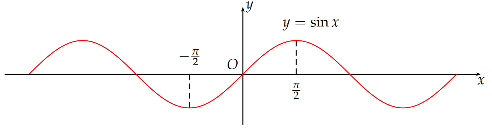

• Hàm số $y = \cos x$ xác định $\forall x \in \mathbb{R}$, là hàm số chẵn, tuần hoàn chu kì $2\pi$.

  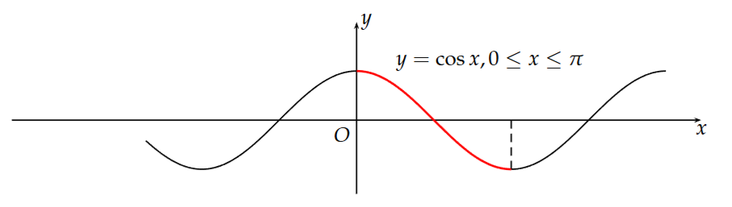

• Hàm số $y = \tan x$ xác định $\forall x \in \mathbb{R} \setminus \left\{\left(2k+1\right)\frac{\pi}{2} \mid k \in \mathbb{Z}\right\}$, là hàm số lẻ, tuần hoàn chu kì $\pi$.

  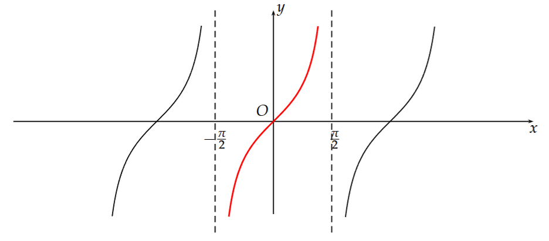

• Hàm số $y = \cot x$ xác định $\forall x \in \mathbb{R} \setminus \left\{k\pi \mid k \in \mathbb{Z}\right\}$, là hàm số lẻ, tuần hoàn chu kì $\pi$.

  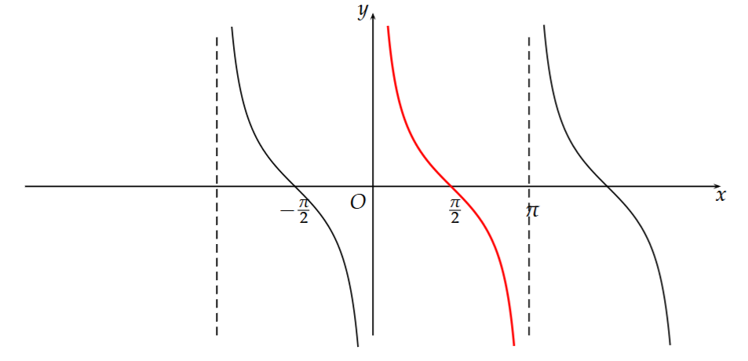

#### ví dụ (Ngụy biện toán học). 
Chứng minh rằng $0 = 2$.

Chứng minh. Ta có $ \cos^2 x = 1 - \sin^2 x \Rightarrow \cos x = \pm \sqrt{1 - \sin^2 x} \Rightarrow 1 + \cos x = 1 \pm \sqrt{1 - \sin^2 x} $. Thay $ x = \pi $ vào, vế trái bằng $0$, còn vế phải bằng $1 \pm 1$, không thể suy ra $0 = 2$.
  
#### Hàm số lượng giác ngược

Muốn tìm hàm ngược của một hàm số, điều kiện cần là hàm số đó phải đơn ánh. Tuy nhiên, các hàm lượng giác đều tuần hoàn nên không đơn ánh trên toàn bộ tập số thực.

Để khắc phục, ta hạn chế miền xác định của các hàm lượng giác về những khoảng mà chúng đơn ánh. Chẳng hạn, hàm $f(x)=\sin x$ là đơn ánh trên khoảng $-\pi/2 \le x \le \pi/2$.

  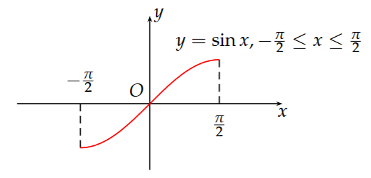

- Hàm số ngược của $y=\sin x$, kí hiệu $\arcsin x$, được xác định bởi:
$x \mapsto y=\arcsin x \Leftrightarrow x=\sin y$

Với qui ước chuẩn, $\arcsin: [-1,1] \to [-\pi/2,\pi/2]$. Hàm $y=\arcsin x$ xác định trên $[-1,1]$, nhận giá trị trong $[-\pi/2,\pi/2]$ và là hàm đơn điệu tăng.

  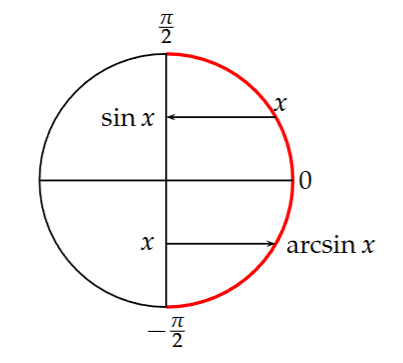

- Hàm số ngược của $y=\cos x$, kí hiệu $\arccos x$, được xác định bởi:
$x \mapsto y=\arccos x \Leftrightarrow x=\cos y$

Với qui ước chuẩn, $\arccos: [-1,1] \to [0,\pi]$. Hàm $y=\arccos x$ xác định trên $[-1,1]$, nhận giá trị trong $[0,\pi]$ và là hàm đơn điệu giảm.

  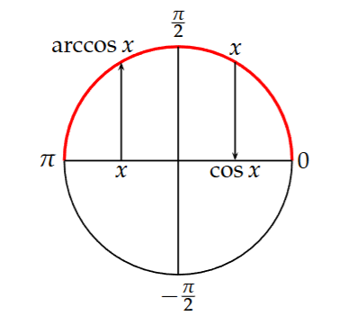

- Hàm số ngược của $y=\tan x$, kí hiệu $\arctan x$, được xác định bởi:
$x \mapsto y=\arctan x \Leftrightarrow x=\tan y$

Ta có $\arctan: (-\infty,+\infty) \to (-\pi/2,\pi/2)$. Hàm $y=\arctan x$ xác định trên toàn bộ $\mathbb R$, nhận giá trị trong $(-\pi/2,\pi/2)$ và là hàm đơn điệu tăng.

  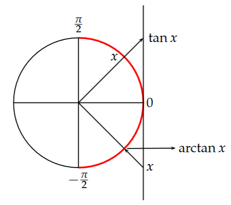

- Hàm số ngược của $y=\cot x$, kí hiệu $\operatorname{arccot} x$, được xác định bởi:
$x \mapsto y=\operatorname{arccot} x \Leftrightarrow x=\cot y$

Theo qui ước này, $\operatorname{arccot}: (-\infty,+\infty) \to (0,\pi)$. Hàm $y=\operatorname{arccot} x$ xác định trên toàn bộ $\mathbb R$, nhận giá trị trong $(0,\pi)$ và là hàm đơn điệu giảm.

  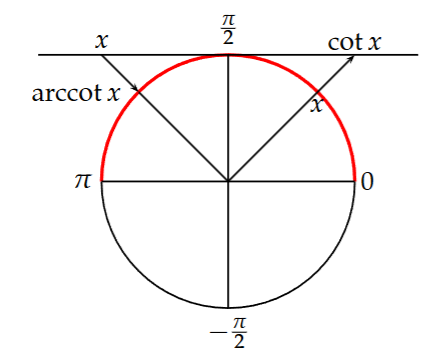

#### Hàm số sơ cấp

Người ta gọi hàm số sơ cấp là hàm số được tạo thành bởi một số hữu hạn các phép toán cộng, trừ, nhân, chia và phép hợp hàm từ các hàm số sơ cấp cơ bản. Các hàm số sơ cấp được chia thành hai loại:

- Hàm số đại số: là những hàm số mà khi tính giá trị của nó ta chỉ sử dụng một số hữu hạn phép cộng, trừ, nhân, chia và lũy thừa với số mũ hữu tỉ. Ví dụ: đa thức, phân thức hữu tỉ, ...

- Hàm số siêu việt: là những hàm số sơ cấp nhưng không phải là hàm số đại số, như $y=\ln x$, $y=\sin x$, ...

## §4. Dãy số

### 4.1 Dãy số và giới hạn của dãy số

#### Định nghĩa 1.5
Một dãy số là một hàm số $\,\mathbb{N} \to \mathbb{R},\; n \mapsto a_n\,$. Kí hiệu $\,\{a_n\}_{n \in \mathbb{N}}\,$.

Một dãy số được gọi là:

- đơn điệu tăng nếu $\,a_n < a_{n+1}\; \forall n\,$; đơn điệu giảm nếu $\,a_n > a_{n+1}\; \forall n\,$.

- bị chặn trên nếu tồn tại số $M$ sao cho $\,a_n \le M\; \forall n\,$; bị chặn dưới nếu tồn tại số $m$ sao cho $\,a_n \ge m\; \forall n\,$.

#### Định nghĩa 1.6
Một dãy số $\,\{a_n\}\,$ được gọi là có giới hạn là $L$ và viết $\,\lim_{n\to\infty} a_n = L\,$ (hay $\,a_n \to L\,$ khi $\,n \to \infty$) nếu:

- (trực giác) có thể làm cho các số hạng $a_n$ gần $L$ đến mức tùy ý bằng cách chọn $n$ đủ lớn.

- (chính xác) với mọi $\,\epsilon > 0\,$, tồn tại $\,N \in \mathbb{N}\,$ sao cho nếu $\,n > N\,$ thì $\,|a_n - L| < \epsilon\,$.

Hình dung rằng $\,\lim_{n\to+\infty} a_n = L\,$ nghĩa là với mọi $\,\epsilon > 0\,$ thì từ một chỉ số đủ lớn trở đi, toàn bộ các số hạng của dãy $\,\{a_n\}_{n > N}\,$ đều nằm trong khoảng $\,\big(L-\epsilon,\; L+\epsilon\big)\,$.

Một dãy số $\,\{a_n\}\,$ có $\,\lim_{n\to+\infty} a_n = L\,$ hữu hạn được gọi là hội tụ. Ngược lại, nó được gọi là phân kì (nghĩa là $\,\lim_{n\to+\infty} a_n = \pm\infty\,$ hoặc giới hạn không tồn tại).

#### Định nghĩa 1.7 (Giới hạn vô cùng)
Ta nói $\,\lim_{n\to+\infty} a_n = +\infty\,$ nếu với mọi $\,M > 0\,$, tồn tại $\,N \in \mathbb{N}\,$ sao cho nếu $\,n > N\,$ thì $\,a_n > M\,$.

Trường hợp $\,\lim_{n\to+\infty} a_n = -\infty\,$ được phát biểu tương tự: với mọi $\,M > 0\,$, tồn tại $\,N \in \mathbb{N}\,$ sao cho nếu $\,n > N\,$ thì $\,a_n < -M\,$.

#### Định lý 1.2 (Các tính chất của giới hạn của dãy số)
- Giới hạn của một dãy số, nếu tồn tại, là duy nhất.

- Mọi dãy số hội tụ đều bị chặn.

#### Định lý 1.3 (Các phép toán trên giới hạn)
Giả sử $\,\lim_{n\to+\infty} a_n = A,\; \lim_{n\to+\infty} b_n = B\,$, ở đó $\,A, B \in \mathbb{R}\,$ (hữu hạn). Khi đó:

- Tổng: $\,\lim_{n\to+\infty} (a_n + b_n) = A + B\,$.

- Hiệu: $\,\lim_{n\to+\infty} (a_n - b_n) = A - B\,$.

- Tích: $\,\lim_{n\to+\infty} (a_n\, b_n) = A B\,$.

- Thương: $\,\lim_{n\to+\infty} \dfrac{a_n}{b_n} = \dfrac{A}{B}\,$ nếu $\,B \ne 0\,$.

#### Chú ý
Các phép toán trên giới hạn sau không thực hiện được (dạng vô định): $\,\infty - \infty,\; 0 \times \infty,\; \dfrac{\infty}{\infty},\; \dfrac{0}{0}\,.$

### 4.2 Các tiêu chuẩn tồn tại giới hạn

#### Định lý 1.4 (Tiêu chuẩn kẹp)

Giả sử:

i) $a_n \le b_n \le c_n$ với mọi $n \in \mathbb{N}$, hoặc với mọi $n \ge K$ nào đó, với $K \in \mathbb{N}$.

ii) $\lim_{n\to+\infty} a_n = \lim_{n\to+\infty} c_n = L$.

Khi đó, $\lim_{n\to+\infty} b_n = L$.

#### Định lý 1.5 (Tiêu chuẩn đơn điệu bị chặn)

Mọi dãy số đơn điệu tăng và bị chặn trên (tương ứng, đơn điệu giảm và bị chặn dưới) đều hội tụ.

#### ví dụ

Xét $u_n = \left(1 + \frac{1}{n}\right)^n$. Chứng minh rằng $\{u_n\}$ là một dãy số tăng và bị chặn.

**bài làm**

- Tăng: Áp dụng AM-GM cho $n+1$ số dương $1,\; \underbrace{1+\tfrac{1}{n},\ldots,1+\tfrac{1}{n}}_{n\ \text{số}}$:
  
  $1 + \left(1+\frac{1}{n}\right) + \cdots + \left(1+\frac{1}{n}\right) \ge (n+1)\sqrt[n+1]{\left(1 \cdot \left(1+\frac{1}{n}\right)^n\right)}$.
  
  Vì vế trái bằng $n+2$, ta được $1 + \frac{1}{n+1} \ge \left(1+\frac{1}{n}\right)^{\frac{n}{n+1}}$. Nâng lũy thừa $(n+1)$ hai vế suy ra:
  
  $\left(1+\frac{1}{n+1}\right)^{n+1} \ge \left(1+\frac{1}{n}\right)^n$, tức $u_{n+1} \ge u_n$.

- Bị chặn trên: Khai triển nhị thức
  
  $u_n = \left(1+\frac{1}{n}\right)^n = \sum_{k=0}^n \binom{n}{k}\frac{1}{n^k} = 1 + 1 + \sum_{k=2}^n \binom{n}{k}\frac{1}{n^k}$.
  
  Với $k \ge 2$,
  
  $\binom{n}{k}\frac{1}{n^k} = \frac{n(n-1)\cdots(n-k+1)}{k!\,n^k} < \frac{1}{k!} \le \frac{1}{2^{\,k-1}}$.
  
  Do đó
  
  $u_n < 1 + 1 + \sum_{k=2}^{\infty} \frac{1}{2^{\,k-1}} = 2 + 1 = 3$.
  
  Vậy $\{u_n\}$ tăng và bị chặn trên bởi $3$ nên hội tụ.

#### Chú ý

Giới hạn $\lim_{n\to+\infty}\left(1+\frac{1}{n}\right)^n$ là một số vô tỉ, được kí hiệu là $e$. Nó có giá trị xấp xỉ $2.71$.

#### ví dụ

Xét sự hội tụ và tìm giới hạn (nếu có) của dãy số $\{x_n\}$ xác định bởi $x_1 > 0$, $x_{n+1} = \frac{1}{2}\left(x_n + \frac{1}{x_n}\right)$, $n \ge 1$.

**bài làm**

- Từ $x_1 > 0$ suy ra bằng quy nạp $x_n > 0$ với mọi $n$.

- Với $n \ge 2$, ta có $x_n = \frac{1}{2}\left(x_{n-1} + \frac{1}{x_{n-1}}\right) \ge 1$ (do AM-GM: $\frac{x + 1/x}{2} \ge 1$ với mọi $x>0$). Vì $x_n \ge 1$ nên
  
  $x_{n+1} = \frac{1}{2}\left(x_n + \frac{1}{x_n}\right) \le \frac{1}{2}(x_n + x_n) = x_n$.
  
  Do đó $\{x_n\}$ là dãy giảm và bị chặn dưới bởi $1$.

- Bởi định lý đơn điệu bị chặn, tồn tại $\lim_{n\to+\infty} x_n = a \ge 1$. Chuyển giới hạn trong hệ thức truy hồi:
  
  $a = \frac{1}{2}\left(a + \frac{1}{a}\right) \Rightarrow a^2 = 1$.
  
  Do $a>0$ nên $a=1$.

Kết luận: $\lim_{n\to+\infty} x_n = 1$.

#### Định nghĩa 1.8

Dãy số $\{a_n\}$ được gọi là dãy số Cauchy nếu với mọi $\epsilon > 0$, tồn tại $N \in \mathbb{N}$ sao cho $|a_n - a_m| < \epsilon$ với mọi $m,n > N$.

#### Định lý 1.6 (Tiêu chuẩn Cauchy)

Dãy số $\{a_n\}$ hội tụ khi và chỉ khi nó là dãy số Cauchy.

## §5. GIỚI HẠN HÀM SỐ
### 5.1 Định nghĩa
#### Định nghĩa 1.9
Giả sử hàm số $f(x)$ được xác định tại mọi điểm $x \in (a,b) \setminus {x_0}$. Ta nói giới hạn của hàm số $f(x)$ khi $x$ tiến đến $x_0$ bằng $L$ và viết
$\lim_{x \to x_0} f(x) = L$

- (Nói một cách nôm na) nếu ta có thể làm cho giá trị $f(x)$ gần $L$ tùy ý bằng cách chọn $x$ đủ gần $x_0$.

- (Nói một cách chính xác) nếu $\forall \epsilon > 0$, $\exists \delta > 0$ sao cho $$ \text{nếu } |x - x_0| < \delta \text{ thì } |f(x) - L| < \epsilon$$

Hình dung: $\lim_{x \to x_0} f(x) = L$ nghĩa là $\forall \epsilon > 0$, $\exists \delta > 0$ sao cho đồ thị hàm số trong $(x_0 - \delta, x_0 + \delta)$ nằm hoàn toàn trong dải $(L - \epsilon, L + \epsilon)$.

  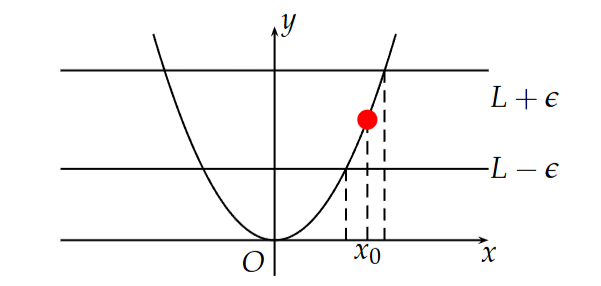

Các giới hạn một phía $\lim_{x \to x_0^+} f(x) = L$, $\lim_{x \to x_0^-} f(x) = L$ và $\lim_{x \to \infty} f(x) = L$ được định nghĩa tương tự.

#### Định lý 1.7 (Tính duy nhất của giới hạn)
Giới hạn $\lim_{x \to x_0} f(x)$, nếu tồn tại, là duy nhất.

### 5.2 Các phép toán trên giới hạn
#### Định lý 1.8 (Các phép toán trên giới hạn)
Giả sử $\lim_{x \to x_0} f(x) = a$, $\lim_{x \to x_0} g(x) = b$ với $a, b$ hữu hạn. Khi đó:

Tổng: $\lim_{x \to x_0} [f(x) + g(x)] = a + b$

Hiệu: $\lim_{x \to x_0} [f(x) - g(x)] = a - b$

Tích: $\lim_{x \to x_0} [f(x) \cdot g(x)] = a \cdot b$

Thương: $\lim_{x \to x_0} \frac{f(x)}{g(x)} = \frac{a}{b}$ (nếu $b \neq 0$)

#### Chú ý
Các phép toán sau không thực hiện được (dạng vô định):
$\infty - \infty$, $0 \cdot \infty$, $\frac{\infty}{\infty}$, $\frac{0}{0}$.

### 5.3 Giới hạn của hàm hợp
Nếu $\lim_{x \to x_0} u(x) = u_0$, $\lim_{u \to u_0} f(u) = f(u_0)$ và tồn tại hàm hợp $f(u(x))$ thì:
$\lim_{x \to x_0} f(u(x)) = f(u_0)$.

Áp dụng:
$\lim_{x \to x_0} A(x)^{B(x)} = e^{\lim_{x \to x_0} B(x) \ln A(x)}$.

### 5.4 Giới hạn vô cùng
#### Định nghĩa 1.10
Giả sử $f(x)$ xác định tại mọi $x \in (a,b) \setminus {x_0}$. Ta nói:
$\lim_{x \to x_0} f(x) = \infty$
nếu $\forall M > 0$, $\exists \delta > 0$ sao cho nếu $|x - x_0| < \delta$ thì $|f(x)| > M$.

Các giới hạn $\lim_{x \to x_0^+} f(x) = \infty$, $\lim_{x \to x_0^-} f(x) = \infty$ và $\lim_{x \to \infty} f(x) = \infty$ định nghĩa tương tự.

### 5.5 Các tiêu chuẩn tồn tại giới hạn
#### Định lý 1.9
Nếu $f(x) \leq g(x)$ trong lân cận của $a$, và tồn tại $\lim_{x \to a} f(x)$, $\lim_{x \to a} g(x)$, thì:
$\lim_{x \to a} f(x) \leq \lim_{x \to a} g(x)$.

#### Hệ quả 1.1 (Tiêu chuẩn kẹp)
Nếu $f(x) \leq g(x) \leq h(x)$ trong lân cận của $a$, và $\lim_{x \to a} f(x) = \lim_{x \to a} h(x) = L$. Khi đó:
$\lim_{x \to a} g(x) = L$.

### 5.6 Mối liên hệ giữa giới hạn dãy số và giới hạn hàm số
Nhiều bài toán giới hạn dãy số có thể chuyển về giới hạn hàm số và sử dụng các công cụ tính giới hạn hàm số để giải quyết dễ dàng. Mối liên hệ này được thể hiện qua định lý sau:

#### Định lý 1.10
$\lim_{x\to x_0} f(x) = L$ khi và chỉ khi với mọi dãy số ${x_n}$ thỏa mãn:

$\lim_{n\to+\infty} x_n = x_0$

$x_n \neq x_0$ (với mọi $n$ đủ lớn)
thì $\lim_{n\to+\infty} f(x_n) = L$.

(Trong định lý này, $x_0$ và $L$ có thể là số thực hoặc $\pm\infty$)

Ứng dụng:
Để tính $\lim_{n \to +\infty} \frac{\ln n}{n}$, ta chuyển về giới hạn hàm số:
$\lim_{x \to +\infty} \frac{\ln x}{x} = 0$
Suy ra $\lim_{n \to +\infty} \frac{\ln n}{n} = 0$.

## §6. VÔ CÙNG LỚN, VÔ CÙNG BÉ

### 6.1 Vô cùng bé (VCB)

#### Định nghĩa 1.11  
Hàm số $f(x)$ được gọi là **vô cùng bé (VCB)** khi $x \to a$ nếu:  
$\lim_{x \to a} f(x) = 0$.

#### Mối liên hệ giữa giới hạn và VCB:  
$\lim_{x \to a} f(x) = \ell \iff f(x) = \ell + \alpha(x)$,  
trong đó $\alpha(x)$ là VCB khi $x \to a$.

#### Tính chất VCB:  
1. Tổng hai VCB là một VCB.  
2. Tích của VCB với hàm bị chặn là VCB.  
3. Tích các VCB là VCB.  

#### Chú ý 
Thương hai VCB là dạng vô định $\frac{0}{0}$.

#### Định nghĩa 1.12 (So sánh VCB)  
Giả sử $\alpha(x)$, $\beta(x)$ là VCB khi $x \to a$:  
- **Cùng bậc** nếu $\lim_{x \to a} \frac{\alpha(x)}{\beta(x)} = A \neq 0$.  
- **Tương đương** ($\alpha(x) \sim \beta(x)$) nếu $\lim_{x \to a} \frac{\alpha(x)}{\beta(x)} = 1$.  

**Các VCB tương đương thường dùng khi $x \to 0$**:  
- $x \sim \sin x \sim \tan x \sim \arcsin x \sim \arctan x \sim e^x - 1 \sim \ln(1 + x)$  
- $(1+x)^a - 1 \sim ax$ (đặc biệt $\sqrt[m]{1+\alpha x} - 1 \sim \frac{\alpha x}{m}$)  
- $1 - \cos x \sim \frac{x^2}{2}$  

#### Định nghĩa 1.13 (VCB bậc cao)  
$\alpha(x)$ là VCB bậc cao hơn $\beta(x)$ nếu $\lim_{x \to a} \frac{\alpha(x)}{\beta(x)} = 0$, kí hiệu $\alpha(x) = o(\beta(x))$.  

#### Định lý 1.11  
a) Hiệu hai VCB tương đương là VCB bậc cao hơn mỗi VCB ban đầu:  
$\alpha \sim \beta \implies \alpha - \beta = o(\alpha)$  
b) Tích hai VCB là VCB bậc cao hơn mỗi VCB:  
$\alpha = o(1), \beta = o(1) \implies \alpha\beta = o(\alpha)$  

#### Định lý 1.12 (Thay tương đương)  
Nếu $\alpha_1 \sim \alpha_2$, $\beta_1 \sim \beta_2$ khi $x \to a$ thì:  
$\lim_{x \to a} \frac{\alpha_1(x)}{\beta_1(x)} = \lim_{x \to a} \frac{\alpha_2(x)}{\beta_2(x)}$,  
$\lim_{x \to a} \alpha_1(x)\gamma(x) = \lim_{x \to a} \alpha_2(x)\gamma(x)$.  

#### Định lý 1.13 (Ngắt bỏ VCB bậc cao)  
Nếu $\alpha_1 = o(\alpha_2)$, $\beta_1 = o(\beta_2)$ khi $x \to a$ thì:  
$\alpha_1 + \alpha_2 \sim \alpha_2$ và  
$\lim_{x \to a} \frac{\alpha_1(x) + \alpha_2(x)}{\beta_1(x) + \beta_2(x)} = \lim_{x \to a} \frac{\alpha_2(x)}{\beta_2(x)}$.  

#### Chú ý 
Không được thay tương đương cho **hiệu** hai VCB tương đương.  
#### Ví dụ: Với $\alpha(x) = \sin x - \tan x + x^3$ khi $x \to 0$:  
- Sai: $\alpha(x) \sim x^3$  
- Đúng: $\alpha(x) \sim \frac{x^3}{2}$ (vì $\lim_{x \to 0} \frac{\sin x - \tan x + x^3}{x^3} = \frac{1}{2}$)  

### 6.2 Vô cùng lớn (VCL)

#### Định nghĩa 1.14  
Hàm số $f(x)$ được gọi là **vô cùng lớn (VCL)** khi $x \to a$ nếu:  
$\lim_{x \to a} |f(x)| = \infty$.  
**Nhận xét**: Nghịch đảo của VCB là VCL và ngược lại.

#### Định nghĩa 1.15 (So sánh VCL)  
Giả sử $\alpha(x)$, $\beta(x)$ là VCL khi $x \to a$:  
- **Cùng bậc** nếu $\lim_{x \to a} \frac{\alpha(x)}{\beta(x)} = A \neq 0$.  
- **Tương đương** ($\alpha(x) \sim \beta(x)$) nếu $\lim_{x \to a} \frac{\alpha(x)}{\beta(x)} = 1$.  

#### Định nghĩa 1.16 (VCL bậc cao)  
$\alpha(x)$ là VCL bậc cao hơn $\beta(x)$ nếu $\lim_{x \to a} \frac{\alpha(x)}{\beta(x)} = \infty$.  

#### Định lý 1.14 (Thay tương đương)  
Nếu $\alpha_1 \sim \alpha_2$, $\beta_1 \sim \beta_2$ là VCL khi $x \to a$ thì:  
$\lim_{x \to a} \frac{\alpha_1(x)}{\beta_1(x)} = \lim_{x \to a} \frac{\alpha_2(x)}{\beta_2(x)}$.  

#### Định lý 1.15 (Ngắt bỏ VCL bậc thấp)  
Nếu $\alpha_1$ là VCL bậc cao hơn $\alpha_2$, $\beta_1$ là VCL bậc cao hơn $\beta_2$ khi $x \to a$ thì:  
$\alpha_1 + \alpha_2 \sim \alpha_1$ và  
$\lim_{x \to a} \frac{\alpha_1(x) + \alpha_2(x)}{\beta_1(x) + \beta_2(x)} = \lim_{x \to a} \frac{\alpha_1(x)}{\beta_1(x)}$.  

#### Chú ý 
Một số dạng vô định (như $\lim_{x \to 0} \frac{x - \sin x}{x^3}$, $\lim_{x \to 0^+} x^{\sin x}$) cần dùng quy tắc L'Hospital hoặc khai triển Maclaurin.  

## §7. HÀM SỐ LIÊN TỤC

### 7.1 Định nghĩa

#### Định nghĩa 1.17  
Cho hàm số $f(x)$ xác định trong lân cận của $x_0$. Hàm số được gọi là:  
- i) **Liên tục phải** tại $x_0$ nếu $\lim_{x \to x_0^+} f(x) = f(x_0)$.  
- ii) **Liên tục trái** tại $x_0$ nếu $\lim_{x \to x_0^-} f(x) = f(x_0)$.  
- iii) **Liên tục** tại $x_0$ nếu $\lim_{x \to x_0} f(x) = f(x_0)$.  

*Cách phát biểu tương đương:*
$f$ liên tục tại $x_0$ nếu $\forall \varepsilon > 0$, $\exists \delta(\varepsilon, x_0) > 0$ sao cho $\forall x$ thỏa mãn $|x - x_0| < \delta$ thì $|f(x) - f(x_0)| < \varepsilon$.  

**Nhận xét**: $f(x)$ liên tục tại $x_0$ $\iff$ $f$ liên tục phải và liên tục trái tại $x_0$.

#### Ví dụ
Các hàm sơ cấp liên tục trên tập xác định của chúng.

#### Định nghĩa 1.18  
$f(x)$ **liên tục trên khoảng $(a, b)$** nếu liên tục tại mọi $x_0 \in (a, b)$.  
$f(x)$ **liên tục trên đoạn $[a, b]$** nếu:  
- Liên tục trên $(a, b)$,  
- Liên tục phải tại $a$,  
- Liên tục trái tại $b$.  

### 7.2 Phép toán trên hàm liên tục

#### Định lý 1.16  
Nếu $f(x)$, $g(x)$ liên tục tại $x_0$ thì:  
- $f(x) \pm g(x)$ liên tục tại $x_0$  
- $f(x) \cdot g(x)$ liên tục tại $x_0$  
- $\frac{f(x)}{g(x)}$ liên tục tại $x_0$ (nếu $g(x_0) \neq 0$)  

Điều tương tự cũng đúng đối với các hàm số liên tục trái (phải) tại ${x0}$.

### 7.3 Hàm ngược liên tục

#### Định lý 1.17  
Nếu $y = f(x)$ đồng biến (hoặc nghịch biến) và liên tục trên khoảng $X$ thì tồn tại hàm ngược $y = g(x)$ đồng biến (hoặc nghịch biến) và liên tục trên $f(X)$.  

#### Ví dụ: Các hàm lượng giác ngược liên tục trên tập xác định.

### 7.4 Hàm hợp liên tục

#### Định lý 1.18  
Nếu $f(x)$ liên tục tại $b$ và $\lim_{x \to a} g(x) = b$ thì:  
$\lim_{x \to a} f(g(x)) = f(b)$  
hay viết gọn:  
$\lim_{x \to a} f(g(x)) = f\left( \lim_{x \to a} g(x) \right)$.

**Hệ quả 1.2**  
Nếu $g(x)$ liên tục tại $a$ và $f(x)$ liên tục tại $g(a)$ thì hàm hợp $f \circ g$ liên tục tại $a$.

### 7.5 Định lý cơ bản về hàm liên tục

#### Định lý 1.19 (Bảo toàn dấu)  
Nếu $f(x)$ liên tục tại $x_0 \in (a,b)$ và $f(x_0) > 0$ (hoặc $< 0$) thì tồn tại lân cận $U(x_0)$ sao cho $f(x)$ cùng dấu với $f(x_0)$ trên $U(x_0)$.

#### Định lý 1.20 (Bị chặn)  
Nếu $f(x)$ liên tục trên đoạn $[a, b]$ thì $f$ bị chặn trên $[a, b]$.

#### Định lý 1.21 (Weierstrass - Đạt min, max)  
Nếu $f(x)$ liên tục trên đoạn $[a, b]$ thì $f$ đạt giá trị lớn nhất và nhỏ nhất trên $[a, b]$.

#### Định lý 1.22 (Cantor - Liên tục đều)  
Nếu $f(x)$ liên tục trên đoạn $[a, b]$ thì $f$ liên tục đều trên $[a, b]$.  
> **Lưu ý**: Định lý không đúng nếu thay đoạn $[a, b]$ bằng khoảng $(a, b)$.

#### Định lý 1.23 (Cauchy)  
Nếu $f(x)$ liên tục trên $[a, b]$ và $f(a) \cdot f(b) < 0$ thì tồn tại $\alpha \in (a, b)$ sao cho $f(\alpha) = 0$.

#### Ví dụ
Cho $f: [1,3] \to [1,3]$ liên tục. Chứng minh tồn tại $x_0 \in [1,3]$ sao cho $f(x_0) = x_0$.  
**Giải**: Xét $g(x) = f(x) - x$.  
- $g(1) = f(1) - 1 \geq 0$ (vì $f(1) \in [1,3]$)  
- $g(3) = f(3) - 3 \leq 0$ (vì $f(3) \in [1,3]$)  

Theo Định lý Cauchy, tồn tại $x_0 \in [1,3]$ sao cho $g(x_0) = 0 \iff f(x_0) = x_0$.

**Hệ quả 1.3**  
Nếu $f$ liên tục trên $[a,b]$, $A = f(a)$, $B = f(b)$ ($A \neq B$) thì $f$ nhận mọi giá trị nằm giữa $A$ và $B$.

**Hệ quả 1.4**  
Nếu $f$ liên tục trên $[a,b]$, $m = \min_{[a,b]} f(x)$, $M = \max_{[a,b]} f(x)$ thì $f([a,b]) = [m, M]$.

### 7.6 Điểm gián đoạn và phân loại

#### Định nghĩa 1.19  
Nếu hàm số không liên tục tại điểm x0thì ta nói nó gián đoạn tại x0

Hình ảnh hình học: đồ thị không liền nét tại điểm gián đoạn.

Theo định nghĩa, hàm số $f(x)$ liên tục tại $x_0$ nếu ba điều kiện sau được thỏa mãn:

- $f(x)$ xác định tại $x_0$,

- tồn tại $\lim_{x \to x_0} f(x)$,

- $\lim_{x \to x_0} f(x) = f(x_0)$.

Như vậy nếu $x_0$ là điểm gián đoạn của $f(x)$ thì

- hoặc $x_0 \notin \text{TXĐ}$,

- hoặc $x_0 \in \text{TXĐ và } \not\exists \lim_{x \to x_0} f(x)$,

- hoặc $x_0 \in \text{TXĐ}$ và $\exists \lim_{x \to x_0} f(x)$ nhưng $\lim_{x \to x_0}  f(x) \neq f(x_0)$, ở đây $x \to x_0$ theo nghĩa cả hai phía hay một phía.

Nếu $x_0 \notin \text{TXD}$ của $f(x)$ thì có thể có rất nhiều điểm gián đoạn, nên ta chỉ quan tâm đến những điểm gián đoạn thuộc tập xác định hay là những điểm đầu mút của khoảngn xác định.

#### Phân loại điểm gián đoạn

Giả sử $x_0$ là điểm gián đoạn của f(x).

1. Điểm gián đoạn loại 1:

Nếu $\exists \lim_{x \to x_0^+} f(x) = f(x_0^+)$ và $\lim_{x \to x_0^-} f(x) = f(x_0^-)$ thì $x_0$ được gọi là điểm gián đoạn loại 1 của hàm số f(x). Khi đó, có thể xảy ra hai trường hợp:

• Nếu $f(x_0^+) \neq f(x_0^-)$ thì giá trị $|f(x_0^+) - f(x_0^-)|$ gọi là bước nhảy của hàm số.

• Đặc biệt: nếu $f(x_0^+) = f(x_0^-)$ thì $x_0$ được gọi là điểm gián đoạn bỏ được của hàm số. Khi đó nếu hàm số chưa xác định tại $x_0$ thì ta có thể bổ sung thêm giá trị của hàm số tại $x_0$ để hàm số liên tục tại điểm $x_0$. Còn nếu hàm số xác định tại điểm $x_0$ thì ta có thể thay đổi giá trị của hàm số tại điểm này để hàm số liên tục tại $x_0$.

2. Điểm gián đoạn loại 2:

Nếu $x_0$ không là điểm gián đoạn loại 1 thì ta nói nó là điểm gián đoạn loại 2.

#### Chú ý

Với quan điểm xem điểm gián đoạn bỏ được là trường hợp đặc biệt của điểm gián đoạn loại 1, nếu $x_0$ là điểm đầu mút của khoảng hay đoạn xác định của f(x), mà có $\lim_{x \to x_0^+} f(x)$ hoặc $\lim_{x \to x_0^-} f(x)$ hữu hạn thì ta cũng xem $x_0$ là điểm gián đoạn bỏ được của hàm số.

## §8. ĐẠO HÀM VÀ VI PHÂN

### 8.1 Định nghĩa

#### Định nghĩa 1.20  
Giới hạn, nếu có, của tỉ số  

$$ \lim_{\Delta x \to 0} \frac{f(x_0 + \Delta x) - f(x_0)}{\Delta x} $$

được gọi là **đạo hàm** của hàm số $f(x)$ tại $x_0$ và được kí hiệu là $f'(x_0)$. Khi đó ta nói hàm số $f(x)$ có đạo hàm tại $x_0$.

Nếu quá trình $\Delta x \to 0$ trong định nghĩa trên được thay bằng:  
- $\Delta x \to 0^+$ thì giới hạn đó được gọi là **đạo hàm phải** tại $x_0$, kí hiệu $f'(x_0^+)$.  
- $\Delta x \to 0^-$ thì giới hạn đó được gọi là **đạo hàm trái** tại $x_0$, kí hiệu $f'(x_0^-)$.  

Hàm số có đạo hàm tại $x_0$ khi và chỉ khi nó có đạo hàm trái và đạo hàm phải tại $x_0$ và $f'(x_0^+) = f'(x_0^-)$.

#### Chú ý
- Nếu tồn tại $f'(x_0)$ thì $f(x)$ liên tục tại $x_0$.  
- Điều ngược lại không đúng. Ví dụ: $f(x) = |x|$ liên tục tại $0$ nhưng không có đạo hàm tại đó.

#### Ví dụ
Cho hàm số $f(x)$ khả vi tại $1$ và $\lim_{x \to 0} \frac{f(1 + 7x) - f(1 + 2x)}{x} = 2$. Tính $f'(1)$.

**Lời giải:**  
$\begin{aligned} 
\lim_{x \to 0} \frac{f(1+7x) - f(1+2x)}{x} &= \lim_{x \to 0} \left[ 7 \cdot \frac{f(1+7x) - f(1)}{7x} - 2 \cdot \frac{f(1+2x) - f(1)}{2x} \right] \\ 
&= 7f'(1) - 2f'(1) = 5f'(1) 
\end{aligned}$  
Theo giả thiết: $5f'(1) = 2 \Rightarrow f'(1) = \dfrac{2}{5}$.

#### Ví dụ
Cho $f(x) = \begin{cases} e^{-1/x} & \text{nếu } x > 0 \\ 0 & \text{nếu } x = 0 \end{cases}$. Tính $f'_+(0)$.

**Lời giải:**  
$f'_+(0) = \lim_{x \to 0^{+}} \frac{f(x) - f(0)}{x} = \lim_{x \to 0^{+}} \frac{e^{-1/x}}{x}$.  
Đặt $t = \frac{1}{x}$:  
$f'_+(0) = \lim_{t \to +\infty} \frac{t}{e^t} = \lim_{t \to +\infty} \frac{1}{e^t} = 0$ (dùng L'Hospital).

### 8.2 Các phép toán trên đạo hàm

#### Định lý 1.24  
Cho $u(x)$, $v(x)$ có đạo hàm tại $x_0$. Khi đó:  
i) $(u \pm v)'(x_0) = u'(x_0) \pm v'(x_0)$  
ii) $(uv)'(x_0) = u'(x_0)v(x_0) + u(x_0)v'(x_0)$  
iii) $\left( \dfrac{u}{v} \right)'(x_0) = \dfrac{u'(x_0)v(x_0) - u(x_0)v'(x_0)}{v^2(x_0)}$ (nếu $v(x_0) \neq 0$)

### 8.3 Đạo hàm của hàm hợp

#### Định lý 1.25  
Nếu $u$ có đạo hàm tại $x$ và $f$ có đạo hàm tại $u(x)$, thì hàm hợp $F = f \circ u$ có đạo hàm tại $x$ và:  
$F'(x) = f'(u(x)) \cdot u'(x)$

**Ý tưởng chứng minh:**  
Với $\Delta x$ đủ nhỏ:  
$u(x_0 + \Delta x) = u(x_0) + u'(x_0) \Delta x + o(\Delta x)$  
Gọi $\delta_u = u'(x_0) \Delta x + o(\Delta x)$. Khi đó:  
$\begin{aligned} 
f[u(x_0 + \Delta x)] - f[u(x_0)] &= f[u_0 + \delta_u] - f(u_0) \\ 
&= f'(u_0) \cdot \delta_u + o(\delta_u) 
\end{aligned}$  
Suy ra:  
$\lim_{\Delta x \to 0} \frac{F(x_0 + \Delta x) - F(x_0)}{\Delta x} = f'(u_0) \cdot u'(x_0)$

### 8.4 Đạo hàm của hàm ngược

#### Định lý 1.26  
Giả sử:  
i) $x = \varphi(y)$ có đạo hàm tại $y_0$ và $\varphi'(y_0) \neq 0$,  
ii) $x = \varphi(y)$ có hàm ngược $y = f(x)$ liên tục tại $x_0 = \varphi(y_0)$.  
Khi đó $f$ có đạo hàm tại $x_0$ và $f'(x_0) = \dfrac{1}{\varphi'(y_0)}$.

#### Định lý 1.27  
Giả sử:  
i) $x = \varphi(y)$ có đạo hàm tại $y_0$ và $\varphi'(y_0) \neq 0$,  
ii) $x = \varphi(y)$ đơn điệu trong lân cận $y_0$.  
Khi đó tồn tại hàm ngược $y = f(x)$ khả vi tại $x_0$ và $f'(x_0) = \dfrac{1}{\varphi'(y_0)}$.

**Ứng dụng:** Xây dựng công thức đạo hàm cho các hàm lượng giác ngược.

### 8.5 Đạo hàm của các hàm số sơ cấp cơ bản

1. $(x^\alpha)' = \alpha x^{\alpha-1}$  
2. $(a^x)' = a^x \ln a$  
3. $(\log_a x)' = \frac{1}{x \ln a}$  
4. $(\ln x)' = \frac{1}{x}$  
5. $(\sin x)' = \cos x$  
6. $(\cos x)' = -\sin x$  
7. $(\tan x)' = \frac{1}{\cos^2 x} = \sec^2 x$  
8. $(\cot x)' = -\frac{1}{\sin^2 x} = -\csc^2 x$  
9. $(\arcsin x)' = \frac{1}{\sqrt{1-x^2}}$  
10. $(\arccos x)' = -\frac{1}{\sqrt{1-x^2}}$  
11. $(\arctan x)' = \frac{1}{1+x^2}$  
12. $(\operatorname{arccot} x)' = -\frac{1}{1+x^2}$  

### 8.6 Vi phân của hàm số

#### Định nghĩa 1.21  
Cho hàm số $y = f(x)$ xác định trong lân cận $U_\epsilon(x_0)$. Nếu có:  
$$\Delta f = A \Delta x + o(\Delta x)$$
trong đó $A$ chỉ phụ thuộc $x_0$ và không phụ thuộc $\Delta x$, thì $f$ **khả vi** tại $x_0$ và **vi phân** của $f$ tại $x_0$ là:  
$$df = A \Delta x$$
  
#### Định lý 1.28 (Mối liên hệ với đạo hàm)
$f(x)$ có đạo hàm tại $x_0$ $\iff$ $f(x)$ khả vi tại $x_0$ và:  
$$df(x_0) = f'(x_0) \Delta x$$
Với biến độc lập $x$, quy ước $dx = \Delta x$, nên:  
$$dy = f'(x) dx$$

#### Chú ý 
Khái niệm "có đạo hàm" và khái niệm "có vi phân" (hay khả vi) là hai khái
niệm khác nhau. Tuy nhiên, vì tính tương đương giữa hai khái niệm này đối với hàm số
một biến số mà nhiều người hiểu nhầm rằng chúng là một. Trong chương 3 của học phần
Giải tích I này, chúng ta sẽ thấy hai khái niệm này là khác nhau đối với hàm số nhiều
biến số.
  
#### Tính bất biến của vi phân cấp 1

Cho $y = f(x)$ là một hàm số khả vi. Khi đó, ta đã biết nếu $x$ là biến số độc lập thì
$$df = f'(x) dx$$

**Định lý 1.29** Nếu $x$ không phải là một biến số độc lập mà $x = x(t)$ là một hàm số phụ thuộc vào biến số $t$ thì công thức
$$df = f'(x) dx$$
vẫn đúng.

#### Ý nghĩa hình học  

  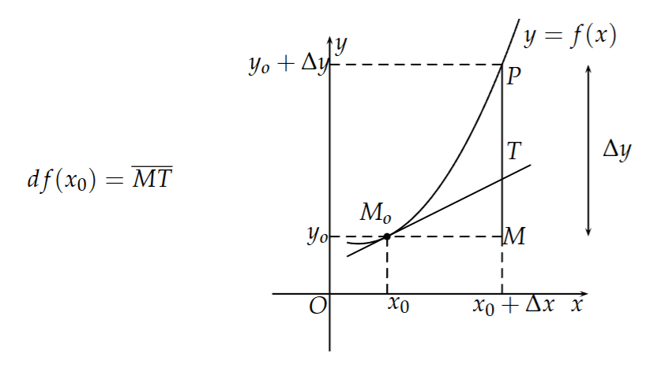

Khi x thay đổi từ $x_0$ đến $x_0$ + $\Delta$ x thì

i) $df(x_0) = \overline{MT}$ thể hiện sự thay đổi của đường thẳng tiếp tuyến

ii) $\Delta y = f(x_0 + \Delta x) - f(x_0)$ thể hiện sự thay đổi của đường cong $y = f(x)$.

#### Công thức vi phân  
- $d(u \pm v) = du \pm dv$  
- $d(uv) = u  dv + v  du$  
- $d\left(\dfrac{u}{v}\right) = \dfrac{v  du - u  dv}{v^2}$

#### Ví dụ
Tìm $f'(x)$ biết:  
$$\dfrac{d}{dx}[f(2016x)] = x^2$$

**Lời giải:**  
Đặt $u = 2016x$. Theo định lý hàm hợp:  
$$\frac{d}{dx}[f(u)] = f'(u) \cdot u' = f'(2016x) \cdot 2016 = x^2 \Rightarrow f'(2016x) = \frac{x^2}{2016}$$

Đặt $t = 2016x \Rightarrow x = \dfrac{t}{2016}$:  
$$

f'(t) = \frac{(t/2016)^2}{2016} = \frac{t^2}{2016^3} \Rightarrow f'(x) = \dfrac{x^2}{2016^3}$$  

#### Ứng dụng tính gần đúng  
$$f(x_0 + \Delta x) \approx f(x_0) + f'(x_0) \Delta x$$

#### Ví dụ 
Tính gần đúng:  
a) $\sqrt[3]{7.97}$
b) $\sqrt[3]{8.03}$

**Lời giải:**  
Xét $f(x) = \sqrt[3]{x}$, $f'(x) = \dfrac{1}{3} x^{-2/3}$.  
a) Chọn $x_0 = 8$, $\Delta x = -0.03$:  
$$f(7.97) \approx f(8) + f'(8) \cdot (-0.03) = 2 + \frac{1}{3} \cdot \frac{1}{4} \cdot (-0.03) = 2 - 0.0025 = 1.9975$$

b) Chọn $x_0 = 8$, $\Delta x = 0.03$:  
$$f(8.03) \approx 2 + \frac{1}{12} \cdot 0.03 = 2 + 0.0025 = 2.0025$$

### 8.7 Đạo hàm cấp cao

#### Định nghĩa 1.22  
- $f'(x)$: đạo hàm cấp 1.  
- $f''(x) = [f'(x)]'$: đạo hàm cấp 2.  
- $f^{(n)}(x) = \left[f^{(n-1)}(x)\right]'$: đạo hàm cấp $n$.

#### Định lý 1.30 (Các phép toán trên đạo hàm cao cấp)
Cho $u,v$ khả vi đến cấp $n$.  
i) $(u \pm v)^{(n)} = u^{(n)} \pm v^{(n)}$  
ii) **Công thức Leibniz**:  
$$(u \cdot v)^{(n)} = \sum_{k=0}^{n} C_n^k  u^{(n-k)}  v^{(k)}$$

#### Đạo hàm cấp cao của hàm cơ bản  
1. $(x^\alpha)^{(n)} = \alpha(\alpha-1)\cdots(\alpha-n+1) x^{\alpha-n}$  
2. $[(1+x)^\alpha]^{(n)} = \alpha(\alpha-1)\cdots(\alpha-n+1) (1+x)^{\alpha-n}$  
3. $\left( \dfrac{1}{1+x} \right)^{(n)} = (-1)^n \dfrac{n!}{(1+x)^{n+1}}$  
4. $\left( \dfrac{1}{1-x} \right)^{(n)} = \dfrac{n!}{(1-x)^{n+1}}$  
5. $(\sin x)^{(n)} = \sin \left( x + \dfrac{n\pi}{2} \right)$  
6. $(\cos x)^{(n)} = \cos \left( x + \dfrac{n\pi}{2} \right)$  
7. $(a^x)^{(n)} = a^x (\ln a)^n$  
8. $(\ln x)^{(n)} = (-1)^{n-1} \dfrac{(n-1)!}{x^n}$  

#### Ví dụ
Tính $y^{(10)}(0)$:  
a) $y = e^{x^2}$  
b) $y = \arctan x$  

**Lời giải:**  
a) $y' = 2x e^{x^2} = 2x y$. Đạo hàm cấp $n$:  
$$y^{(n+1)} = [2x y]^{(n)} = 2x y^{(n)} + 2n y^{(n-1)}$$
Tại $x=0$: $y^{(n+1)}(0) = 2n y^{(n-1)}(0)$.  
Truy hồi:  
$$y^{(10)}(0) = 2\cdot9\cdot y^{(8)}(0) = \cdots = 2^5 \cdot (9\cdot7\cdot5\cdot3\cdot1) \cdot 1 = 30240$$

b) $y' = \dfrac{1}{1+x^2}$. Đạo hàm cấp $n$:  
$$(1+x^2) y^{(n+1)} + 2n x y^{(n)} + n(n-1) y^{(n-1)} = 0$$
Tại $x=0$: $y^{(n+1)}(0) = -n(n-1) y^{(n-1)}(0)$.  
Tính $y''(0) = 0$ nên $y^{(10)}(0) = 0$  

#### Ví dụ
Tính $f^{(10)}(1)$ với $f(x) = x^9 \ln x$.  

**Lời giải:**  
Xét $g(x) = x^n \ln x$. Đạo hàm cấp $n+1$:  
$$g^{(n+1)}(x) = \dfrac{n!}{x}$$
Với $n=9$: $f^{(10)}(x) = \dfrac{9!}{x} \Rightarrow f^{(10)}(1) = 9! = 362880$  

### 8.8 Vi phân cấp cao

#### Định nghĩa 1.23  
- $df = f'(x) dx$: vi phân cấp 1.  
- $d^2 f = d(df)$: vi phân cấp 2.  
- $d^n f = d(d^{n-1} f)$: vi phân cấp $n$.

#### Biểu thức  
Nếu $x$ là biến độc lập:  
$$d^n f = f^{(n)}(x)  dx^n$$

#### Không bất biến  
Nếu $x = x(t)$, thì:  
$$d^2 f = f''(x) (dx)^2 + f'(x) d^2 x \neq f''(x) dx^2$$

#### Ví dụ
Cho $y = x^3$, $x = t^2$. Chứng minh $d^2 y \neq y^{(2)} dx^2$.  

**Lời giải:**  
- Tính trực tiếp: $y = t^6 \Rightarrow dy = 6t^5 dt \Rightarrow d^2 y = 30t^4 (dt)^2 + 6t^5 d^2 t$  
- Tính qua $x$: $y'' dx^2 = 6x (dx)^2 = 6t^2 (2t dt)^2 = 24t^4 (dt)^2$  
Rõ ràng $30t^4 (dt)^2 + 6t^5 d^2 t \neq 24t^4 (dt)^2$ nên $d^2 y \neq y^{(2)} dx^2$.

### 8.10 Đọc thêm: Về khái niệm vi phân

Vi phân có lẽ là một khái niệm trừu tượng và dễ gây hiểu nhầm nhất trong môn Giải tích I. Theo sự hiểu biết của tác giả thì có nhiều cách tiếp cận khác nhau đối với phép tính vi phân.

1) **Cách tiếp cận của Leibniz**:  
   Người đầu tiên đưa ra khái niệm vi phân có lẽ là Leibniz, khi ông coi $dy$ là một đại lượng vô cùng bé thể hiện sự thay đổi của hàm số $y = f(x)$ tương ứng với sự thay đổi vô cùng bé $dx$ của biến số $x$, nghĩa là ông định nghĩa:  
   $$f'(x) := \frac{dy}{dx}$$
   Kí hiệu $\frac{dy}{dx}$ này là kí hiệu của Leibniz cho đạo hàm của hàm số $f(x)$. Mặc dù có nhiều chỉ trích, nó vẫn được dùng đến ngày nay. Chú ý rằng kí hiệu $f'(x)$ là của d'Alambert.

2) **Cải tiến của Cauchy**:  
   Cauchy cải tiến ý tưởng của Leibniz như sau. Ông định nghĩa đạo hàm:  
   $$f'(x) := \lim_{\Delta x \to 0} \frac{f(x + \Delta x) - f(x)}{\Delta x}$$
   là giới hạn của tỉ số giữa số gia hàm số và số gia đối số. Sau đó, ông định nghĩa vi phân:  
   $$dy = f'(x)dx$$
   như một hàm số của hai biến $x$ và $dx$, trong đó $dx$ là một biến số mới có thể nhận giá trị tùy ý (không bắt buộc là vô cùng bé).

3) **Tiếp cận hiện đại**:  

#### Định nghĩa 1.24  
Cho hàm số $f(x)$ có đạo hàm tại $x_0$. Ánh xạ $d_{x_0}f$, kí hiệu:  
$$d_{x_0}f: \mathbb{R} \to \mathbb{R},$$
$$h \mapsto f'(x_0)h$$
được gọi là **vi phân của $f$ tại $x_0$**.  

i) Vi phân là một hàm số $df$ của hai biến $x_0$ và $h$:  
$d_{x_0}f(h) = f'(x_0)h$,  
trong đó $h$ là biến số mới nhận giá trị tùy ý.  

ii) Kí hiệu $\text{Id}$ là ánh xạ đồng nhất, ta có:  $d_{x_0}(\text{Id})(h) = h$ hay $d_{x_0}(\text{Id}) = \text{Id}$.  

iii) Lạm dụng kí hiệu: Đặt $x := \text{Id}$ (ánh xạ đồng nhất). Khi đó:  
$d_{x_0}x = \text{Id}$ (không phụ thuộc $x_0$) nên kí hiệu $dx$. Suy ra: $d_{x_0}f = f'(x_0)dx$.  Bỏ $x_0$ và thay $f'(x_0)$ bởi $f'(x)$, ta có biểu thức cô đọng:  
$$df = f'(x)dx$$

## §9. CÁC ĐỊNH LÝ VỀ HÀM KHẢ VI VÀ ỨNG DỤNG

### 9.1 Các định lý về hàm khả vi

#### Định nghĩa 1.25 (Cực trị của hàm số)

Cho hàm số $f(x)$ liên tục trên $(a,b)$. Ta nói hàm số đạt cực trị tại điểm $x_0\in (a,b)$ nếu tồn tại lân cận $U(x_0)\subset (a,b)$ sao cho $f(x)-f(x_0)$ không đổi dấu với mọi $x\in U(x_0)\setminus \{x_0\}$.

- Nếu $f(x)-f(x_0)>0$ thì ta nói hàm số đạt cực tiểu tại $x_0$.

- Nếu $f(x)-f(x_0)<0$ thì ta nói hàm số đạt cực đại tại $x_0$.

#### Định lý 1.31 (Định lý Fermat)

Cho $f(x)$ liên tục trên khoảng $(a,b)$. Nếu hàm số đạt cực trị tại điểm $x_0\in (a,b)$ và có đạo hàm tại $x_0$ thì $f'(x_0)=0$.

Chứng minh.

Nếu hàm số đạt cực đại tại $x_0$ thì theo định nghĩa tồn tại lân cận $U(x_0)$ sao cho $f(x)-f(x_0)<0$ với mọi $x\in U(x_0)$. Do đó, với $h$ đủ nhỏ sao cho $x_0+h\in U(x_0)$ ta có $f(x_0+h)-f(x_0)<0$.

- $f'_+(x_0)=\lim_{h\to 0^+}\frac{f(x_0+h)-f(x_0)}{h}\le 0$.

- $f'_-(x_0)=\lim_{h\to 0^-}\frac{f(x_0+h)-f(x_0)}{h}\ge 0$.

Do giả thiết tồn tại $f'(x_0)$ nên $f'_+(x_0)=f'_-(x_0)$, điều này chỉ xảy ra khi $f'_+(x_0)=f'_-(x_0)=0$. Trường hợp cực tiểu là tương tự.

#### Ví dụ
Cho $f$ là hàm khả vi trên $\mathbb{R}$ và thỏa $f'(2)<\lambda<f'(3)$. Chứng minh tồn tại $x_0\in (2,3)$ sao cho $f'(x_0)=\lambda$.

**[Lời giải]**

Xét $g(x)=f(x)-\lambda x$.

i) $g'(2)=f'(2)-\lambda<0$, do đó tồn tại $x_1\in (2,3)$ sao cho $g(x_1)<g(2)$. Nếu không thì $g'_+(2)=\lim_{x\to 2^+}\frac{g(x)-g(2)}{x-2}\ge 0$.

ii) $g'(3)=f'(3)-\lambda>0$, do đó tồn tại $x_2\in (2,3)$ sao cho $g(x_2)<g(3)$. Nếu không thì $g'_-(3)=\lim_{x\to 3^-}\frac{g(x)-g(3)}{x-3}\le 0$.

iii) Vậy $g(x)$ đạt cực tiểu tại một điểm $x_0\in (2,3)$, suy ra $g'(x_0)=0\Rightarrow f'(x_0)=\lambda$.

#### Định lý 1.32 (Định lý Rolle)

Nếu hàm số $f(x)$:

i) Liên tục trên $[a,b]$,

ii) Có đạo hàm trên $(a,b)$,

iii) Thỏa $f(a)=f(b)$,

thì tồn tại ít nhất một điểm $c\in (a,b)$ sao cho $f'(c)=0$.

Chứng minh.

Do $f$ liên tục trên $[a,b]$ nên đạt GTLN và GTNN trên $[a,b]$.

- Nếu $f$ là hằng trên $[a,b]$ thì $f'(x)=0$ với mọi $x\in (a,b)$.

- Nếu tồn tại $x\in (a,b)$ sao cho $f(x)>f(a)=f(b)$ thì GTLN đạt tại một $c\in (a,b)$, theo Định lý Fermat suy ra $f'(c)=0$.

- Nếu tồn tại $x\in (a,b)$ sao cho $f(x)<f(a)=f(b)$ thì GTNN đạt tại một $c\in (a,b)$, theo Định lý Fermat suy ra $f'(c)=0$.

#### Ví dụ 
Cho $f(x)=(x-1)(x^2-2)(x^2-3)$. Phương trình $f'(x)=0$ có bao nhiêu nghiệm thực? Giải thích.

**[Lời giải]**

Phương trình $f(x)=0$ có 5 nghiệm $x=-\sqrt 3,\,-\sqrt 2,\,1,\,\sqrt 2,\,\sqrt 3$.

i) Vì $f(-\sqrt 3)=f(-\sqrt 2)=0$ nên theo Rolle tồn tại $x_1\in (-\sqrt 3,-\sqrt 2)$ sao cho $f'(x_1)=0$.

ii) Vì $f(-\sqrt 2)=f(1)=0$ nên tồn tại $x_2\in (-\sqrt 2,1)$ sao cho $f'(x_2)=0$.

iii) Vì $f(1)=f(\sqrt 2)=0$ nên tồn tại $x_3\in (1,\sqrt 2)$ sao cho $f'(x_3)=0$.

iv) Vì $f(\sqrt 2)=f(\sqrt 3)=0$ nên tồn tại $x_4\in (\sqrt 2,\sqrt 3)$ sao cho $f'(x_4)=0$.

Vậy $f'(x)=0$ có ít nhất 4 nghiệm. Mặt khác $f'(x)$ là đa thức bậc 4 nên có nhiều nhất 4 nghiệm. Kết luận: có đúng 4 nghiệm phân biệt.

#### Ví dụ
Cho $a,b,c\in \mathbb{R}$ thỏa $a+b+c=0$. Chứng minh rằng:

a) Phương trình $3ax^2+4bx+5c=0$ có ít nhất một nghiệm thuộc $(1,+\infty)$.

b) Phương trình $2ax^2+3bx+4c=0$ có ít nhất một nghiệm thuộc $(1,+\infty)$.

**[Lời giải]**

a) Xét $f(x)=c x^5+b x^4+a x^3$ thỏa điều kiện Rolle trên $[0,1]$ vì $f(0)=0$ và $f(1)=a+b+c=0$. Do đó tồn tại $x_0\in (0,1)$ sao cho $f'(x_0)=5c x_0^4+4b x_0^3+3a x_0^2=0$. Suy ra $3a(1/x_0)^2+4b(1/x_0)+5c=0$. Vậy phương trình $3ax^2+4bx+5c=0$ có nghiệm $x=1/x_0\in (1,+\infty)$.

b) Xét $f(x)=c x^4+b x^3+a x^2$ thỏa điều kiện Rolle trên $[0,1]$ vì $f(0)=0$ và $f(1)=a+b+c=0$. Do đó tồn tại $x_0\in (0,1)$ sao cho $f'(x_0)=4c x_0^3+3b x_0^2+2a x_0=0$. Suy ra $2a(1/x_0)^2+3b(1/x_0)+4c=0$. Vậy phương trình $2ax^2+3bx+4c=0$ có nghiệm $x=1/x_0\in (1,+\infty)$.

#### Ví dụ 
Cho $f$ liên tục trên $[a,b]$ và thỏa $ \int_a^b f(x)\,dx=0$. Chứng minh rằng tồn tại $c\in (a,b)$ sao cho $2017\int_a^c f(x)\,dx=f(c)$.

**[Lời giải]**

Đặt $g(x)=\int_a^x f(t)\,dt$. Khi đó $g$ liên tục trên $[a,b]$, khả vi trên $(a,b)$ và $g(a)=g(b)=0$. Xét $h(x)=e^{-2017x}g(x)$, $h$ liên tục trên $[a,b]$, khả vi trên $(a,b)$ và $h(a)=h(b)=0$. Áp dụng Rolle cho $h$ trên $[a,b]$, tồn tại $c\in (a,b)$ sao cho $h'(c)=0$, tức $g'(c)e^{-2017c}-2017 e^{-2017c}g(c)=0$. Suy ra $g'(c)-2017 g(c)=0$, hay $f(c)=2017\int_a^c f(x)\,dx$.

#### Ví dụ
Giả sử $f:[0,1]\to \mathbb{R}$ khả vi và $ \int_0^1 f(x)\,dx=\int_0^1 x f(x)\,dx$. Chứng minh rằng tồn tại $c\in (0,1)$ sao cho $f(c)=2018\int_0^c f(x)\,dx$.

**Chứng minh**

i) Xét $F(x)=x\int_0^x f(t)\,dt-\int_0^x t f(t)\,dt$. Khi đó $F$ khả vi trên $[0,1]$ và $F(0)=F(1)=0$. Theo Rolle, tồn tại $x_0\in (0,1)$ sao cho $F'(x_0)=0$. Ta có $F'(x)=\int_0^x f(t)\,dt$, nên $\int_0^{x_0} f(t)\,dt=0$.

ii) Đặt $G(x)=e^{-2018x}\int_0^x f(t)\,dt$. Khi đó $G(0)=G(x_0)=0$. Áp dụng Rolle trên $[0,x_0]$ suy ra tồn tại $c\in (0,x_0)$ sao cho $G'(c)=0$, tức $f(c)-2018\int_0^c f(t)\,dt=0$. Vậy $f(c)=2018\int_0^c f(x)\,dx$.

#### Ví dụ
Giả sử $f:[0,1]\to \mathbb{R}$ khả vi và $ \int_0^1 f(x)\,dx=\int_0^1 x f(x)\,dx$. Chứng minh rằng tồn tại $c\in (0,1)$ sao cho $f(c)=2018 f'(c)\int_0^c f(x)\,dx$.

**Chứng minh**

i) Như trên, tồn tại $x_0\in (0,1)$ sao cho $\int_0^{x_0} f(t)\,dt=0$.

ii) Đặt $F(x)=\int_0^x f(t)\,dt$ và $H(x)=e^{-2018 f(x)}F(x)$. Khi đó $H(0)=H(x_0)=0$. Áp dụng Rolle trên $[0,x_0]$, tồn tại $c\in (0,x_0)$ sao cho $H'(c)=0$. Tính $H'(x)=e^{-2018 f(x)}\big(f(x)-2018 f'(x)F(x)\big)$, do đó $H'(c)=0\Rightarrow f(c)=2018 f'(c)\int_0^c f(t)\,dt$.

#### Định lý 1.33 (Định lý Lagrange)

Nếu hàm số $f(x)$:

i) Liên tục trên $[a,b]$,

ii) Có đạo hàm trên $(a,b)$,

thì tồn tại ít nhất một điểm $c\in (a,b)$ sao cho $f'(c)=\frac{f(b)-f(a)}{b-a}$.

Chứng minh.

Xét $h(x)=f(x)-f(a)-\frac{f(b)-f(a)}{b-a}(x-a)$. Khi đó $h$ thỏa các điều kiện của Rolle, nên tồn tại $c\in (a,b)$ sao cho $h'(c)=0$, tức $f'(c)=\frac{f(b)-f(a)}{b-a}$.

#### Ví dụ
Chứng minh các bất đẳng thức sau với $0<a<b$:

a) $\frac{a-b}{1+a^2}<\operatorname{arccot} b-\operatorname{arccot} a<\frac{a-b}{1+b^2}$.

b) $\frac{b-a}{1+b^2}<\operatorname{arctan} b-\operatorname{arctan} a<\frac{b-a}{1+a^2}$.

**[Lời giải]**

a) Áp dụng Lagrange cho $f(x)=\operatorname{arccot} x$ trên $[a,b]$ có $\frac{\operatorname{arccot} b-\operatorname{arccot} a}{b-a}=f'(c)=-\frac{1}{1+c^2}$ với $c\in (a,b)$. Do đó $-\frac{1}{1+a^2}<-\frac{1}{1+c^2}<-\frac{1}{1+b^2}$, suy ra bất đẳng thức đã nêu.

b) Tương tự với $f(x)=\operatorname{arctan} x$ vì $f'(x)=\frac{1}{1+x^2}$.

#### Ví dụ 
Cho $f:(0,+\infty)\to \mathbb{R}$ thỏa $f(x)\le 1$ và $f''(x)\ge 0$ với mọi $x>0$. Chứng minh $f'(x)\le 0$ với mọi $x>0$.

**[Lời giải]**

Giả sử phản chứng, tồn tại $x_0>0$ sao cho $f'(x_0)>0$.

i) Vì $f''(x)\ge 0$ nên $f'$ không giảm, do đó $f'(x)\ge f'(x_0)$ với mọi $x>x_0$.

ii) Áp dụng Lagrange cho $f$ trên $[x_0,x]$ có $f(x)=f(x_0)+f'(c)(x-x_0)\ge f(x_0)+f'(x_0)(x-x_0)$ với $c\in (x_0,x)$.

iii) Vì $f'(x_0)>0$ nên $\lim_{x\to +\infty}\big(f(x_0)+f'(x_0)(x-x_0)\big)=+\infty$, suy ra $\lim_{x\to +\infty} f(x)=+\infty$, mâu thuẫn với $f(x)\le 1$.

Suy ra $f'(x)\le 0$ với mọi $x>0$.

#### Định lý 1.34 (Định lý Cauchy)

Nếu các hàm số $f(x),g(x)$:

i) Liên tục trên $[a,b]$,

ii) Có đạo hàm trên $(a,b)$,

iii) $g'(x)$ không triệt tiêu trên $(a,b)$,

thì tồn tại ít nhất một điểm $c\in (a,b)$ sao cho $\frac{f(b)-f(a)}{g(b)-g(a)}=\frac{f'(c)}{g'(c)}$.

#### Chú ý

a) Định lý Rolle là trường hợp riêng của định lý Lagrange; định lý Lagrange là trường hợp riêng của định lý Cauchy. Các giả thiết trong các định lý này là cần thiết.

b) Dạng khác của định lý Lagrange (công thức số gia hữu hạn): $\Delta f=f'(x_0+\theta\,\Delta x)\,\Delta x$, với $\theta\in (0,1)$.

### 9.2 Các công thức khai triển Taylor, Maclaurin

#### Định lý 1.35 (Công thức Taylor)

Giả sử hàm số $f(x)$:

(i) Có đạo hàm đến cấp $n$ tại $x_0$,

(ii) Có đạo hàm đến cấp $n+1$ trong một lân cận $U_\varepsilon(x_0)$,

khi đó với mọi $x$ đủ gần $x_0$ ta có
$f(x)=f(x_0)+\frac{f'(x_0)}{1!}(x-x_0)+\dots+\frac{f^{(n)}(x_0)}{n!}(x-x_0)^n+\frac{f^{(n+1)}(c)}{(n+1)!}(x-x_0)^{n+1}$,

trong đó $c$ là một số nằm giữa $x$ và $x_0$.

Nếu $x_0=0$ thì ta có công thức Maclaurin:
$f(x)=f(0)+\frac{f'(0)}{1!}x+\dots+\frac{f^{(n)}(0)}{n!}x^n+\frac{f^{(n+1)}(c)}{(n+1)!}x^{n+1}$  (1.1)

hay
$f(x)=f(0)+\frac{f'(0)}{1!}x+\dots+\frac{f^{(n)}(0)}{n!}x^n+o(x^n)$  (1.2)

ở đó $o(x^n)$ là một vô cùng bé bậc cao hơn $x^n$.

#### Một số khai triển Maclaurin quan trọng

(1) $(1+x)^\alpha=1+\alpha x+\frac{\alpha(\alpha-1)}{2}x^2+\cdots+\frac{\alpha(\alpha-1)\cdots(\alpha-n+1)}{n!}x^n+o(x^n)$

(2) $\frac{1}{1+x}=1-x+x^2-\cdots+(-1)^n x^n+o(x^n)$

(3) $\frac{1}{1-x}=1+x+x^2+\cdots+x^n+o(x^n)$

(4) $e^x=1+x+\frac{x^2}{2!}+\cdots+\frac{x^n}{n!}+o(x^n)$

(5) $\sin x=x-\frac{x^3}{3!}+\frac{x^5}{5!}+\cdots+(-1)^n\frac{x^{2n+1}}{(2n+1)!}+o(x^{2n+1})$

(6) $\cos x=1-\frac{x^2}{2!}+\frac{x^4}{4!}+\cdots+(-1)^n\frac{x^{2n}}{(2n)!}+o(x^{2n})$

(7) $\ln(1+x)=x-\frac{x^2}{2}+\frac{x^3}{3}-\cdots+(-1)^{n-1}\frac{x^n}{n}+o(x^n)$

#### Các phép toán trên khai triển Maclaurin

Giả sử $f(x)=\sum_{n=0}^{+\infty} a_n x^n$ và $g(x)=\sum_{n=0}^{+\infty} b_n x^n$ là các chuỗi Maclaurin hình thức. Khi đó:

1) Phép cộng, trừ:
$f(x)\pm g(x)=\sum_{n=0}^{+\infty}(a_n\pm b_n)x^n$

2) Phép nhân (tích chập):
$f(x)g(x)=\sum_{n=0}^{+\infty} c_n x^n$, với $c_n=\sum_{i=0}^n a_i b_{n-i}$

3) Phép chia: thực hiện tương tự phép chia đa thức.

4) Phép lấy hàm hợp: nếu $g(x)=\sum_{n=1}^{+\infty} b_n x^n$ (với $b_0=0$) và $f(x)=\sum_{k=0}^{+\infty} a_k x^k$ thì
$(f\circ g)(x)=\sum_{n=0}^{+\infty} c_n x^n$, trong đó $c_0=a_0$ và
$c_n=\sum_{k=1}^n a_k \sum_{i_1+\cdots+i_k=n} b_{i_1}\cdots b_{i_k}$

#### Ví dụ 9.10

Tìm khai triển Maclaurin của $f(x)=e^x\sin x$.

**Lời giải**

Dùng phép nhân chuỗi:
$e^x=1+x+\frac{x^2}{2!}+\frac{x^3}{3!}+\cdots$, $\quad \sin x=x-\frac{x^3}{3!}+\frac{x^5}{5!}-\cdots$.

Nhân hai chuỗi và gom hệ số:
$e^x\sin x=x+x^2+\left(\frac{1}{2!}-\frac{1}{3!}\right)x^3+\left(\frac{1}{3!}-\frac{1}{4!}\right)x^4+\cdots$

Ngoài ra, có công thức tổng quát (chứng minh bằng quy nạp/đạo hàm):
$f^{(n)}(x)=(\sqrt{2})^n e^x \sin\!\left(x+\frac{n\pi}{4}\right)$, nên
$e^x\sin x=\sum_{n=0}^{+\infty}\frac{(\sqrt{2})^n\sin\!\left(\frac{n\pi}{4}\right)}{n!}\,x^n$.

#### Ví dụ 9.11

Cho $y=e^x\sin x$. Tính $y^{(6)}(0)$.

**Lời giải**

Dùng công thức tổng quát ở trên: $y^{(6)}(0)=(\sqrt{2})^6\sin\!\left(\frac{6\pi}{4}\right)=8\cdot(-1)=-8$.

Có thể kiểm tra bằng hệ số $x^6$ trong $e^x\sin x$, là $-\frac{1}{90}$, nên $\frac{y^{(6)}(0)}{6!}=-\frac{1}{90}\Rightarrow y^{(6)}(0)=-8$.

#### Định lý 1.36 (Công thức Faà di Bruno)

Với $n\in\mathbb{N}$:
$\frac{d^n}{dx^n}\,f(g(x))=\sum \frac{n!}{m_1!\cdots m_n!}\,f^{(m_1+\cdots+m_n)}(g(x))\prod_{j=1}^n\left(\frac{g^{(j)}(x)}{j!}\right)^{m_j}$,

trong đó tổng lấy trên mọi bộ $(m_1,\ldots,m_n)$ số nguyên không âm thỏa $\sum_{j=1}^n j\,m_j=n$.

#### Hệ quả 1.5 (Chuỗi của hàm hợp)

Nếu $f(x)=\sum_{k=0}^{+\infty} a_k x^k$, $g(x)=\sum_{n=0}^{+\infty} b_n x^n$ và $b_0=0$, thì chuỗi Maclaurin hình thức của $(f\circ g)(x)$ là $\sum_{n=0}^{+\infty} c_n x^n$, với
$c_0=a_0$ và $c_n=\sum_{k=1}^n a_k \sum_{i_1+\cdots+i_k=n} b_{i_1}\cdots b_{i_k}$.

5) Phép lấy đạo hàm

Nếu $f(x)=\sum_{n=0}^{+\infty} a_n x^n$ thì
$f'(x)=\sum_{n=1}^{+\infty} n a_n x^{n-1}=a_1+2a_2 x+3a_3 x^2+\cdots$

#### Ví dụ
đạo hàm chuỗi của $\sin x$ cho $\cos x$; đạo hàm chuỗi của $\ln(1+x)$ cho $\frac{1}{1+x}$.

6) Phép lấy tích phân

Nếu $f(x)=\sum_{n=0}^{+\infty} a_n x^n$ thì
$\int_0^x f(t)\,dt=\sum_{n=0}^{+\infty} a_n \frac{x^{n+1}}{n+1}=a_0 x+a_1\frac{x^2}{2}+a_2\frac{x^3}{3}+\cdots$

#### Ví dụ
từ $\frac{1}{1+x^2}=1-x^2+x^4-\cdots+(-1)^n x^{2n}+\cdots$ suy ra
$\arctan x=\int_0^x \frac{1}{1+t^2}\,dt=x-\frac{x^3}{3}+\frac{x^5}{5}-\cdots+(-1)^n\frac{x^{2n+1}}{2n+1}+\cdots$

#### Ứng dụng của khai triển Maclaurin

1) Tính gần đúng

#### Ví dụ 9.12

Tính gần đúng số $e$ với sai số nhỏ hơn $0{,}0001$.

Lời giải.

Với $x=1$, phần dư Lagrange của $e^x$ thỏa $R_n=\frac{e^c}{(n+1)!}$ với $c\in(0,1)$, nên $R_n<\frac{e}{(n+1)!}$. Cần $\frac{e}{(n+1)!}<10^{-4}\Rightarrow (n+1)!> \frac{e}{10^{-4}}\approx 27183$. Do $8!=40320>27183$, chọn $n=7$.

Vậy $e\approx 1+1+\frac{1}{2!}+\frac{1}{3!}+\frac{1}{4!}+\frac{1}{5!}+\frac{1}{6!}+\frac{1}{7!}$, sai số $<1\cdot 10^{-4}$.

2) Tính giới hạn

#### Ví dụ 9.13

Tính $\lim_{x\to 0}\frac{x-\sin x}{x^3}$.

Lời giải.

$\sin x=x-\frac{x^3}{3!}+o(x^3)\ \Rightarrow\ x-\sin x=\frac{x^3}{6}+o(x^3)$.

Do đó $\lim_{x\to 0}\frac{x-\sin x}{x^3}=\frac{1}{6}$.

#### Ví dụ 9.14 

a) $\lim_{x\to 0}\frac{e^x-\frac{1}{1-x}}{x^2}$.

b) $\lim_{x\to 0}\frac{e^x-\sin x-\cos x}{x^2}$.

**Lời giải**

a) $e^x=1+x+\frac{x^2}{2}+\frac{x^3}{6}+o(x^3)$, $\ \frac{1}{1-x}=1+x+x^2+x^3+o(x^3)$.

Suy ra $e^x-\frac{1}{1-x}=-\frac{x^2}{2}-\frac{5}{6}x^3+o(x^3)$, nên giới hạn bằng $-\frac{1}{2}$.

b) $\sin x+\cos x=1+x-\frac{x^2}{2}-\frac{x^3}{6}+\frac{x^4}{24}+o(x^4)$.

Suy ra $e^x-(\sin x+\cos x)=x^2+\frac{x^3}{3}+o(x^3)$, nên giới hạn bằng $1$.

#### Ví dụ 9.15

Tìm $a,b\in\mathbb{R}$ sao cho:

a) $\lim_{x\to 0}\frac{a x^2+b\ln(\cos x)}{x^4}=1$.

b) $\lim_{x\to 0}\frac{a x+b\sin(\sin x)}{x^3}=1$.

**Lời giải**

a) $\cos x=1-\frac{x^2}{2}+\frac{x^4}{24}+o(x^4)\Rightarrow \ln(\cos x)=-\frac{x^2}{2}-\frac{x^4}{12}+o(x^4)$.

Suy ra $\frac{a x^2+b\ln(\cos x)}{x^4}=\frac{(a-\frac{b}{2})x^2-\frac{b}{12}x^4+o(x^4)}{x^4}$.

Để giới hạn hữu hạn cần $a-\frac{b}{2}=0\Rightarrow a=\frac{b}{2}$. Khi đó giới hạn $=-\frac{b}{12}=1\Rightarrow b=-12$, $a=-6$.

b) $\sin x=x-\frac{x^3}{6}+o(x^3)\Rightarrow \sin(\sin x)=\sin\!\big(x-\frac{x^3}{6}+o(x^3)\big)=x-\frac{x^3}{3}+o(x^3)$.

Suy ra $\frac{a x+b\sin(\sin x)}{x^3}=\frac{(a+b)x-\frac{b}{3}x^3+o(x^3)}{x^3}$.

Cần $a+b=0\Rightarrow a=-b$, và $-\frac{b}{3}=1\Rightarrow b=-3$, do đó $a=3$.

3) Tính đạo hàm cấp cao $f^{(n)}(0)$

#### Ví dụ 9.16

Tính $y^{(10)}(0)$ với:

a) $y(x)=e^{x^2}$.

b) $y(x)=e^{-x^2}$.

c) $y(x)=\arctan x$.

d) $y(x)=\operatorname{arccot} x$.

**Lời giải**

a) $e^{x^2}=1+x^2+\frac{x^4}{2!}+\frac{x^6}{3!}+\frac{x^8}{4!}+\frac{x^{10}}{5!}+\cdots$, nên $\frac{y^{(10)}(0)}{10!}=\frac{1}{5!}\Rightarrow y^{(10)}(0)=\frac{10!}{5!}=30240$.

b) $e^{-x^2}=1-x^2+\frac{x^4}{2!}-\frac{x^6}{3!}+\frac{x^8}{4!}-\frac{x^{10}}{5!}+\cdots$, nên $\frac{y^{(10)}(0)}{10!}=-\frac{1}{5!}\Rightarrow y^{(10)}(0)=-30240$.

c) $\arctan x=x-\frac{x^3}{3}+\frac{x^5}{5}-\cdots$, chỉ có lũy thừa lẻ nên $y^{(10)}(0)=0$.

d) Chọn nhánh $\operatorname{arccot} x=\frac{\pi}{2}-\arctan x$. Khi đó khai triển quanh $0$: $\operatorname{arccot} x=\frac{\pi}{2}-\big(x-\frac{x^3}{3}+\frac{x^5}{5}-\cdots\big)$, chỉ có lũy thừa lẻ (bỏ hằng), nên $y^{(10)}(0)=0$.

#### Ví dụ 9.17

Tính $y^{(10)}(0)$ với:

a) $y(x)=\sin(x^2)$.

b) $y(x)=\cos(x^2)$.

**Lời giải**

a) $\sin(x^2)=\sum_{n=0}^{+\infty}(-1)^n\frac{x^{2(2n+1)}}{(2n+1)!}$, hệ số $x^{10}$ ứng với $2(2n+1)=10\Rightarrow n=2$, nên $\frac{y^{(10)}(0)}{10!}=\frac{1}{5!}\Rightarrow y^{(10)}(0)=30240$.

b) $\cos(x^2)=\sum_{n=0}^{+\infty}(-1)^n\frac{x^{4n}}{(2n)!}$, không có số hạng $x^{10}$ (vì $4n=10$ vô nghiệm nguyên), nên $y^{(10)}(0)=0$.

#### Ví dụ 9.18

Tính $y^{(9)}(0)$ với:

a) $f(x)=\ln(1-x+x^2)$.

b) $g(x)=\ln(1+x+x^2)$.

**Lời giải**

a) $(1-x+x^2)=\frac{1+x^3}{1+x}\Rightarrow \ln(1-x+x^2)=\ln(1+x^3)-\ln(1+x)$.

Hệ số $x^9$: từ $\ln(1+x^3)$ là $\frac{1}{3}$; từ $-\ln(1+x)$ là $-\frac{1}{9}$. Vậy hệ số $x^9$ là $\frac{2}{9}$, nên $\frac{f^{(9)}(0)}{9!}=\frac{2}{9}\Rightarrow f^{(9)}(0)=2\cdot 8!=80640$.

b) $(1+x+x^2)=\frac{1-x^3}{1-x}\Rightarrow \ln(1+x+x^2)=\ln(1-x^3)-\ln(1-x)$.

Hệ số $x^9$: từ $\ln(1-x^3)$ là $-\frac{1}{3}$; từ $-\ln(1-x)$ là $+\frac{1}{9}$. Vậy hệ số $x^9$ là $-\frac{2}{9}$, nên $g^{(9)}(0)=-2\cdot 8!=-80640$.

#### Ví dụ 9.19

a) Tìm khai triển Maclaurin của $f(x)=\arcsin x$.

b) Tính $\arcsin^{(n)}(0)$ (Giữa kì, K59).

**Lời giải**

a) $(\arcsin x)'=\frac{1}{\sqrt{1-x^2}}$. Dùng khai triển nhị thức:
$(1+u)^\alpha=\sum_{n=0}^{+\infty}\binom{\alpha}{n}u^n$.

Với $\alpha=-\tfrac12$ và $u=-x^2$:
$\frac{1}{\sqrt{1-x^2}}=\sum_{n=0}^{+\infty}\frac{(2n-1)!!}{(2n)!!}\,x^{2n}$.

Tích phân từ $0$ đến $x$ cho ta
$\arcsin x=\sum_{n=0}^{+\infty}\frac{(2n-1)!!}{(2n)!!}\cdot \frac{x^{2n+1}}{2n+1}=\sum_{n=0}^{+\infty}\frac{(2n)!}{4^n(n!)^2(2n+1)}\,x^{2n+1}$.

b) Từ chuỗi trên:
$\arcsin^{(2n)}(0)=0,\quad \arcsin^{(2n+1)}(0)=\frac{[(2n)!]^2}{4^n(n!)^2}=[(2n-1)!!]^2$.

#### Ví dụ 9.20

Cho $f(x)=\frac{x}{1+x^3}$. Tính $f^{(10)}(0)$.

**Lời giải**

Viết $f(x)=x\,g(x)$ với $g(x)=\frac{1}{1+x^3}$. Quy tắc Leibniz cho $n\ge 1$:
$f^{(n)}(x)=x\,g^{(n)}(x)+n\,g^{(n-1)}(x)$.

Thay $x=0$, được $f^{(n)}(0)=n\,g^{(n-1)}(0)$. Với $n=10$: $f^{(10)}(0)=10\,g^{(9)}(0)$.

Mà $\frac{1}{1+x^3}=1-x^3+x^6-x^9+\cdots$, hệ số $x^9$ là $-1$, nên $g^{(9)}(0)=-9!$.

Suy ra $f^{(10)}(0)=10\cdot(-9!)=-10!$.

### 9.3 Quy tắc L'Hospital

#### Định lý 1.37 (Quy tắc L'Hospital)

Giả thiết:

i) Các hàm số $f(x),g(x)$ khả vi trong một lân cận (có thể bỏ điểm) của $x_0$, và $g'(x)\ne 0$ trong lân cận đó.

ii) $\lim_{x\to x_0}f(x)=\lim_{x\to x_0}g(x)=0$ (dạng $0/0$), hoặc $\lim_{x\to x_0}f(x)=\pm\infty$, $\lim_{x\to x_0}g(x)=\pm\infty$ (dạng $\infty/\infty$).

Khi đó, nếu tồn tại $\lim_{x\to x_0}\frac{f'(x)}{g'(x)}=A$ (có thể hữu hạn hoặc vô hạn) thì $\lim_{x\to x_0}\frac{f(x)}{g(x)}=A$.

#### Chú ý

- Kết luận vẫn đúng khi thay $x\to x_0$ bởi một trong các quá trình $x\to x_0^+$, $x\to x_0^-$, $x\to +\infty$, $x\to -\infty$.

- Có thể thay điều kiện $\lim_{x\to x_0}f(x)=\lim_{x\to x_0}g(x)=0$ bởi $\lim_{x\to x_0}f(x)=\pm\infty$, $\lim_{x\to x_0}g(x)=\pm\infty$.

Ý tưởng chứng minh

Xét trường hợp đơn giản $g'(x_0)\ne 0$.

1) Nếu $f(x_0)=g(x_0)=0$, với $x\ne x_0$ áp dụng định lý giá trị trung bình dạng Cauchy cho $f$ và $g$ trên đoạn nối $x$ và $x_0$ ta có $\frac{f(x)-f(x_0)}{g(x)-g(x_0)}=\frac{f'(c)}{g'(c)}$ với $c$ nằm giữa $x$ và $x_0$. Khi $x\to x_0$ thì $c\to x_0$, do đó $\lim_{x\to x_0}\frac{f(x)}{g(x)}=\lim_{c\to x_0}\frac{f'(c)}{g'(c)}=A$.

2) Nếu chỉ biết $\lim_{x\to x_0}f(x)=\lim_{x\to x_0}g(x)=0$ (chưa chắc xác định tại $x_0$), đặt $F(x)=0$ nếu $x=x_0$, $F(x)=f(x)$ nếu $x\ne x_0$; tương tự $G(x)=0$ nếu $x=x_0$, $G(x)=g(x)$ nếu $x\ne x_0$. Áp dụng bước 1) cho $F,G$.

3) Trường hợp $x\to \infty$, đặt $y=1/x$ rồi chuyển về $y\to 0$.

#### Ví dụ 9.21

Tính các giới hạn:

a) $\lim_{x\to 0}\frac{\ln(1+x)-\sin x}{x^2}$.

b) $\lim_{x\to 0}\frac{e^{2x}-\sin 2x}{x^2}$.

Lời giải.

a) Áp dụng L'Hospital hai lần:
$\frac{\ln(1+x)-\sin x}{x^2}\xrightarrow{\text{L'H}} \frac{\frac{1}{1+x}-\cos x}{2x}\xrightarrow{\text{L'H}} \frac{-\frac{1}{(1+x)^2}+\sin x}{2}\to -\frac{1}{2}$.

b) Khi $x\to 0$, tử số $e^{2x}-\sin 2x\to 1$, mẫu số $x^2\to 0^+$, nên giới hạn là $+\infty$.

#### Ví dụ 9.22

Tính các giới hạn sau:

a) $\lim_{x\to 0}\frac{x-\sin x}{(\arcsin x)^3}$.

b) $\lim_{x\to 0^+}x^x$.

c) $\lim_{x\to 0^+}x^\alpha\ln x$.

d) $\lim_{x\to \infty}\frac{a^x}{x}$.

Lời giải.

a) Dùng tương đương gần $0$: $x-\sin x\sim \frac{x^3}{6}$, $\arcsin x\sim x$, nên $\frac{x-\sin x}{(\arcsin x)^3}\to \frac{1}{6}$.

b) Viết $x^x=e^{x\ln x}$. Ta có $x\ln x=\frac{\ln x}{1/x}\xrightarrow{\text{L'H}} \frac{1/x}{-1/x^2}=-x\to 0$. Do đó $x^x\to e^0=1$.

c) Với $\alpha\in \mathbb{R}$, viết $x^\alpha\ln x=\frac{\ln x}{x^{-\alpha}}$. Áp dụng L'Hospital khi cần:
- Nếu $\alpha>0$: $\frac{\ln x}{x^{-\alpha}}\xrightarrow{\text{L'H}} \frac{1/x}{-\alpha x^{-\alpha-1}}=-\frac{1}{\alpha}x^\alpha\to 0$, nên giới hạn $=0$.
- Nếu $\alpha=0$: $x^0\ln x=\ln x\to -\infty$.
- Nếu $\alpha<0$: đặt $\beta=-\alpha>0$, $x^\alpha\ln x=x^{-\beta}\ln x\to -\infty$.

d) Giả sử $a>0$. Viết $\frac{a^x}{x}=\frac{e^{(\ln a)x}}{x}$.
- Nếu $a>1$ thì là dạng $\infty/\infty$, áp dụng L'Hospital: $\frac{(\ln a)e^{(\ln a)x}}{1}\to +\infty$.
- Nếu $a=1$ thì $\frac{1}{x}\to 0$.
- Nếu $0<a<1$ thì $a^x\to 0$, nên giới hạn $=0$.

#### Chú ý

- L'Hospital và thay tương đương chỉ là các công cụ đủ để tìm giới hạn. Có những giới hạn không thuộc dạng $0/0$ hay $\infty/\infty$ nên không áp dụng được L'Hospital, ví dụ $\lim_{x\to 0} x^2\sin\!\frac{1}{x}=0$ (dùng kẹp).

- Nên kết hợp khéo léo giữa thay tương đương và L'Hospital.

- Có thể dùng L'Hospital nhiều lần nếu sau mỗi lần vẫn còn dạng vô định thích hợp.

#### Chú ý

Công thức L'Hospital được công bố năm 1696 trong cuốn Analyse des Infiniment Petits của Marquis de l'Hospital (1661–1704), nhưng được khám phá vào năm 1694 bởi Johann Bernoulli (1667–1748). Hai người có thỏa thuận rằng l'Hospital trả tiền để được quyền công bố các phát hiện của Bernoulli trong một thời gian. Trích đoạn thư của l'Hospital gửi Bernoulli ngày 17-3-1694:

"I will be happy to give you a retainer of 300 pounds, beginning with the first of January of this year ... I promise shortly to increase this retainer, which I know is very modest, as soon as my affairs are somewhat straightened out ... I am not so unreasonable as to demand in return all of your time, but I will ask you to give me at intervals some hours of your time to work on what I request and also to communicate to me your discoveries, at the same time asking you not to disclose any of them to others. I ask you even not to send here to Mr. Varignon or to others any copies of the writings you have left with me; if they are published, I will not be at all pleased. Answer me regarding all this ..."

### 9.4 Về một số dạng vô định

Quy tắc L'Hospital, ngoài việc áp dụng để khử các dạng vô định $\frac{0}{0}$, $\frac{\infty}{\infty}$, còn có thể dùng để xử lý các dạng sau bằng cách biến đổi phù hợp trước khi áp dụng.

#### Dạng vô định $0\cdot \infty$

Viết tích về dạng thương để áp dụng L'Hospital, chẳng hạn
$\lim_{x\to x_0} f(x)g(x)=\lim_{x\to x_0}\frac{f(x)}{1/g(x)}$.

#### Ví dụ 9.23

Tính $\lim_{x\to 0^+} x\ln x$.

**Lời giải**

Viết $x\ln x=\frac{\ln x}{1/x}$. Áp dụng L'Hospital:
$\lim_{x\to 0^+}\frac{\ln x}{1/x}=\lim_{x\to 0^+}\frac{1/x}{-1/x^2}=\lim_{x\to 0^+}(-x)=0$.

#### Dạng vô định $\infty-\infty$

Đưa phép trừ về dạng một phân số, bằng quy đồng mẫu số hay đặt nhân tử chung, rồi áp dụng L'Hospital hay thay tương đương.

#### Ví dụ 9.24

Tính $\lim_{x\to 0}\left(\frac{1}{x}-\frac{1}{\sin x}\right)$.

**Lời giải**

Quy đồng:
$\frac{1}{x}-\frac{1}{\sin x}=\frac{\sin x-x}{x\sin x}$.

Dùng L'Hospital hai lần cho tỷ số $\frac{\sin x-x}{x\sin x}$:
Lần 1: $\frac{\cos x-1}{\sin x+x\cos x}$; Lần 2: $\frac{-\sin x}{2\cos x - x\sin x}\to \frac{0}{2}=0$.

Vậy giới hạn bằng $0$.

#### Dạng $\lim_{x\to x_0} A(x)^{B(x)}$

Đặt $f(x)=A(x)^{B(x)}$, lấy log:
$\ln f(x)=B(x)\ln A(x)=\frac{\ln A(x)}{1/B(x)}$.

Nếu xuất hiện dạng $\frac{0}{0}$ hoặc $\frac{\infty}{\infty}$, áp dụng L'Hospital để tìm $\lim \ln f(x)$, rồi suy ra $\lim f(x)=\exp\!\left(\lim \ln f(x)\right)$.

- Nếu $\lim \frac{\ln A(x)}{1/B(x)}$ có dạng $\frac{0}{0}$ thì $\lim A(x)=1$, $\lim B(x)=\infty$ nên là dạng vô định $1^\infty$.

- Nếu $\lim \frac{\ln A(x)}{1/B(x)}$ có dạng $\frac{\infty}{\infty}$ thì hoặc $\lim A(x)=0$, $\lim B(x)=0$ (dạng $0^0$), hoặc $\lim A(x)=\infty$, $\lim B(x)=0$ (dạng $\infty^0$).

Chỉ có ba dạng vô định kiểu lũy thừa: $0^0$, $1^\infty$, $\infty^0$.

#### Trường hợp đặc biệt
Các trường hợp sau không phải dạng vô định và tính trực tiếp:
$0^1=0$, $0^{+\infty}=0$, $0^{-\infty}=+\infty$, $1^0=1$, $1^1=1$, $\infty^1=\infty$, $\infty^\infty=\infty$.

### 9.5 Thay tương đương khi có hiệu hai VCB?

Đây có lẽ là một câu hỏi thú vị và được rất nhiều bạn đọc quan tâm. Chúng ta bắt đầu với một ví dụ sau đây.

  
#### Ví dụ 9.25 
Tính $ \lim_{x\to 0}\frac{e^x-\sin x-\cos x}{x^2} $.

**Lời giải 1 (dùng quy tắc L'Hospital)**

Đặt $N(x)=e^x-\sin x-\cos x$, $D(x)=x^2$. Ta có $N(0)=0$, $D(0)=0$.

Áp dụng L'Hospital lần 1:
$ \frac{N'(x)}{D'(x)}=\frac{e^x-\cos x+\sin x}{2x} \xrightarrow[x\to 0]{} \frac{0}{0} $.

Áp dụng L'Hospital lần 2:
$ \lim_{x\to 0}\frac{N''(x)}{D''(x)}=\lim_{x\to 0}\frac{e^x+\sin x+\cos x}{2}=\frac{1+0+1}{2}=1 $.

Vậy $ \lim_{x\to 0}\frac{e^x-\sin x-\cos x}{x^2}=1 $.

  
**Lời giải 2 (dùng khai triển Maclaurin)**

$ e^x=1+x+\frac{x^2}{2}+\frac{x^3}{6}+o(x^3) $  
$ \sin x=x-\frac{x^3}{6}+o(x^3) $  
$ \cos x=1-\frac{x^2}{2}+o(x^2) $

Suy ra
$ e^x-\sin x-\cos x=\big(1+x+\frac{x^2}{2}+\frac{x^3}{6}\big)-\big(x-\frac{x^3}{6}\big)-\big(1-\frac{x^2}{2}\big)+o(x^3)=x^2+\frac{x^3}{3}+o(x^3) $.

Do đó
$ \frac{e^x-\sin x-\cos x}{x^2}=1+\frac{x}{3}+o(x)\xrightarrow[x\to 0]{}1 $.

  
Sai lầm thường gặp khi “thay tương đương” với dấu cộng, trừ

Có bạn thay $(e^x-1)\sim x$ và $\sin x\sim x$ nên viết $(e^x-1)-\sin x\sim x-x=0$, từ đó suy ra tử số $\sim \frac{x^2}{2}$ và giới hạn bằng $ \frac{1}{2} $ (SAI). Thực tế
$ (e^x-1)-\sin x=\frac{x^2}{2}+o(x^2)\sim \frac{x^2}{2} $,
nên nếu thay $x$ cho cả $e^x-1$ và $\sin x$ thì ta đã làm mất số hạng bậc hai quyết định giới hạn.

  
#### Chú ý 1.17

Nếu $\alpha_1(x)$, $\alpha_2(x)$, $\beta_1(x)$, $\beta_2(x)$ là các VCB khi $x\to x_0$ và $\alpha_1(x)\sim \alpha_2(x)$, $\beta_1(x)\sim \beta_2(x)$ thì:

- $ \alpha_1(x)\beta_1(x)\sim \alpha_2(x)\beta_2(x) $.

- $ \lim_{x\to x_0}\frac{\alpha_1(x)}{\beta_1(x)}=\lim_{x\to x_0}\frac{\alpha_2(x)}{\beta_2(x)} $.

- Nhưng chưa chắc $ \alpha_1(x)\pm \beta_1(x)\sim \alpha_2(x)\pm \beta_2(x) $. Chẳng hạn, $\sin x\sim x$, $\tan x\sim x$ khi $x\to 0$, nhưng $ \tan x-\sin x\sim \frac{1}{2}x^3 $.

  
Vậy có thay tương đương được trong biểu thức có dấu $ \pm $ hay không? Muốn biết $ \alpha_1(x)-\beta_1(x) $ có tương đương với $ \alpha_2(x)-\beta_2(x) $ hay không, ta xét
$ \lim_{x\to a}\frac{\alpha_1(x)-\beta_1(x)}{\alpha_2(x)-\beta_2(x)} $.
Chia thành các trường hợp:

1) Nếu $\alpha_1$ là VCB bậc cao hơn $\beta_1$ thì $ \lim\frac{\alpha_1}{\beta_1}=\lim\frac{\alpha_2}{\beta_2}=0 $. Khi đó
$ \frac{\alpha_1-\beta_1}{\alpha_2-\beta_2}=\frac{\frac{\alpha_1}{\beta_1}-1}{\frac{\alpha_2}{\beta_2}-1}\cdot \frac{\beta_1}{\beta_2}\to \frac{0-1}{0-1}\cdot 1=1 $,
nên $ \alpha_1-\beta_1\sim \alpha_2-\beta_2 $.

2) Nếu $\beta_1$ là VCB bậc cao hơn $\alpha_1$ thì tương tự ta cũng được $ \alpha_1-\beta_1\sim \alpha_2-\beta_2 $.

3) Nếu $\alpha_1$ và $\beta_1$ cùng bậc nhưng không tương đương, đặt $ \lim\frac{\alpha_1}{\beta_1}=A\neq 1 $. Khi đó
$ \frac{\alpha_1-\beta_1}{\alpha_2-\beta_2}=\frac{\frac{\alpha_1}{\beta_1}-1}{\frac{\alpha_2}{\beta_2}-1}\cdot \frac{\beta_1}{\beta_2}\to \frac{A-1}{A-1}\cdot 1=1 $,
nên $ \alpha_1-\beta_1\sim \alpha_2-\beta_2 $.

4) Nếu $\alpha_1$ và $\beta_1$ tương đương thì $ \lim\frac{\alpha_1}{\beta_1}=1 $, khi đó
$ \lim\frac{\alpha_1-\beta_1}{\alpha_2-\beta_2}=\lim \frac{\frac{\alpha_1}{\beta_1}-1}{\frac{\alpha_2}{\beta_2}-1}\cdot \frac{\beta_1}{\beta_2} $ là dạng vô định $ \frac{0}{0} $, không kết luận được.

5) Nếu $\alpha_1$ và $\beta_1$ không so sánh được, thì $ \alpha_1-\beta_1 $ và $ \alpha_2-\beta_2 $ có thể cũng không so sánh được.

  
Kết luận: Nếu $\alpha_1$, $\alpha_2$, $\beta_1$, $\beta_2$ là các VCB khi $x\to x_0$ và $\alpha_1\sim \alpha_2$, $\beta_1\sim \beta_2$ thì
$ \alpha_1-\beta_1\sim \alpha_2-\beta_2 $ ngoại trừ trường hợp $\alpha_1$ và $\beta_1$ là các VCB tương đương hoặc không so sánh được với nhau.

Ví dụ, không thay tương đương được trong biểu thức $ \tan x-\sin x $ vì $ \tan x\sim \sin x $, nhưng vẫn thay tương đương được trong $ \tan 2x-\sin x\sim 2x-x=x $ hoặc $ \sin x-\tan^2 x\sim x-x^2\sim x $.

  
Quay trở lại Ví dụ 9.25, sai lầm là ở chỗ đã thay $(e^x-1)-\sin x\sim x-x=0$, dẫn đến $(e^x-1)-\sin x+(1-\cos x)\sim \frac{x^2}{2}$ và tính ra giới hạn $ \frac{1}{2} $ (SAI). Thực tế $ e^x-1\sim \sin x $, nên $(e^x-1)-\sin x$ là một VCB bậc cao hơn và
$ (e^x-1)-\sin x=\frac{x^2}{2}+o(x^2)\sim \frac{x^2}{2} $.
Khi thay $x$ cho cả hai hạng, ta đã làm mất số hạng $ \frac{x^2}{2} $ quyết định.

  
#### Ví dụ 9.26
Tính $ \lim_{x\to 0}\frac{e^x-\cos x-\ln(1+x)}{x^2} $.

Gợi ý: Nếu thay tương đương nông sẽ cho kết quả $ \frac{1}{2} $ (SAI). Dùng L'Hospital hoặc Maclaurin được $ \frac{3}{2} $ (ĐÚNG).

- Maclaurin: $ e^x=1+x+\frac{x^2}{2}+o(x^2) $, $ \cos x=1-\frac{x^2}{2}+o(x^2) $, $ \ln(1+x)=x-\frac{x^2}{2}+o(x^2) $. Suy ra tử số $ = \frac{3}{2}x^2+o(x^2) $, nên giới hạn $ =\frac{3}{2} $.

- L'Hospital: Hai lần đạo hàm cho
$ \lim\frac{e^x+\cos x+\frac{1}{(1+x)^2}}{2}=\frac{1+1+1}{2}=\frac{3}{2} $.

  
### 9.6 Hiệu hai VCB tương đương

Trong mục trước, chúng ta biết rằng không thay tương đương được trong biểu thức $ \alpha(x)-\beta(x) $ nếu $\alpha(x)$ và $\beta(x)$ là các VCB tương đương. Vậy hiệu của hai VCB tương đương là gì?

  
#### Bổ đề 1.1. Hiệu của hai VCB tương đương là một VCB bậc cao hơn cả hai VCB đó.

Chứng minh. Giả sử $ \alpha(x)\sim \beta(x) $ khi $ x\to x_0 $. Khi đó,
$ \lim_{x\to x_0}\frac{\alpha(x)-\beta(x)}{\alpha(x)}=1-\lim_{x\to x_0}\frac{\beta(x)}{\alpha(x)}=1-1=0 $.
Vậy theo định nghĩa, $ \alpha(x)-\beta(x) $ là một VCB bậc cao hơn $ \alpha(x) $ (và tương tự so với $ \beta(x) $).

  
#### Ví dụ 9.27 (Một số ví dụ về hiệu hai VCB tương đương)

- a) $ x-\sin x\sim \frac{x^3}{6} $

- b) $ x-\tan x\sim -\frac{x^3}{3} $

- c) $ x-\arcsin x\sim -\frac{x^3}{6} $

- d) $ x-\arctan x\sim \frac{x^3}{3} $

- e) $ \sin x-\tan x\sim -\frac{x^3}{2} $

- f) $ \sin x-\arcsin x\sim -\frac{x^3}{3} $

- g) $ \sin x-\arctan x\sim \frac{x^3}{6} $

- h) $ \tan x-\arcsin x\sim \frac{x^3}{6} $

- i) $ \tan x-\arctan x\sim \frac{2x^3}{3} $

- j) $ \arcsin x-\arctan x\sim \frac{x^3}{2} $

- k) $ x-(e^x-1)\sim -\frac{x^2}{2} $

- l) $ x-\ln(1+x)\sim \frac{x^2}{2} $

- m) $ (1-\cos x)-\frac{x^2}{2}\sim -\frac{x^4}{24} $

Hiệu hai VCB cùng bậc là một VCB bậc cao hơn cả hai VCB đó, vậy cụ thể “cao hơn” là bao nhiêu? Lấy $\alpha(x)=x$. Ở ví dụ trên ta thấy $ x-\sin x\sim \frac{x^3}{6} $ (cùng bậc với $ x^3 $) còn $ x-(e^x-1)\sim -\frac{x^2}{2} $ (cùng bậc với $ x^2 $) khi $ x\to 0 $.

Với các “VCB tương đương nhân tạo”, muốn $ x-\beta(x)\sim x^a $ với $ a>1 $ bất kì, chỉ cần chọn $ \beta(x)=x-x^a $. Khi đó $ x\sim x-x^a $ (ngắt bỏ VCB bậc cao), và $ x-(x-x^a)=x^a $.

  
### 9.7 Ba phương pháp (mới) để tính giới hạn

Đến thời điểm hiện tại, ta có ba phương pháp “mới” để tính giới hạn:

- Phương pháp sử dụng VCB–VCL (thay tương đương, ngắt bỏ).

- Phương pháp dùng khai triển Maclaurin.

- Phương pháp dùng quy tắc L'Hospital.

Mỗi phương pháp có ưu, nhược điểm riêng và hợp với từng dạng bài. Dưới đây là 6 ví dụ minh họa:

  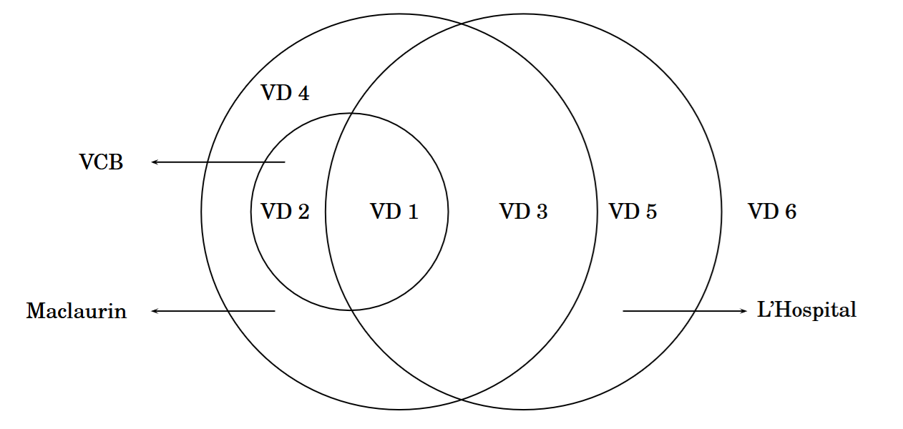

  
#### Ví dụ 1 (Cả ba phương pháp đều áp dụng được)

$ \lim_{x\to 0}\frac{1-\cos x}{\ln(1+x^2)}=\frac{\frac{x^2}{2}+o(x^2)}{x^2+o(x^2)}\to \frac{1}{2} $.

  
#### Ví dụ 2 (Dùng VCB hoặc Maclaurin; không nên dùng L'Hospital)

$ \lim_{x\to 0}\frac{1-\cos x+x^2-\sin x}{x+\sin^2 x+\arcsin^3 x+\arctan^4 x} $.

  
#### Ví dụ 3 (Dùng Maclaurin hoặc L'Hospital; không “thay tương đương” bừa bãi)

$ \lim_{x\to 0}\frac{x-\sin x+x^3}{x^3} $.

Ở đây $ x-\sin x\sim \frac{x^3}{6} $, nên tử số $ \sim \big(\frac{1}{6}+1\big)x^3 $, giới hạn bằng $ \frac{7}{6} $. Nếu thay $ x\sim \sin x $ thì sẽ sai.

  
#### Ví dụ 4 (Khai triển Maclaurin; không thay tương đương ở tử số và không dùng L'Hospital)

$ \lim_{x\to 0}\frac{x-\sin x-x^3}{\arcsin(\arctan^3 x)} $.

Tử số $ x-\sin x-x^3\sim \frac{x^3}{6}-x^3=-\frac{5}{6}x^3 $. Mẫu $ \arcsin(\arctan^3 x)\sim \arcsin(x^3)\sim x^3 $. Do đó giới hạn $ =-\frac{5}{6} $.

  
#### Ví dụ 5 (Dùng L'Hospital; không dùng VCB, Maclaurin)

- $ \lim_{x\to 0^+}\frac{\ln x}{x}=-\infty $.

- $ \lim_{x\to 0^+}x^x=\lim_{x\to 0^+}e^{x\ln x}=e^{\lim x\ln x}=e^0=1 $.

  
#### Ví dụ 6 (Không dùng cả ba phương pháp L'Hospital, VCB, Maclaurin)

$ \lim_{x\to +\infty}\frac{x-\sin x}{x+\cos x}=\lim_{x\to +\infty}\frac{1-\frac{\sin x}{x}}{1+\frac{\cos x}{x}}=1 $.

  
#### Chú ý 1.18

Trong quá trình tìm giới hạn của các dạng vô định, nên linh hoạt, có thể kết hợp nhiều phương pháp với nhau để đạt hiệu quả tốt nhất. Chẳng hạn trong Ví dụ 4, nên dùng Maclaurin ở tử số và thay tương đương ở mẫu số.

  
### 9.8 Về các VCL tiêu biểu

Ta đã học về VCB, VCL, quy tắc thay tương đương, ngắt bỏ VCB bậc cao, ngắt bỏ VCL bậc thấp. Các VCL tiêu biểu khi $ x\to +\infty $ là:

- Hàm số mũ với cơ số lớn hơn 1, ví dụ $ a^x $ (với $ a>1 $).

- Các hàm đa thức, lũy thừa của $ x $, như $ x^n $, $ x^{\alpha} $ ($ \alpha>0 $).

- Các hàm logarit với cơ số lớn hơn 1, như $ \ln x $, $ \log_a x $ ($ a>1 $).

Cả ba đều tiến ra vô cùng khi $ x\to +\infty $, nhưng tốc độ khác nhau: mũ ≻ đa thức ≻ logarit.

Cụ thể, bạn đọc có thể chứng minh (bằng L'Hospital):

$ \lim_{x\to+\infty}\frac{a^x}{x^{\alpha}}=\infty $ với mọi $ a>1 $, $ \alpha>0 $.

$ \lim_{x\to+\infty}\frac{x^{\alpha}}{\log_a x}=\infty $ với mọi $ a>1 $, $ \alpha>0 $.

  
#### Ví dụ 9.28
Tính $ \lim_{x\to +\infty}\frac{\ln x+x^{2016}+e^x}{\log_2 x+x^{2017}+2e^x} $.

Áp dụng quy tắc ngắt bỏ VCL bậc thấp:
$ \ln x+x^{2016}+e^x\sim e^x $,  
$ \log_2 x+x^{2017}+2e^x\sim 2e^x $.

Do đó
$ \lim_{x\to +\infty}\frac{\ln x+x^{2016}+e^x}{\log_2 x+x^{2017}+2e^x}=\frac{1}{2} $.

## §10. CÁC LƯỢC ĐỒ KHẢO SÁT HÀM SỐ

### 10.1 Khảo sát và vẽ đồ thị của hàm số $y = f(x)$

Mục này sinh viên đã được học khá kĩ ở phổ thông, nên chỉ nhấn mạnh các điểm cần chú ý trong quá trình khảo sát hàm số và bổ sung một số dạng khác như hàm có chứa căn thức, ...

Sơ đồ khảo sát

1. Tìm tập xác định (TXĐ) của hàm số, nhận xét tính chẵn, lẻ, tuần hoàn (nếu có).

2. Xác định chiều biến thiên: tìm các khoảng tăng, giảm của hàm số.

3. Tìm cực trị (nếu có).

4. Xét tính lồi, lõm (nếu cần), điểm uốn (nếu có).

5. Tìm các tiệm cận của hàm số (nếu có).

6. Lập bảng biến thiên.

7. Tìm một số điểm đặc biệt mà đồ thị đi qua (ví dụ giao điểm với các trục toạ độ, ...), và vẽ đồ thị của hàm số.

#### Ví dụ 10.2 
Tìm các đường tiệm cận của đường cong $y=x^2\sin\dfrac{1}{x}$.

**Lời giải**

- TXĐ: $ \mathbb{R}\setminus \{0\} $.

- Vì $0\le \left|x^2\sin\dfrac{1}{x}\right|\le x^2$, nên $ \lim_{x\to 0} x^2\sin\dfrac{1}{x}=0 $ (giới hạn kẹp). Suy ra không có tiệm cận đứng tại $x=0$.

- $ \lim_{x\to\infty} x^2\sin\dfrac{1}{x} = \lim_{x\to\infty} x\cdot \frac{\sin(1/x)}{1/x} = \infty $, do đó không có tiệm cận ngang.

- Xét tiệm cận xiên khi $x\to +\infty$:
  
  $ \lim_{x\to\infty}\frac{y}{x} = \lim_{x\to\infty} x\sin\frac{1}{x} = 1 $.
  
  $ \lim_{x\to\infty}(y-x) = \lim_{x\to\infty} x\left(x\sin\frac{1}{x}-1\right) = \lim_{t\to 0} \frac{1}{t}\left(\frac{\sin t}{t}-1\right) = \lim_{t\to 0}\frac{\sin t - t}{t^2}=0 $ (đặt $t=\tfrac{1}{x}$).

Kết luận: Đường cong có một tiệm cận xiên là $y=x$.

  
#### Ví dụ 10.3
Tìm các tiệm cận xiên của đường cong $y=\ln(1+e^{-2x})$.

**Lời giải**

- Khi $x\to +\infty$, $ \lim \dfrac{y}{x}=0 $ nên không có tiệm cận xiên ở $+\infty$.

- Khi $x\to -\infty$, tính hệ số góc và hệ số tự do:
  
  $ a=\lim_{x\to -\infty}\frac{y}{x}=\lim_{x\to -\infty}\frac{\ln(1+e^{-2x})}{x}=\lim_{x\to -\infty}\frac{-2e^{-2x}}{1+e^{-2x}}=-2 $ (L'Hospital).
  
  $ b=\lim_{x\to -\infty}(y-ax)=\lim_{x\to -\infty}\big(\ln(1+e^{-2x})+2x\big)=\lim_{x\to -\infty}\ln\big[(1+e^{-2x})e^{2x}\big]=\lim_{x\to -\infty}\ln(1+e^{2x})=0 $.

Kết luận: $y=-2x$ là tiệm cận xiên của đường cong.

### 10.2 Khảo sát và vẽ đường cong cho dưới dạng tham số

Giả sử cần khảo sát và vẽ đường cong cho dưới dạng tham số
$ \begin{cases}
x=x(t) \\
y=y(t)
\end{cases} $

1. Tìm TXĐ, nhận xét tính chẵn, lẻ, tuần hoàn của $x(t)$, $y(t)$ (nếu có).

2. Xác định chiều biến thiên của $x(t)$, $y(t)$ theo $t$ bằng cách xét dấu các đạo hàm $x'(t)$, $y'(t)$.

3. Tìm các tiệm cận của đường cong:

   (a) Tiệm cận đứng: nếu $ \lim_{t\to t_0(\infty)}y(t)=\infty $ và $ \lim_{t\to t_0(\infty)}x(t)=x_0 $ thì $ x=x_0 $ là tiệm cận đứng.

   (b) Tiệm cận ngang: nếu $ \lim_{t\to t_0(\infty)}x(t)=\infty $ và $ \lim_{t\to t_0(\infty)}y(t)=y_0 $ thì $ y=y_0 $ là tiệm cận ngang.

   (c) Tiệm cận xiên: nếu $ \lim_{t\to t_0(\infty)}y(t)=\infty $ và $ \lim_{t\to t_0(\infty)}x(t)=\infty $ thì có thể có tiệm cận xiên. Khi đó
  
   $ a=\lim_{t\to t_0(\infty)}\frac{y(t)}{x(t)}, \quad b=\lim_{t\to t_0(\infty)}\big(y(t)-a\,x(t)\big) $,
  
   thì $ y=ax+b $ là tiệm cận xiên.

4. Để vẽ chính xác hơn, xác định tiếp tuyến của đường cong tại các điểm đặc biệt. Hệ số góc của tiếp tuyến tại điểm có $x'(t)\ne 0$ là
$ \frac{dy}{dx}=\frac{dy/dt}{dx/dt} $.

Ngoài ra có thể khảo sát tính lồi, lõm và điểm uốn (nếu cần) bằng đạo hàm cấp hai:
$ \frac{d^2y}{dx^2}=\frac{d\left(\frac{dy/dt}{dx/dt}\right)}{dx}=\frac{y''(t)\,x'(t)-y'(t)\,x''(t)}{(x'(t))^3} $.

5. Xác định một số điểm đặc biệt mà đồ thị đi qua và vẽ đồ thị.

### 10.3 Khảo sát và vẽ đường cong trong hệ toạ độ cực

# CHƯƠNG 2: PHÉP TÍNH TÍCH PHÂN MỘT BIẾN SỐ

## §1. TÍCH PHÂN BẤT ĐỊNH

### 1.1 Nguyên hàm của hàm số

Chương này trình bày về phép tính tích phân, đây là phép toán ngược của phép tính đạo hàm (vi phân) của hàm số. Nếu ta cho trước một hàm số $f(x)$, thì có tồn tại hay không một hàm số $F(x)$ có đạo hàm bằng $f(x)$? Nếu tồn tại, hãy tìm tất cả các hàm số $F(x)$ như vậy.

#### Định nghĩa 2.26
Hàm số $F(x)$ được gọi là một nguyên hàm của hàm số $f(x)$ trên khoảng $D$, nếu $F'(x) = f(x)$, $\forall x \in D$, hay $dF(x) = f(x) dx$.

#### Định lý 2.38

Nếu $F(x)$ là một nguyên hàm của hàm số $f(x)$ trên khoảng $D$, thì:

- Hàm số $F(x) + C$ cũng là một nguyên hàm của hàm số $f(x)$, với $C$ là một hằng số bất kỳ.
- Ngược lại, mọi nguyên hàm của hàm số $f(x)$ đều viết được dưới dạng $F(x) + C$, trong đó $C$ là một hằng số.

Như vậy, biểu thức $F(x) + C$ biểu diễn tất cả các nguyên hàm của hàm số $f(x)$, mỗi hằng số $C$ tương ứng cho ta một nguyên hàm.

#### Định nghĩa 2.27

Tích phân bất định của một hàm số $f(x)$ là họ các nguyên hàm $F(x) + C$, với $x \in D$, trong đó $F(x)$ là một nguyên hàm của hàm số $f(x)$ và $C$ là một hằng số bất kỳ. Tích phân bất định của $f(x) dx$ được ký hiệu là $\int f(x) dx$. Biểu thức $f(x) dx$ được gọi là biểu thức dưới dấu tích phân, và hàm số $f(x)$ được gọi là hàm số dưới dấu tích phân.

Vậy: $\int f(x) dx = F(x) + C$, với $F(x)$ là nguyên hàm của $f(x)$.

#### Các tính chất của tích phân bất định

- $\left[ \int f(x) dx \right]' = f(x)$ hay $d \left( \int f(x) dx \right) = f(x) dx$
- $\int F'(x) dx = F(x) + C$ hay $\int dF(x) = F(x) + C$
- $\int a f(x) dx = a \int f(x) dx$ (với $a$ là hằng số khác 0)
- $\int [f(x) \pm g(x)] dx = \int f(x) dx \pm \int g(x) dx$

Hai tính chất cuối cùng là tính chất tuyến tính của tích phân bất định, ta có thể viết chung:

$$\int [\alpha f(x) + \beta g(x)] dx = \alpha \int f(x) dx + \beta \int g(x) dx$$

trong đó $\alpha$, $\beta$ là các hằng số không đồng thời bằng 0.

#### Các công thức tích phân dạng đơn giản

1) $\int x^{\alpha} dx = \frac{x^{\alpha + 1}}{\alpha + 1} + C$, ($\alpha \neq -1$)

2) $\int \frac{dx}{x} = \ln |x| + C$

3) $\int \sin x dx = -\cos x + C$

4) $\int \cos x dx = \sin x + C$

5) $\int \frac{dx}{\sin^2 x} = -\cot x + C$

6) $\int \frac{dx}{\cos^2 x} = \tan x + C$

7) $\int a^x dx = \frac{a^x}{\ln a} + C$, ($a > 0$, $a \neq 1$)

8) $\int e^x dx = e^x + C$

9) $\int \frac{dx}{a^2 - x^2} = \frac{1}{2a} \ln \left| \frac{a + x}{a - x} \right| + C$

10) $\int \frac{dx}{x^2 + a^2} = \frac{1}{a} \arctan \frac{x}{a} + C$

11) $\int \frac{dx}{\sqrt{x^2 + a}} = \ln \left| x + \sqrt{x^2 + a} \right| + C$

12) $\int \frac{dx}{\sqrt{a^2 - x^2}} = \arcsin \frac{x}{a} + C$

13) $\int \sqrt{a^2 - x^2} dx = \frac{1}{2} x \sqrt{a^2 - x^2} + \frac{a^2}{2} \arcsin \frac{x}{a} + C$

14) $\int \sqrt{x^2 + a} dx = \frac{1}{2} \left[ x \sqrt{x^2 + a} + a \ln \left| x + \sqrt{x^2 + a} \right| \right] + C$

### 1.2 Các phương pháp tính tích phân bất định

#### 1. Phương pháp khai triển

Để tính một tích phân bất định bất kỳ, ta cần sử dụng các phương pháp thích hợp để đưa về các tích phân đã có trong bảng các công thức tích phân đơn giản ở trên. Một phương pháp đơn giản là phương pháp khai triển, dựa trên tính chất tuyến tính của tích phân bất định:

$$\int [\alpha f(x) + \beta g(x)] dx = \alpha \int f(x) dx + \beta \int g(x) dx$$

Ta phân tích hàm số dưới dấu tích phân thành tổng (hiệu) của các hàm số đơn giản mà đã biết được nguyên hàm của chúng, các hằng số được đưa ra bên ngoài dấu tích phân.

#### Ví dụ 1.1

- $\int (2x \sqrt{x} - 3x^2) dx = 2 \int x^{\frac{3}{2}} dx - 3 \int x^2 dx = \frac{4}{5} x^{\frac{5}{2}} - x^3 + C$
- $\int \left( 2 \sin x + x^3 - \frac{1}{x} \right) dx = 2 \int \sin x dx + \int x^3 dx - \int \frac{dx}{x} = -2 \cos x + \frac{x^4}{4} - \ln |x| + C$
- $\int \frac{dx}{x^2 (1 + x^2)} = \int \left( \frac{1}{x^2} - \frac{1}{1 + x^2} \right) dx = -\frac{1}{x} + \arctan x + C$

#### 2. Phương pháp biến đổi biểu thức vi phân

Nhận xét: Nếu $\int f(x) dx = F(x) + C$, thì $\int f(u) du = F(u) + C$, trong đó $u = u(x)$ là một hàm số khả vi liên tục. Ta có thể kiểm tra lại bằng cách đạo hàm hai vế theo $x$. Sử dụng tính chất này, ta biến đổi biểu thức dưới dấu tích phân $g(x) dx$ về dạng:

$$g(x) dx = f(u(x)) u'(x) dx$$

trong đó $f(x)$ là một hàm số mà ta dễ dàng tìm được nguyên hàm $F(x)$. Khi đó, tích phân cần tính trở thành:

$$\int g(x) dx = \int f(u(x)) u'(x) dx = \int f(u(x)) du = F(u(x)) + C$$

Trong trường hợp đơn giản $u(x) = ax + b$, thì $du = a dx$, do đó nếu $\int f(x) dx = F(x) + C$, ta suy ra:

$$\int f(ax + b) dx = \frac{1}{a} F(ax + b) + C$$

#### Ví dụ 1.2

a) $\int \sin ax dx = -\frac{1}{a} \cos ax + C$

b) $\int e^{ax} dx = \frac{e^{ax}}{a} + C$

c) $\int e^{\sin x} \cos x dx = \int e^{\sin x} d(\sin x) = e^{\sin x} + C$

d) $\int \frac{dx}{\cos^4 x} = \int (1 + \tan^2 x) d(\tan x) = \frac{\tan^3 x}{3} + \tan x + C$

e) $\int x \sqrt{1 + 3x^2} dx = \frac{1}{6} \int \sqrt{1 + 3x^2} d(1 + 3x^2) = \frac{1}{9} (1 + 3x^2)^{\frac{3}{2}} + C$

f) $I = \int \frac{\arccos x \arcsin x}{\sqrt{1 - x^2}} dx = \int \left( \frac{\pi}{2} - \arcsin x \right) \arcsin x d(\arcsin x) = \frac{\pi}{4} \arcsin^2 x - \frac{1}{3} \arcsin^3 x + C$

#### 3. Phương pháp đổi biến

Xét tích phân $I = \int f(x) dx$, trong đó $f(x)$ là một hàm số liên tục. Để tính tích phân này, ta tìm cách chuyển sang tính tích phân khác của một hàm số khác bằng một phép đổi biến $x = \varphi(t)$, sao cho biểu thức dưới dấu tích phân đối với biến $t$ có thể tìm được nguyên hàm một cách đơn giản hơn.

**Phép đổi biến thứ nhất**:

Đặt $x = \varphi(t)$, trong đó $\varphi(t)$ là một hàm số đơn điệu và có đạo hàm liên tục. Khi đó:

$$I = \int f(x) dx = \int f(\varphi(t)) \varphi'(t) dt$$

Giả sử hàm số $g(t) = f(\varphi(t)) \varphi'(t)$ có nguyên hàm là hàm $G(t)$, và $t = h(x)$ là hàm số ngược của hàm số $x = \varphi(t)$, ta có:

$$\int g(t) dt = G(t) + C \Rightarrow I = G(h(x)) + C$$

**Phép đổi biến thứ hai**:

Đặt $t = \psi(x)$, trong đó $\psi(x)$ là một hàm số có đạo hàm liên tục, và ta viết được hàm $f(x) = g(\psi(x)) \psi'(x)$. Khi đó:

$$I = \int f(x) dx = \int g(\psi(x)) \psi'(x) dx$$

Giả sử hàm số $g(t)$ có nguyên hàm là hàm số $G(t)$, ta có:

$$I = G(\psi(x)) + C$$

#### Chú ý

Khi tính tích phân bất định bằng phương pháp đổi biến số, sau khi tìm được nguyên hàm theo biến số mới, phải đổi lại thành hàm số của biến số cũ.

#### Ví dụ 1.3

Tính các tích phân sau:

a) $I_1 = \int \sqrt{\frac{x}{2 - x}} \, dx$

Đặt $x = 2 \sin^2 t$, $t \in \left[0, \frac{\pi}{2}\right]$. Ta tính được:

$$dx = 4 \sin t \cos t \, dt, \quad \sqrt{\frac{x}{2 - x}} = \sqrt{\frac{2 \sin^2 t}{2 (1 - \sin^2 t)}} = \tan t$$

Suy ra:

$$I_1 = \int \sqrt{\frac{x}{2 - x}} \, dx = \int \tan t \cdot 4 \sin t \cos t \, dt = 4 \int \sin^2 t \, dt = 2t - \sin 2t + C$$

Đổi lại biến $x$, với $t = \arcsin \sqrt{\frac{x}{2}}$, ta thu được:

$$I_1 = 2 \arcsin \sqrt{\frac{x}{2}} - \sqrt{2x - x^2} + C$$

b) $I_2 = \int \frac{e^{2x}}{e^x + 1} \, dx$

Đặt $e^x = t \Rightarrow e^x \, dx = dt$. Ta có:

$$I_2 = \int \frac{t}{t + 1} \, dt = \int \left( 1 - \frac{1}{t + 1} \right) \, dt = t - \ln |t + 1| + C$$

Đổi lại biến $x$, ta được:

$$I_2 = e^x - \ln (e^x + 1) + C$$

c) $I_3 = \int \frac{dx}{\sqrt{1 + 4x}}$

Đặt $t = 2^{-x} \Rightarrow dt = -2^{-x} \ln 2 \, dx$. Tích phân trở thành:

$$I_3 = \int \frac{-dt}{t \ln 2 \sqrt{1 + t^{-2}}} = -\frac{1}{\ln 2} \int \frac{dt}{\sqrt{t^2 + 1}} = -\frac{1}{\ln 2} \ln \left( t + \sqrt{t^2 + 1} \right) + C$$

Đổi lại biến $x$, ta có:

$$I_3 = -\frac{1}{\ln 2} \ln \left( 2^{-x} + \sqrt{4^{-x} + 1} \right) + C$$

#### 4. Phương pháp tích phân từng phần

Giả sử $u = u(x)$ và $v = v(x)$ là các hàm số có đạo hàm liên tục. Theo quy tắc lấy vi phân:

$$d(uv) = u \, dv + v \, du \Rightarrow uv = \int d(uv) = \int u \, dv + \int v \, du$$

Suy ra:

$$\int u \, dv = uv - \int v \, du$$

Xét tích phân $I = \int f(x) \, dx$. Ta cần biểu diễn:

$$f(x) \, dx = [g(x) h(x)] \, dx = g(x) [h(x) \, dx] = u \, dv$$

và áp dụng công thức tích phân từng phần với các hàm số $u = g(x)$, $v = \int h(x) \, dx$. Phương pháp này thường được sử dụng khi biểu thức dưới dấu tích phân chứa một trong các hàm số sau: $\ln x$, $a^x$, hàm lượng giác, hoặc hàm lượng giác ngược. Cụ thể:

- Trong các tích phân $\int x^n e^{kx} \, dx$, $\int x^n \sin kx \, dx$, $\int x^n \cos kx \, dx$, với $n$ nguyên dương, ta thường chọn $u = x^n$.
- Trong các tích phân $\int x^\alpha \ln^n x \, dx$, với $\alpha \neq -1$ và $n$ nguyên dương, ta thường chọn $u = \ln^n x$.
- Trong các tích phân $\int x^n \arctan kx \, dx$, $\int x^n \arcsin kx \, dx$, với $n$ nguyên dương, ta thường chọn $u = \arctan kx$ hoặc $u = \arcsin kx$, $dv = x^n \, dx$.

#### Ví dụ 1.5

Tính các tích phân bất định sau:

a) $I_1 = \int \ln x \, dx = x \ln x - \int dx = x \ln x - x + C$

b) $I_2 = \int x^2 \sin x \, dx$

Đặt $u = x^2$, $dv = \sin x \, dx \Rightarrow v = -\cos x$. Ta được:

$$I_2 = -x^2 \cos x + 2 \int x \cos x \, dx$$

Đặt $u = x$, $dv = \cos x \, dx \Rightarrow v = \sin x$. Ta được:

$$I_2 = -x^2 \cos x + 2 \left( x \sin x - \int \sin x \, dx \right) = -x^2 \cos x + 2x \sin x + 2 \cos x + C$$

c) $I_3 = \int \frac{x e^x}{(x + 1)^2} \, dx$

Đặt $u = \frac{x}{x + 1}$, $dv = \frac{e^x}{x + 1} \, dx \Rightarrow v = \frac{e^x}{x + 1}$. Ta được:

$$I_3 = \frac{x e^x}{x + 1} - \int \frac{e^x}{x + 1} \, dx = \frac{x e^x}{x + 1} - e^x + C = \frac{e^x}{x + 1} + C$$

d) $I_4 = \int \frac{x e^x}{\sqrt{1 + e^x}} \, dx$

Đặt $\sqrt{1 + e^x} = t \Rightarrow \frac{e^x \, dx}{\sqrt{1 + e^x}} = 2 \, dt$. Ta có:

$$I_4 = 2 \int \left[ \ln (t - 1) + \ln (t + 1) \right] dt = 2(t - 1) \ln (t - 1) + 2(t + 1) \ln (t + 1) - 4t + C$$

Đổi lại biến $x$:

$$I_4 = 2(x - 2) \sqrt{1 + e^x} + 4 \ln \left( 1 + \sqrt{1 + e^x} \right) - 2x + C$$

e) $I_5 = \int \frac{x \arcsin x}{\sqrt{1 - x^2}} \, dx$

Đặt $u = \arcsin x$, $dv = \frac{x}{\sqrt{1 - x^2}} \, dx \Rightarrow v = -\sqrt{1 - x^2}$. Ta được:

$$I_5 = -\sqrt{1 - x^2} \arcsin x + \int dx = -\sqrt{1 - x^2} \arcsin x + x + C$$

f) $I_6 = \int e^x \cos 2x \, dx$

Đặt $u = \cos 2x$, $dv = e^x \, dx \Rightarrow v = e^x$, $du = -2 \sin 2x \, dx$. Ta được:

$$I_6 = e^x \cos 2x + 2 \int e^x \sin 2x \, dx$$

Đặt $u = \sin 2x$, $dv = e^x \, dx \Rightarrow v = e^x$, $du = 2 \cos 2x \, dx$. Ta được:

$$I_6 = e^x \cos 2x + 2 \left( e^x \sin 2x - 2 \int e^x \cos 2x \, dx \right) = e^x \cos 2x + 2 e^x \sin 2x - 4 I_6$$

Giải phương trình trên:

$$I_6 + 4 I_6 = e^x \cos 2x + 2 e^x \sin 2x \Rightarrow I_6 = \frac{e^x}{5} (\cos 2x + 2 \sin 2x) + C$$

#### Ví dụ 1.7

Chứng minh rằng $0 = 1$.

**Chứng minh**:

Xét tích phân:

$$I = \int \frac{dx}{x \ln x} = \int \frac{1}{\ln x} \, d(\ln x)$$

Sử dụng tích phân từng phần, đặt $u = \frac{1}{\ln x}$, $dv = d(\ln x) \Rightarrow v = \ln x$, $du = -\frac{1}{x \ln^2 x} \, dx$. Ta được:

$$I = \frac{1}{\ln x} \cdot \ln x - \int \ln x \cdot \left( -\frac{1}{x \ln^2 x} \right) \, dx = 1 - \int \frac{dx}{x \ln x} = 1 - I$$

Phương trình $I = 1 - I$ dẫn đến $2I = 1 \Rightarrow I = \frac{1}{2}$. Tuy nhiên, $I = I + 1$ dẫn đến $0 = 1$. Sai lầm ở đâu?

**Giải thích sai lầm**: Sai lầm trong ví dụ này nằm ở việc tích phân $\int \frac{dx}{x \ln x}$ không hội tụ trên miền xác định (chẳng hạn gần $x = 1$ hoặc khi $\ln x \to 0$). Do đó, các phép biến đổi trên không hợp lệ, dẫn đến kết quả mâu thuẫn.

### 1.3 Tích phân hàm phân thức hữu tỷ

#### Định nghĩa 2.28

Một hàm phân thức hữu tỷ là một hàm số có dạng $f(x) = \frac{P(x)}{Q(x)}$, trong đó $P(x)$, $Q(x)$ là các đa thức của $x$. Một phân thức hữu tỷ có bậc của đa thức ở tử số nhỏ hơn bậc của đa thức ở mẫu số được gọi là phân thức hữu tỷ thực sự.

Bằng phép chia đa thức, chia $P(x)$ cho $Q(x)$, ta luôn đưa được một hàm phân thức hữu tỷ về dạng:

$$f(x) = H(x) + \frac{r(x)}{Q(x)}$$

trong đó $H(x)$ là đa thức thương, $r(x)$ là phần dư trong phép chia. Khi đó, $\frac{r(x)}{Q(x)}$ là một phân thức hữu tỷ thực sự. Nguyên hàm của đa thức được tìm bởi công thức tích phân cơ bản.

Ta sẽ xét việc tìm nguyên hàm của phân thức hữu tỷ $\frac{r(x)}{Q(x)}$ trong hai trường hợp đặc biệt: mẫu số của phân thức là đa thức bậc nhất hoặc đa thức bậc hai. Trong những trường hợp mẫu số phức tạp hơn, chúng ta sử dụng phương pháp hệ số bất định để đưa về hai trường hợp trên.

#### Phương pháp hệ số bất định

Giả sử chúng ta muốn phân tích một phân thức hữu tỷ thực sự $\frac{P(x)}{Q(x)}$ thành tổng (hiệu) của các phân thức hữu tỷ thực sự có mẫu số là đa thức bậc nhất hoặc bậc hai. Trước hết, ta phân tích đa thức ở mẫu số $Q(x)$ thành tích của các đa thức bậc nhất hoặc bậc hai vô nghiệm:

$$Q(x) = (x - \alpha_1)^{a_1} \dots (x - \alpha_m)^{a_m} (x^2 + p_1 x + q_1)^{b_1} \dots (x^2 + p_n x + q_n)^{b_n}$$

trong đó $\alpha_i$, $p_j$, $q_j$ là các hằng số, $a_i$, $b_j$ là các số nguyên dương, $1 \le i \le m$, $1 \le j \le n$.

- Nếu trong phân tích của $Q(x)$ xuất hiện đơn thức $(x - \alpha)^a$, $a$ là số nguyên dương, thì trong phân tích của phân thức $\frac{P(x)}{Q(x)}$ xuất hiện các hạng tử dạng $\frac{A_i}{(x - \alpha)^i}$, trong đó $A_i$ là hằng số và $1 \le i \le a$.
- Nếu trong phân tích của $Q(x)$ xuất hiện biểu thức $(x^2 + p x + q)^b$, $b$ là số nguyên dương, thì trong phân tích của phân thức $\frac{P(x)}{Q(x)}$ xuất hiện các hạng tử dạng $\frac{B_j x + C_j}{(x^2 + p x + q)^j}$, trong đó $B_j$, $C_j$ là các hằng số và $1 \le j \le b$.

Sau khi viết được phân tích của $\frac{P(x)}{Q(x)}$, ta tìm các hằng số $A_i$, $B_j$, $C_j$ bằng cách quy đồng mẫu số ở hai vế, rồi đồng nhất hệ số của $x^n$, $n \in \mathbb{N}$, ở hai vế. Như vậy, việc dùng phương pháp hệ số bất định dẫn chúng ta tới việc tính bốn loại tích phân hữu tỷ cơ bản sau:

1. $\int \frac{A}{x - a} \, dx = A \ln |x - a| + C$

2. $\int \frac{A}{(x - a)^k} \, dx = \frac{-A}{(k - 1)(x - a)^{k - 1}} + C$, ($k \ge 2$)

3. $\int \frac{M x + N}{x^2 + p x + q} \, dx = \int \frac{M t + (N - M p / 2)}{t^2 + a^2} \, dt$, ($a = \sqrt{q - \frac{p^2}{4}}$, đổi biến $t = x + \frac{p}{2}$)

   $= \frac{M}{2} \ln (t^2 + a^2) + \frac{N - M p / 2}{a} \arctan \frac{t}{a} + C$

   $= \frac{M}{2} \ln (x^2 + p x + q) + \frac{2N - M p}{\sqrt{4q - p^2}} \arctan \frac{2x + p}{\sqrt{4q - p^2}} + C$

4. $\int \frac{M x + N}{(x^2 + p x + q)^m} \, dx = \int \frac{M t + (N - M p / 2)}{(t^2 + a^2)^m} \, dt$, ($a = \sqrt{q - \frac{p^2}{4}}$, đổi biến $t = x + \frac{p}{2}$)

   $= \int \frac{M t}{(t^2 + a^2)^m} \, dt + \int \frac{N - M p / 2}{(t^2 + a^2)^m} \, dt$

   - Tích phân thứ nhất: $\int \frac{M t}{(t^2 + a^2)^m} \, dt = -\frac{M}{2(m - 1)(t^2 + a^2)^{m - 1}} + C$
   - Tích phân thứ hai: Thực hiện phép đổi biến số lượng giác $t = a \tan z$, ta có:

     $\begin{cases} t^2 + a^2 = \frac{a^2}{\cos^2 z}, \\ dt = \frac{a}{\cos^2 z} \, dz \end{cases}$

     Khi đó:

     $\int \frac{dt}{(t^2 + a^2)^m} = a^{1 - 2m} \int \cos^{2m - 2} z \, dz$

     Tích phân của hàm lượng giác này sẽ được nghiên cứu kỹ ở phần sau.

#### Ví dụ 1.8

Tính các tích phân bất định sau:

a) $I_1 = \int \frac{x^4 - x^3 + 2x^2 - 2x + 1}{(x^2 + 2)(x - 1)} \, dx$

Ta có:

$$\frac{x^4 - x^3 + 2x^2 - 2x + 1}{(x^2 + 2)(x - 1)} = x + \frac{1}{(x^2 + 2)(x - 1)} = x + \frac{A}{x - 1} + \frac{B x + C}{x^2 + 2}$$

Quy đồng mẫu số ở hai vế:

$$1 = (A + B) x^2 + (C - B + 2A) x + (2 - C)$$

Đồng nhất hệ số của $x^2$, $x$ và hệ số tự do, ta được:

$$\begin{cases} A + B = 0 \\ C - B + 2A = 0 \\ 2 - C = 1 \end{cases} \Rightarrow \begin{cases} A = 1 \\ B = -1 \\ C = 1 \end{cases}$$

Suy ra:

$$\frac{x^4 - x^3 + 2x^2 - 2x + 1}{(x^2 + 2)(x - 1)} = x + \frac{1}{x - 1} - \frac{x + 1}{x^2 + 2}$$

Vậy tích phân bằng:

$$I_1 = \int x \, dx + \int \frac{1}{x - 1} \, dx - \int \frac{x + 1}{x^2 + 2} \, dx = \frac{x^2}{2} + \ln |x - 1| - \frac{1}{2} \ln (x^2 + 2) - \frac{1}{\sqrt{2}} \arctan \frac{x}{\sqrt{2}} + C$$

b) $I_2 = \int \frac{2x^4 + 10x^3 + 17x^2 + 16x + 5}{(x + 1)^2 (x^2 + 2x + 3)} \, dx$

Ta viết:

$$\frac{2x^4 + 10x^3 + 17x^2 + 16x + 5}{(x + 1)^2 (x^2 + 2x + 3)} = 2 + \frac{2}{x + 1} - \frac{1}{(x + 1)^2} - \frac{4}{x^2 + 2x + 3}$$

Suy ra:

$$I_2 = \int 2 \, dx + \int \frac{2}{x + 1} \, dx - \int \frac{1}{(x + 1)^2} \, dx - \int \frac{4}{x^2 + 2x + 3} \, dx$$

$$= 2x + 2 \ln |x + 1| + \frac{1}{x + 1} - 2 \sqrt{2} \arctan \frac{x + 1}{\sqrt{2}} + C$$

### 1.4 Tích phân hàm lượng giác

#### 1. Phương pháp chung

Xét tích phân $\int R(\sin x, \cos x) \, dx$, trong đó hàm dưới dấu tích phân là một biểu thức hữu tỷ đối với $\sin x$, $\cos x$. Ta có thể sử dụng phép đổi biến tổng quát $t = \tan \frac{x}{2}$, khi đó:

$$\sin x = \frac{2t}{1 + t^2}, \quad \cos x = \frac{1 - t^2}{1 + t^2}, \quad \tan x = \frac{2t}{1 - t^2}, \quad dx = \frac{2}{1 + t^2} \, dt$$

Tích phân đang xét được đưa về tích phân của một phân thức hữu tỷ của biến $t$.

#### Ví dụ 1.11

Tính tích phân $\int \frac{\sin x - \cos x + 2}{1 + \sin x + \cos x} \, dx$

Ta viết:

$$\int \frac{\sin x - \cos x + 2}{1 + \sin x + \cos x} \, dx = -\int \frac{d(1 + \sin x + \cos x)}{1 + \sin x + \cos x} + 2 \int \frac{dx}{1 + \sin x + \cos x}$$

Đặt $t = \tan \frac{x}{2}$, suy ra:

$$\int \frac{dx}{1 + \sin x + \cos x} = \int \frac{\frac{2}{1 + t^2} \, dt}{1 + \frac{2t}{1 + t^2} + \frac{1 - t^2}{1 + t^2}} = \int \frac{2 \, dt}{(1 + t^2) + 2t + (1 - t^2)} = \int \frac{dt}{1 + t} = \ln |1 + t| + C$$

Đổi lại biến $x$, ta được:

$$\int \frac{\sin x - \cos x + 2}{1 + \sin x + \cos x} \, dx = -\ln |1 + \sin x + \cos x| + 2 \ln \left| 1 + \tan \frac{x}{2} \right| + C$$

#### 2. Tích phân dạng $\int \sin^m x \cos^n x \, dx$, trong đó $m, n$ là các số nguyên

- Nếu $m$ là số nguyên dương lẻ, ta đặt $t = \cos x$.
- Nếu $n$ là số nguyên dương lẻ, ta đặt $t = \sin x$.
- Nếu $m, n$ là các số nguyên dương chẵn, ta sử dụng công thức hạ bậc:

  $\sin^2 x = \frac{1 - \cos 2x}{2}, \quad \cos^2 x = \frac{1 + \cos 2x}{2}$

  rồi đưa về tích phân dạng $\int \sin^k 2x \cos^l 2x \, dx$.

#### Ví dụ 1.12

Tính các tích phân bất định sau:

a) $I_1 = \int \sin^3 x \cos^2 x \, dx$

Đặt $\cos x = t \Rightarrow -\sin x \, dx = dt$. Ta có:

$$I_1 = \int \sin^3 x \cos^2 x \, dx = \int (1 - t^2) t^2 (-dt) = \int (t^4 - t^2) \, dt = \frac{t^5}{5} - \frac{t^3}{3} + C = \frac{\cos^5 x}{5} - \frac{\cos^3 x}{3} + C$$

b) $I_2 = \int \sin^4 x \cos^2 x \, dx$

Sử dụng công thức hạ bậc, ta có:

$$I_2 = \int \left( \frac{1 - \cos 2x}{2} \right)^2 \frac{1 + \cos 2x}{2} \, dx = \frac{1}{8} \int (1 - \cos 2x)^2 (1 + \cos 2x) \, dx$$

$$= \frac{1}{8} \int (1 - 2 \cos 2x + \cos^2 2x)(1 + \cos 2x) \, dx = \frac{1}{8} \int (1 - \cos 2x - \cos^2 2x + \cos^3 2x) \, dx$$

Sử dụng công thức $\cos^2 2x = \frac{1 + \cos 4x}{2}$, $\cos^3 2x = \cos 2x (1 - \sin^2 2x)$, ta tiếp tục:

$$I_2 = \frac{1}{8} \left( \int dx - \int \cos 2x \, dx - \int \frac{1 + \cos 4x}{2} \, dx + \int \cos 2x (1 - \sin^2 2x) \, d(\sin 2x) \right)$$

$$= \frac{1}{8} \left( x - \frac{\sin 2x}{2} - \frac{x}{2} - \frac{\sin 4x}{8} + \frac{\sin 2x}{2} - \frac{\sin^3 2x}{6} \right) + C$$

$$= \frac{1}{8} \left( \frac{x}{2} - \frac{\sin 4x}{8} - \frac{\sin^3 2x}{6} \right) + C$$

Cách khác, sử dụng công thức hạ bậc cho $\cos^3 2x = \frac{3 \cos 2x + \cos 6x}{4}$:

$$I_2 = \frac{1}{8} \int \left( 1 - \cos 2x - \frac{1 + \cos 4x}{2} + \frac{3 \cos 2x + \cos 6x}{4} \right) \, dx$$

$$= \frac{1}{8} \left( \int dx - \int \cos 2x \, dx - \frac{1}{2} \int dx - \frac{1}{2} \int \cos 4x \, dx + \frac{3}{4} \int \cos 2x \, dx + \frac{1}{4} \int \cos 6x \, dx \right)$$

$$= \frac{1}{8} \left( x - \frac{\sin 2x}{2} - \frac{x}{2} - \frac{\sin 4x}{8} + \frac{3 \sin 2x}{8} + \frac{\sin 6x}{24} \right) + C$$

$$= \frac{1}{8} \left( \frac{x}{2} - \frac{\sin 2x}{8} - \frac{\sin 4x}{8} + \frac{\sin 6x}{24} \right) + C$$

#### 3. Tích phân $\int R(\sin x, \cos x) \, dx$ có dạng đặc biệt

- Đặt $t = \cos x$ nếu $R(-\sin x, \cos x) = -R(\sin x, \cos x)$.
- Đặt $t = \sin x$ nếu $R(\sin x, -\cos x) = -R(\sin x, \cos x)$.
- Đặt $t = \tan x$ nếu $R(-\sin x, -\cos x) = R(\sin x, \cos x)$.

#### Ví dụ 1.13

Tính tích phân $\int \frac{dx}{\sin x \cos^4 x}$

Đặt $t = \cos x \Rightarrow dt = -\sin x \, dx$. Ta có:

$$\int \frac{dx}{\sin x \cos^4 x} = \int \frac{-dt}{(1 - t^2) t^4}$$

Phân tích phân thức:

$$\frac{1}{(1 - t^2) t^4} = \frac{1}{t^4 (1 - t) (1 + t)} = \frac{A}{t} + \frac{B}{t^2} + \frac{C}{t^3} + \frac{D}{t^4} + \frac{E}{1 - t} + \frac{F}{1 + t}$$

Quy đồng mẫu số và đồng nhất hệ số, ta được $A = B = C = 0$, $D = 1$, $E = \frac{1}{2}$, $F = -\frac{1}{2}$. Do đó:

$$\frac{1}{(1 - t^2) t^4} = \frac{1}{t^4} + \frac{1}{2(1 - t)} - \frac{1}{2(1 + t)}$$

Tích phân:

$$\int \frac{-dt}{(1 - t^2) t^4} = -\int \left( \frac{1}{t^4} + \frac{1}{2(1 - t)} - \frac{1}{2(1 + t)} \right) \, dt$$

$$= -\left( -\frac{1}{3 t^3} - \frac{1}{2} \ln |1 - t| - \frac{1}{2} \ln |1 + t| \right) + C$$

$$= \frac{1}{3 t^3} + \frac{1}{2} \ln \left| \frac{1 - t}{1 + t} \right| + C$$

Thay $t = \cos x$:

$$\int \frac{dx}{\sin x \cos^4 x} = \frac{1}{3 \cos^3 x} + \frac{1}{2} \ln \left| \frac{1 - \cos x}{1 + \cos x} \right| + C$$

### 1.5 Tích phân các biểu thức vô tỷ

Xét các tích phân có dạng:

- $\int R(x, \sqrt{x^2 + \alpha^2}) \, dx$
- $\int R(x, \sqrt{x^2 - \alpha^2}) \, dx$
- $\int R(x, \sqrt{\alpha^2 - x^2}) \, dx$

trong đó $R(u, v)$ là các hàm số hữu tỷ. Có hai phương pháp xử lý tích phân các biểu thức vô tỷ là **phép thế lượng giác** và **phép thế Euler**. Ý tưởng của cả hai phương pháp này là khử các biểu thức vô tỷ bằng cách:

1. Đưa về tích phân của các hàm lượng giác bằng phép thế lượng giác.
2. Đưa về tích phân của các hàm phân thức hữu tỷ bằng phép thế Euler.

#### Phép thế lượng giác

- Đặt $x = \alpha \tan t$ đối với tích phân $\int R(x, \sqrt{x^2 + \alpha^2}) \, dx$.
- Đặt $x = \frac{\alpha}{\cos t}$ hoặc $x = \frac{\alpha}{\sin t}$ đối với tích phân $\int R(x, \sqrt{x^2 - \alpha^2}) \, dx$.
- Đặt $x = \alpha \sin t$ hoặc $x = \alpha \cos t$ đối với tích phân $\int R(x, \sqrt{\alpha^2 - x^2}) \, dx$.

#### Ví dụ 1.14

Tính $\int \frac{dx}{\sqrt{\alpha^2 - x^2}}$

Đặt $x = \alpha \sin t$, $-\frac{\pi}{2} < t < \frac{\pi}{2}$. Ta có:

$$\begin{cases} t = \arcsin \frac{x}{\alpha}, \\ dx = \alpha \cos t \, dt, \\ \sqrt{\alpha^2 - x^2} = \alpha \cos t \end{cases}$$

Tích phân trở thành:

$$I = \int \frac{\alpha \cos t \, dt}{\alpha \cos t} = \int dt = t + C = \arcsin \frac{x}{\alpha} + C$$

#### Ví dụ 1.15

Tính $\int \sqrt{\alpha^2 - x^2} \, dx$

Đặt $x = \alpha \sin t$, $-\frac{\pi}{2} \le t \le \frac{\pi}{2}$. Ta có:

$$\begin{cases} t = \arcsin \frac{x}{\alpha}, \\ dx = \alpha \cos t \, dt, \\ \sqrt{\alpha^2 - x^2} = \alpha \cos t \end{cases}$$

Tích phân trở thành:

$$I = \int (\alpha \cos t) (\alpha \cos t \, dt) = \alpha^2 \int \cos^2 t \, dt = \alpha^2 \int \frac{1 + \cos 2t}{2} \, dt$$

$$= \frac{\alpha^2}{2} \left( t + \frac{\sin 2t}{2} \right) + C = \frac{\alpha^2}{2} t + \frac{\alpha^2}{2} \sin t \cos t + C$$

Thay $t = \arcsin \frac{x}{\alpha}$, $\sin t = \frac{x}{\alpha}$, $\cos t = \frac{\sqrt{\alpha^2 - x^2}}{\alpha}$, ta được:

$$I = \frac{\alpha^2}{2} \arcsin \frac{x}{\alpha} + \frac{\alpha^2}{2} \cdot \frac{x}{\alpha} \cdot \frac{\sqrt{\alpha^2 - x^2}}{\alpha} + C = \frac{x \sqrt{\alpha^2 - x^2}}{2} + \frac{\alpha^2}{2} \arcsin \frac{x}{\alpha} + C$$

#### Phép thế Euler

- Đặt $t = x + \sqrt{x^2 + a}$ đối với tích phân $\int R(x, \sqrt{x^2 + a}) \, dx$, trong đó $a$ có thể âm hoặc dương ($a = \pm \alpha^2$). Khi đó:

  $dt = \left( 1 + \frac{x}{\sqrt{x^2 + a}} \right) dx = \frac{x + \sqrt{x^2 + a}}{\sqrt{x^2 + a}} \, dx \Rightarrow \frac{dt}{t} = \frac{dx}{\sqrt{x^2 + a}}$

  Tích phân được đưa về tích phân của phân thức hữu tỷ.

- Đặt $\sqrt{\alpha^2 - x^2} = x t + \alpha$ đối với tích phân $\int R(x, \sqrt{\alpha^2 - x^2}) \, dx$. Khi đó:

  $\alpha^2 - x^2 = (x t + \alpha)^2 \Rightarrow \alpha^2 - x^2 = x^2 t^2 + 2 \alpha x t + \alpha^2 \Rightarrow x = -\frac{2 \alpha t}{1 + t^2}$

  Tích phân được đưa về tích phân của phân thức hữu tỷ.

#### Ví dụ 1.16
Tính $\int \frac{dx}{\sqrt{x^2 + a}}$

Đặt $t = x + \sqrt{x^2 + a}$. Khi đó:

$$\frac{dt}{t} = \frac{dx}{\sqrt{x^2 + a}}$$

Tích phân trở thành:

$$I = \int \frac{dt}{t} = \ln |t| + C = \ln \left| x + \sqrt{x^2 + a} \right| + C$$

#### Ví dụ 1.17

Tính $\int \sqrt{x^2 + a} \, dx$

[Lời giải] Sử dụng công thức tích phân thường gặp

$$\begin{aligned} I &= x \sqrt{x^2 + a} - \int \frac{x^2}{\sqrt{x^2 + a}} \, dx \\ &= x \sqrt{x^2 + a} - \int \frac{(x^2 + a) - a}{\sqrt{x^2 + a}} \, dx \\ &= x \sqrt{x^2 + a} + a \int \frac{1}{\sqrt{x^2 + a}} \, dx - I. \end{aligned}$$

Do đó,

$$I = \frac{1}{2} \left[ x \sqrt{x^2 + a} + a \ln \left| x + \sqrt{x^2 + a} \right| \right] + C.$$

#### Những công thức tích phân cơ bản thường gặp dựa trên các biểu thức phổ biến

1. $\int \frac{dx}{\sqrt{\alpha^2 - x^2}} = \arcsin \frac{x}{\alpha} + C.$

2. $\int \sqrt{\alpha^2 - x^2} \, dx = \frac{1}{2} x \sqrt{\alpha^2 - x^2} + \frac{\alpha^2}{2} \arcsin \frac{x}{\alpha} + C.$

3. $\int \frac{dx}{\sqrt{x^2 + a}} = \ln \left| x + \sqrt{x^2 + a} \right| + C.$

4. $\int \sqrt{x^2 + a} \, dx = \frac{1}{2} \left[ x \sqrt{x^2 + a} + a \ln \left| x + \sqrt{x^2 + a} \right| \right] + C.$

#### Ví dụ 1.18

Tính các tích phân sau

a) $\int (1 - x^2)^{-\frac{3}{2}} \, dx$

Đặt $ x = \sin t, t \in \left[-\frac{\pi}{2}, \frac{\pi}{2}\right] \Rightarrow dx = \cos t \, dt, \sqrt{1 - x^2} = \cos t$, thì

$$\int (1 - x^2)^{-\frac{3}{2}} \, dx = \int \frac{dt}{\cos^3 t} = \tan t + C = \tan(\arcsin x) + C$$

b) $\int \frac{dx}{x^2 \sqrt{1 + x^2}}$

Đặt $ x = \tan t \Rightarrow dx = \frac{dt}{\cos^2 t}$, ta có

$$\int \frac{dx}{x^2 \sqrt{1 + x^2}} = \int \frac{\cos t \, dt}{\sin^2 t} = -\frac{1}{\sin t} + C = -\frac{1}{\sin(\arctan x)} + C$$

c) $\int \frac{dx}{\sqrt{x^2 + x + 1}}$

Ta có

$$I = \int \frac{d \left( x + \frac{1}{2} \right)}{\sqrt{\left( x + \frac{1}{2} \right)^2 + \frac{3}{4}}} = \left[ x + \frac{1}{2} + \sqrt{x^2 + x + 1} \right] + C$$

**Tích phân có dạng** $\int \frac{px + q}{\sqrt{ax^2 + bx + c}} \, dx$

Viết

$$\int \frac{px + q}{\sqrt{ax^2 + bx + c}} \, dx = \frac{p}{2a} \int d(ax^2 + bx + c) \cdot \left( q - \frac{pb}{2a} \right) \int \frac{1}{\sqrt{ax^2 + bx + c}} \, dx$$

được dựa trên các tích phân cơ bản.

#### Ví dụ 1.21

Tính $\int \sqrt{\frac{x+1}{x+2}} \, dx$

[Lời giải] Đặt $t = \sqrt{\frac{x+1}{x+2}}$ ta có $x = \frac{2t^2 - 1}{t^2 - 1}, \, dx = \frac{2t}{(t^2 - 1)^2} \, dt$ và

$$\begin{aligned} I &= 2 \int \frac{t^2}{(t^2 - 1)^2} \, dt \\ &= \frac{1}{2} \int \left[ \frac{1}{t - 1} - \frac{1}{t + 1} + \frac{1}{(t - 1)^2} + \frac{1}{(t + 1)^2} \right] \, dt \\ &= \frac{1}{2} \ln \frac{t - 1}{t + 1} - \frac{1}{2} \left( \frac{1}{t - 1} - \frac{1}{t + 1} \right) + C \\ &= \frac{1}{2} \ln \frac{\sqrt{\frac{x+1}{x+2}} - 1}{\sqrt{\frac{x+1}{x+2}} + 1} - \frac{x + 2}{x + 1} + C. \end{aligned}$$

## §2. TÍCH PHÂN XÁC ĐỊNH

### 2.1 Định nghĩa tích phân xác định

#### Định nghĩa 2.29

Giả sử hàm số $f(x)$ xác định và bị chặn trên $[a,b]$. Chia $[a,b]$ thành $n$ khoảng nhỏ $[x_i, x_{i+1}]$ với $a = x_0 < x_1 < \ldots < x_n = b$. Trong mỗi khoảng $[x_i, x_{i+1}]$, ta chọn điểm $\xi_i \in [x_i, x_{i+1}]$ và thành lập biểu thức

$$S_n = \sum_{i=0}^{n-1} f(\xi_i) \Delta x_i \quad \text{với} \quad \Delta x_i = x_{i+1} - x_i \tag{2.3}$$

Biểu thức $S_n$ được gọi là tổng tích phân. Gọi $\lambda = \max_{0 \leq i \leq n-1} \Delta x_i$. Nếu tồn tại giới hạn hữu hạn $I = \lim_{\lambda \to 0} S_n$ không phụ thuộc vào cách chia đoạn $[a, b]$ và không phụ thuộc vào cách chọn điểm $\xi_i$, thì $I$ được gọi là tích phân xác định của hàm số $f(x)$ trên $[a,b]$ và ký hiệu là

$$\int_{a}^{b} f(x) \, dx$$

Trong trường hợp đó, ta nói hàm số $f(x)$ khả tích trên $[a, b]$.

#### Chú ý 2.19

Trong định nghĩa trên, ta đã xét hàm số $f(x)$ trong khoảng đóng $[a, b]$, tức là đã giả thiết $a < b$. Nếu $b < a$, ta định nghĩa

$$\int_{a}^{b} f(x) \, dx = -\int_{b}^{a} f(x) \, dx$$

và khi $a = b$, ta định nghĩa

$$\int_{a}^{b} f(x) \, dx = 0$$

### 2.2 Các tiêu chuẩn khả tích

#### Định lý 2.39

Điều kiện cần và đủ để hàm số bị chặn $f(x)$ khả tích trên $[a,b]$ là

$$\lim_{\lambda \to 0} (S - s) = 0$$

trong đó:

$$S = \sum_{i=0}^{n-1} M_i \Delta x_i, \quad s = \sum_{i=0}^{n-1} m_i \Delta x_i$$

$$M_i = \sup_{x \in [x_i, x_{i+1}]} f(x), \quad m_i = \inf_{x \in [x_i, x_{i+1}]} f(x)$$

Áp dụng định lý 2.39, chúng ta có thể chứng minh được các định lý sau:

#### Định lý 2.40

Nếu $f(x)$ liên tục trên $[a,b]$, thì $f(x)$ khả tích trên $[a,b]$.

#### Định lý 2.41

Nếu $f(x)$ bị chặn trên $[a,b]$ và chỉ có một số hữu hạn điểm gián đoạn trên $[a,b]$, thì $f(x)$ khả tích trên $[a, b]$.

#### Định lý 2.42

Nếu $f(x)$ bị chặn và đơn điệu trên $[a, b]$, thì $f(x)$ khả tích trên $[a, b]$.

### 2.3 Các tính chất của tích phân xác định

Trong các phần tiếp theo, nếu không có chú thích gì thì khi viết $\int_{a}^{b} f(x) \, dx$, ta hiểu rằng $f(x)$ được giả thiết là khả tích trên $[a, b]$.

#### Tính chất 1

$$\int_{a}^{b} [\alpha f(x) + \beta g(x)] \, dx = \alpha \int_{a}^{b} f(x) \, dx + \beta \int_{a}^{b} g(x) \, dx$$

#### Tính chất 2

Cho ba khoảng đóng $[a, b]$, $[a, c]$, $[c, b]$, nếu $f(x)$ khả tích trên khoảng có độ dài lớn nhất, thì $f(x)$ cũng khả tích trên hai khoảng còn lại, và

$$\int_{a}^{b} f(x) \, dx = \int_{a}^{c} f(x) \, dx + \int_{c}^{b} f(x) \, dx$$

#### Tính chất 3

Giả thiết $a < b$. Khi đó:

(i) Nếu $f(x) \geq 0$, $\forall x \in [a, b]$, thì

$$\int_{a}^{b} f(x) \, dx \geq 0$$

(ii) Nếu $f(x) \geq g(x)$, $\forall x \in [a, b]$, thì

$$\int_{a}^{b} f(x) \, dx \geq \int_{a}^{b} g(x) \, dx$$

(iii) Nếu $f(x)$ khả tích trên $[a, b]$, thì $|f(x)|$ khả tích trên $[a, b]$ và:

$$\left| \int_{a}^{b} f(x) \, dx \right| \leq \int_{a}^{b} |f(x)| \, dx$$

(iv) Nếu $m \leq f(x) \leq M$, $\forall x \in [a, b]$, thì

$$m(b-a) \leq \int_{a}^{b} f(x) \, dx \leq M(b-a)$$

#### Tính chất 4 (Định lý trung bình thứ nhất)

Giả sử $f(x)$ khả tích trên $[a, b]$ và $m \leq f(x) \leq M$, $\forall x \in [a, b]$. Khi đó, tồn tại $\mu$ sao cho:

$$\int_{a}^{b} f(x) \, dx = \mu (b-a), \quad m \leq \mu \leq M$$

Đặc biệt, nếu $f(x)$ liên tục trên $[a, b]$, thì tồn tại $c \in [a, b]$ sao cho:

$$\int_{a}^{b} f(x) \, dx = f(c)(b-a)$$

#### Tính chất 5 (Định lý trung bình thứ hai)

Giả thiết:

(i) $f(x)$ và $f(x)g(x)$ khả tích trên $[a, b]$.

(ii) $m \leq f(x) \leq M$, $\forall x \in [a, b]$.

(iii) $g(x)$ không đổi dấu trên $[a, b]$.

Khi đó,

$$\int_{a}^{b} f(x)g(x) \, dx = \mu \int_{a}^{b} g(x) \, dx, \quad m \leq \mu \leq M$$

Đặc biệt, nếu $f(x)$ liên tục trên $[a, b]$, thì tồn tại $c \in [a, b]$ sao cho:

$$\int_{a}^{b} f(x)g(x) \, dx = f(c) \int_{a}^{b} g(x) \, dx$$

### 2.4 Tích phân với cận trên thay đổi (hàm tích phân)

Giả sử $f(x)$ là một hàm khả tích trên $[a, b]$. Khi đó, với mỗi $x \in [a, b]$, hàm $f$ cũng khả tích trên $[a, x]$. Ta xác định hàm số

$$F(x) = \int_{a}^{x} f(t) \, dt$$

#### Định lý 2.43

(1) Nếu $f(t)$ khả tích trên $[a, b]$, thì $F(x)$ liên tục trên $[a, b]$.

(2) Nếu $f$ liên tục tại $x_0 \in [a, b]$, thì $F(x)$ có đạo hàm tại $x_0$ và $F'(x_0) = f(x_0)$.

#### Định lý 2.44 (Công thức Newton-Leibniz)

Nếu $f(x)$ liên tục trong khoảng đóng $[a, b]$ và $F(x)$ là một nguyên hàm của $f(x)$, thì

$$\int_{a}^{b} f(x) \, dx = F(b) - F(a)$$

### 2.5 Các phương pháp tính tích phân xác định

1. **Sử dụng công thức tích phân từng phần**

Giả sử $u(x)$, $v(x)$ là các hàm số có đạo hàm liên tục trong $[a, b]$. Khi đó:

$$\int_{a}^{b} u \, dv = \left. uv \right|_{a}^{b} - \int_{a}^{b} v \, du$$

2. **Sử dụng các phép đổi biến số**

#### Định lý 2.45 (Đổi biến $x = \varphi(t)$)

Xét $I = \int_{a}^{b} f(x) \, dx$ với $f(x)$ liên tục trong $[a, b]$. Thực hiện phép đổi biến $x = \varphi(t)$ thỏa mãn ba điều kiện sau:

(1) $\varphi(t)$ có đạo hàm liên tục trong $[\alpha, \beta]$.

(2) $\varphi(\alpha) = a$, $\varphi(\beta) = b$.

(3) Khi $t$ biến thiên trong $[\alpha, \beta]$ từ $\alpha$ đến $\beta$, thì $x = \varphi(t)$ biến thiên liên tục từ $a$ đến $b$.

Khi đó, ta có công thức:

$$\int_{a}^{b} f(x) \, dx = \int_{\alpha}^{\beta} f(\varphi(t)) \varphi'(t) \, dt$$

#### Định lý 2.46 (Đổi biến $t = \varphi(x)$)

Giả sử tích phân cần tính có dạng $I = \int_{a}^{b} f(\varphi(x)) \varphi'(x) \, dx$, trong đó $\varphi(x)$ biến thiên đơn điệu ngặt và có đạo hàm liên tục trên $[a, b]$. Khi đó:

$$\int_{a}^{b} f(\varphi(x)) \varphi'(x) \, dx = \int_{\varphi(a)}^{\varphi(b)} f(t) \, dt$$

3. **Sử dụng các phép truy hồi, quy nạp**

### 2.6 Hệ thống bài tập

**Dạng 1.** Tính đạo hàm của hàm tích phân.

Chúng ta có các công thức sau:

$$\left( \int f(t) \, dt \right)^{\prime}_x = f(x) \tag{2.4}$$

$$\left( \int_{x}^{g(x)} f(t) \, dt \right)^{\prime}_x = f(g(x)) \cdot g'(x) \tag{2.5}$$

Công thức (2.4) chúng ta đã biết trong Định lý 2.43,  
còn công thức (2.5) được suy ra từ công thức đạo hàm của hàm hợp.

## §3. TÍCH PHÂN SUY RỘNG

Khi định nghĩa tích phân xác định, chúng ta đã xét các hàm số xác định trên một đoạn hữu hạn $[a, b]$ và bị chặn trên đoạn đó. Trong phần này, chúng ta sẽ mở rộng khái niệm tích phân, từ đó đưa vào khái niệm tích phân suy rộng với cận vô hạn và tích phân của hàm số không bị chặn.

### 3.1 Tích phân suy rộng với cận vô hạn

Giả sử $f(x)$ là hàm số xác định trên khoảng $[a, +\infty)$ và khả tích trên mọi đoạn hữu hạn $[a, A]$, ($a \leq A < +\infty$).

#### Định nghĩa 2.30

Giới hạn của tích phân $\int_{a}^{A} f(x) \, dx$ khi $A \to +\infty$ được gọi là tích phân suy rộng của hàm số $f(x)$ trên khoảng $[a, +\infty)$ và ký hiệu như sau:

$$\int_{a}^{+\infty} f(x) \, dx = \lim_{A \to +\infty} \int_{a}^{A} f(x) \, dx$$

Nếu giới hạn này tồn tại hữu hạn, ta nói tích phân suy rộng $\int_{a}^{+\infty} f(x) \, dx$ hội tụ. Ngược lại, nếu không tồn tại giới hạn này hoặc giới hạn bằng vô cực, ta nói tích phân đó phân kỳ.

Tương tự, ta định nghĩa tích phân của một hàm số $f(x)$ trên các khoảng $(-\infty, a]$ và $(-\infty, +\infty)$ bởi các công thức sau:

$$\int_{-\infty}^{a} f(x) \, dx = \lim_{A \to -\infty} \int_{A}^{a} f(x) \, dx$$

$$\int_{-\infty}^{+\infty} f(x) \, dx = \lim_{A' \to -\infty, A \to +\infty} \int_{A'}^{A} f(x) \, dx$$

Ta có thể viết:

$$\int_{-\infty}^{+\infty} f(x) \, dx = \int_{-\infty}^{a} f(x) \, dx + \int_{a}^{+\infty} f(x) \, dx$$

khi hai trong ba tích phân nói trên hội tụ.

Qua các định nghĩa trên, ta thấy rằng tích phân suy rộng là giới hạn của tích phân xác định (hiểu theo nghĩa thông thường) khi cho cận tích phân dần tới vô cực. Do đó, có thể dùng công thức Newton-Leibniz để tính tích phân, sau đó cho cận tiến ra vô cực:

$$\int_{a}^{A} f(x) \, dx = F(A) - F(a)$$

Ký hiệu:

$$F(+\infty) = \lim_{A \to +\infty} F(A)$$

thì có thể viết:

$$\int_{a}^{+\infty} f(x) \, dx = F(+\infty) - F(a) = \left. F(x) \right|_{a}^{+\infty}$$

#### Ví dụ 3.1

a) Tính tích phân $\int_{e^2}^{+\infty} \frac{dx}{x \ln x (\ln \ln x)^2}$

Ta có:

$$\int_{e^2}^{A} \frac{dx}{x \ln x (\ln \ln x)^2} = \left. -\frac{1}{\ln \ln x} \right|_{e^2}^{A} = \frac{1}{\ln 2} - \frac{1}{\ln \ln A}$$

Do đó:

$$\lim_{A \to +\infty} \int_{e^2}^{A} \frac{dx}{x \ln x (\ln \ln x)^2} = \frac{1}{\ln 2}$$

Vậy:

$$\int_{e^2}^{+\infty} \frac{dx}{x \ln x (\ln \ln x)^2} = \frac{1}{\ln 2}$$

b) Tính tích phân $\int_{-\infty}^{+\infty} \frac{dx}{(x^2 + 1)^2}$

Trước hết, ta tính $\int_{A'}^{A} \frac{dx}{(x^2 + 1)^2}$. Đặt $x = \tan t$, suy ra $\frac{dx}{(1 + x^2)^2} = \cos^2 t \, dt$. Khi đó:

$$\int_{A'}^{A} \frac{dx}{(x^2 + 1)^2} = \int_{\arctan A'}^{\arctan A} \cos^2 t \, dt = \int_{\arctan A'}^{\arctan A} \frac{1 + \cos 2t}{2} \, dt = \left. \left( \frac{t}{2} + \frac{\sin 2t}{4} \right) \right|_{\arctan A'}^{\arctan A}$$

Khi $A \to +\infty$, $A' \to -\infty$, thì $\arctan A \to \frac{\pi}{2}$, $\arctan A' \to -\frac{\pi}{2}$. Suy ra:

$$\int_{-\infty}^{+\infty} \frac{dx}{(x^2 + 1)^2} = \left. \left( \frac{t}{2} + \frac{\sin 2t}{4} \right) \right|_{-\frac{\pi}{2}}^{\frac{\pi}{2}} = \frac{\pi}{2}$$

c) Tính tích phân $\int_{-\infty}^{0} x \sin x \, dx$

Ta có:

$$\int_{-\infty}^{0} x \sin x \, dx = \lim_{A \to -\infty} \int_{A}^{0} x \sin x \, dx = \lim_{A \to -\infty} \left. \left( -x \cos x + \sin x \right) \right|_{A}^{0} = \lim_{A \to -\infty} \left( A \cos A - \sin A \right)$$

Giới hạn này không tồn tại, do đó tích phân phân kỳ.

d) Xét sự hội tụ của tích phân $I = \int_{1}^{+\infty} \frac{dx}{x^{\alpha}}$

Tích phân suy rộng $I$ hội tụ khi và chỉ khi $\alpha > 1$, và phân kỳ khi và chỉ khi $\alpha \leq 1$.

### 3.2 Tích phân suy rộng của hàm số không bị chặn

Giả sử $f(x)$ là hàm số xác định trên khoảng $[a, b)$ và khả tích trên mọi đoạn $[a, t]$, ($t < b$), và $\lim_{x \to b^-} f(x) = \infty$. Điểm $x = b$ được gọi là điểm bất thường (điểm kỳ dị) của hàm số $f(x)$.

#### Định nghĩa 2.31

Giới hạn của tích phân $\int_{a}^{t} f(x) \, dx$ khi $t \to b^-$ được gọi là tích phân suy rộng của hàm số $f(x)$ trên khoảng $[a, b)$ và được ký hiệu như sau:

$$\int_{a}^{b} f(x) \, dx = \lim_{t \to b^-} \int_{a}^{t} f(x) \, dx$$

Nếu giới hạn này tồn tại hữu hạn, ta nói tích phân suy rộng hội tụ. Ngược lại, nếu không tồn tại giới hạn này hoặc giới hạn bằng vô cực, ta nói tích phân phân kỳ.

Tương tự, ta định nghĩa tích phân suy rộng của hàm số $f(x)$ không bị chặn trên khoảng $(a, b]$ và $(a, b)$ lần lượt nhận $x = a$ và $x = b$ làm điểm bất thường:

$$\int_{a}^{b} f(x) \, dx = \lim_{t \to a^+} \int_{t}^{b} f(x) \, dx$$

$$\int_{a}^{b} f(x) \, dx = \lim_{t \to a^+, t' \to b^-} \int_{t}^{t'} f(x) \, dx$$

Đối với tích phân có hai điểm bất thường $x = a$ và $x = b$, ta có thể viết:

$$\int_{a}^{b} f(x) \, dx = \int_{a}^{c} f(x) \, dx + \int_{c}^{b} f(x) \, dx$$

khi hai trong ba tích phân nói trên hội tụ.

#### Ví dụ 3.2

a) Xét sự hội tụ của tích phân $\int_{-1}^{1} \frac{dx}{\sqrt{1 - x^2}}$

Ta tính:

$$\int_{-1}^{0} \frac{dx}{\sqrt{1 - x^2}} = \lim_{t \to -1^+} \int_{t}^{0} \frac{dx}{\sqrt{1 - x^2}} = \lim_{t \to -1^+} \left. \arcsin x \right|_{t}^{0} = \lim_{t \to -1^+} \left( -\arcsin t \right) = \frac{\pi}{2}$$

$$\int_{0}^{1} \frac{dx}{\sqrt{1 - x^2}} = \lim_{t \to 1^-} \int_{0}^{t} \frac{dx}{\sqrt{1 - x^2}} = \lim_{t \to 1^-} \left. \arcsin x \right|_{0}^{t} = \lim_{t \to 1^-} \arcsin t = \frac{\pi}{2}$$

Do đó:

$$\int_{-1}^{1} \frac{dx}{\sqrt{1 - x^2}} = \int_{-1}^{0} \frac{dx}{\sqrt{1 - x^2}} + \int_{0}^{1} \frac{dx}{\sqrt{1 - x^2}} = \pi$$

b) Xét sự hội tụ của tích phân $I = \int_{0}^{1} \frac{dx}{x^{\alpha}}$

Tích phân suy rộng $I$ hội tụ khi và chỉ khi $\alpha < 1$, phân kỳ khi và chỉ khi $\alpha \geq 1$.

### 3.3 Các tiêu chuẩn hội tụ

#### Định lý 2.47 (Tiêu chuẩn so sánh)

1. Cho hai hàm số $f(x)$ và $g(x)$ khả tích trên mọi khoảng hữu hạn $[a, A]$ ($a \leq A$) và $0 \leq f(x) \leq g(x)$, $\forall x \geq a$. Khi đó:

i) Nếu $\int_{a}^{+\infty} g(x) \, dx$ hội tụ thì $\int_{a}^{+\infty} f(x) \, dx$ hội tụ.

ii) Nếu $\int_{a}^{+\infty} f(x) \, dx$ phân kỳ thì $\int_{a}^{+\infty} g(x) \, dx$ phân kỳ.

2. Giả sử $f(x)$ và $g(x)$ là hai hàm số khả tích trên mọi đoạn hữu hạn $[a, A]$ ($a \leq A$) và $\lim_{x \to +\infty} \frac{f(x)}{g(x)} = k$ ($0 < k < +\infty$). Khi đó, các tích phân $\int_{a}^{+\infty} f(x) \, dx$ và $\int_{a}^{+\infty} g(x) \, dx$ hoặc cùng hội tụ, hoặc cùng phân kỳ.

#### Hệ quả 2.6

Cho $f$ và $g$ là hai hàm số dương khả tích trên $[a, +\infty)$. Khi đó:

1. Nếu $\lim_{x \to +\infty} \frac{f(x)}{g(x)} = 0$ và $\int_{a}^{+\infty} g(x) \, dx$ hội tụ thì $\int_{a}^{+\infty} f(x) \, dx$ hội tụ.

2. Nếu $\lim_{x \to +\infty} \frac{f(x)}{g(x)} = +\infty$ và $\int_{a}^{+\infty} g(x) \, dx$ phân kỳ thì $\int_{a}^{+\infty} f(x) \, dx$ phân kỳ.

Tương tự, chúng ta cũng có các tiêu chuẩn hội tụ cho trường hợp tích phân suy rộng của hàm số không bị chặn.

#### Định lý 2.48 (Tiêu chuẩn so sánh)

1. Cho hai hàm số $f(x)$ và $g(x)$ khả tích trên $(a, b]$ và có cùng điểm bất thường là $x = a$ sao cho

$$0 \leq f(x) \leq g(x), \quad \forall x \in (a, b]$$

Khi đó:

i) Nếu $\int_{a}^{b} g(x) \, dx$ hội tụ thì $\int_{a}^{b} f(x) \, dx$ hội tụ.

ii) Nếu $\int_{a}^{b} f(x) \, dx$ phân kỳ thì $\int_{a}^{b} g(x) \, dx$ phân kỳ.

2. Giả sử $f(x)$ và $g(x)$ là hai hàm số dương khả tích trên $(a, b]$ và có cùng điểm bất thường $x = a$. Nếu tồn tại giới hạn

$$\lim_{x \to a^+} \frac{f(x)}{g(x)} = k \quad (0 < k < +\infty)$$

Khi đó, các tích phân $\int_{a}^{b} f(x) \, dx$ và $\int_{a}^{b} g(x) \, dx$ hoặc cùng hội tụ, hoặc cùng phân kỳ.

#### Hệ quả 2.7

Cho $f$ và $g$ là hai hàm số dương khả tích trên $(a, b]$ và có cùng điểm bất thường $x = a$. Khi đó:

1. Nếu $\lim_{x \to a^+} \frac{f(x)}{g(x)} = 0$ và $\int_{a}^{b} g(x) \, dx$ hội tụ thì $\int_{a}^{b} f(x) \, dx$ hội tụ.

2. Nếu $\lim_{x \to a^+} \frac{f(x)}{g(x)} = +\infty$ và $\int_{a}^{b} g(x) \, dx$ phân kỳ thì $\int_{a}^{b} f(x) \, dx$ phân kỳ.

#### Chú ý

- Khi xét đến tính chất hội tụ hay phân kỳ của một tích phân suy rộng, nói chung chúng ta chỉ quan tâm đến dạng điêu của hàm số tại các điểm bất thường.
- Khi sử dụng tiêu chuẩn so sánh, chúng ta thường so sánh các tích phân suy rộng đã cho với hai loại tích phân suy rộng sau:

a) $$I_1 = \int_{a}^{+\infty} \frac{dx}{x^{\alpha}} \quad \begin{cases} \text{hội tụ nếu } \alpha > 1 \\ \text{phân kỳ nếu } \alpha \leq 1 \end{cases}$$

b) $$I_2 = \int_{a}^{b} \frac{dx}{(x - a)^{\alpha}} \quad \begin{cases} \text{hội tụ nếu } \alpha < 1 \\ \text{phân kỳ nếu } \alpha \geq 1 \end{cases}, \quad I_2' = \int_{a}^{b} \frac{dx}{(b - x)^{\alpha}} \quad \begin{cases} \text{hội tụ nếu } \alpha < 1 \\ \text{phân kỳ nếu } \alpha \geq 1 \end{cases}$$

### 3.4 Tích phân suy rộng hội tụ tuyệt đối và bán hội tụ

#### Định lý 2.49

1. Nếu $\int_{a}^{+\infty} |f(x)| \, dx$ hội tụ thì $\int_{a}^{+\infty} f(x) \, dx$ hội tụ.

2. Nếu $\int_{a}^{b} |f(x)| \, dx$ (có điểm bất thường là $a$ hoặc $b$) hội tụ thì $\int_{a}^{b} f(x) \, dx$ cũng hội tụ.

#### Định nghĩa 2.32

1. Nếu $\int_{a}^{+\infty} |f(x)| \, dx$ hội tụ thì ta nói $\int_{a}^{+\infty} f(x) \, dx$ hội tụ tuyệt đối. Nếu $\int_{a}^{+\infty} f(x) \, dx$ hội tụ nhưng $\int_{a}^{+\infty} |f(x)| \, dx$ phân kỳ thì ta nói $\int_{a}^{+\infty} f(x) \, dx$ bán hội tụ.

2. Nếu $\int_{a}^{b} |f(x)| \, dx$ (có điểm bất thường là $a$ hoặc $b$) hội tụ thì ta nói $\int_{a}^{b} f(x) \, dx$ hội tụ tuyệt đối. Nếu $\int_{a}^{b} f(x) \, dx$ hội tụ nhưng $\int_{a}^{b} |f(x)| \, dx$ phân kỳ thì ta nói $\int_{a}^{b} f(x) \, dx$ bán hội tụ.

#### Ví dụ 3.4

Chứng minh rằng $\int_{1}^{+\infty} \frac{\cos x}{x^2} \, dx$ hội tụ tuyệt đối.

*Chứng minh*: Ta có:

$$\left| \frac{\cos x}{x^2} \right| \leq \frac{1}{x^2}$$

Mà $\int_{1}^{+\infty} \frac{1}{x^2} \, dx$ hội tụ, nên theo tiêu chuẩn so sánh, $\int_{1}^{+\infty} \frac{\cos x}{x^2} \, dx$ hội tụ tuyệt đối.

#### Ví dụ 3.5 (Tích phân Dirichlet)

Chứng minh rằng $\int_{0}^{+\infty} \frac{\sin x}{x} \, dx$ là bán hội tụ.

*Chứng minh*: Ta có:

$$\int_{0}^{+\infty} \frac{\sin x}{x} \, dx = \int_{0}^{1} \frac{\sin x}{x} \, dx + \int_{1}^{+\infty} \frac{\sin x}{x} \, dx$$

Tích phân $\int_{0}^{1} \frac{\sin x}{x} \, dx$ là tích phân xác định vì $\lim_{x \to 0^+} \frac{\sin x}{x} = 1$, do đó $\int_{0}^{1} \frac{\sin x}{x} \, dx \in \mathbb{R}$. Vì vậy, chỉ cần chỉ ra rằng $\int_{1}^{+\infty} \frac{\sin x}{x} \, dx$ hội tụ.

Theo công thức tích phân từng phần:

$$\int_{1}^{M} \frac{\sin x}{x} \, dx = \left. -\frac{\cos x}{x} \right|_{1}^{M} + \int_{1}^{M} \frac{\cos x}{x^2} \, dx = \cos 1 - \frac{\cos M}{M} + \int_{1}^{M} \frac{\cos x}{x^2} \, dx$$

Khi $M \to +\infty$, ta có:

$$\int_{1}^{+\infty} \frac{\sin x}{x} \, dx = \cos 1 + \int_{1}^{+\infty} \frac{\cos x}{x^2} \, dx$$

Mà $\int_{1}^{+\infty} \frac{\cos x}{x^2} \, dx$ hội tụ (do $\left| \frac{\cos x}{x^2} \right| \leq \frac{1}{x^2}$ và $\int_{1}^{+\infty} \frac{1}{x^2} \, dx$ hội tụ), nên $\int_{1}^{+\infty} \frac{\sin x}{x} \, dx$ cũng hội tụ.

Tiếp theo, ta chỉ ra rằng $\int_{0}^{+\infty} \left| \frac{\sin x}{x} \right| \, dx$ phân kỳ. Thật vậy:

$$\int_{0}^{+\infty} \left| \frac{\sin x}{x} \right| \, dx = \sum_{n=0}^{+\infty} \int_{n\pi}^{(n+1)\pi} \left| \frac{\sin x}{x} \right| \, dx = \sum_{n=0}^{+\infty} \int_{0}^{\pi} \frac{\sin v}{v + n\pi} \, dv$$

Vì $\frac{1}{v + n\pi} \geq \frac{1}{(n+1)\pi}$ với $0 \leq v \leq \pi$, nên:

$$\int_{0}^{\pi} \frac{\sin v}{v + n\pi} \, dv \geq \frac{1}{(n+1)\pi} \int_{0}^{\pi} \sin v \, dv = \frac{2}{(n+1)\pi}$$

Mà $\sum_{n=0}^{+\infty} \frac{2}{(n+1)\pi}$ phân kỳ, nên theo tiêu chuẩn so sánh, $\int_{0}^{+\infty} \left| \frac{\sin x}{x} \right| \, dx$ phân kỳ. Do đó, $\int_{0}^{+\infty} \frac{\sin x}{x} \, dx$ là bán hội tụ.

## §4. CÁC ỨNG DỤNG CỦA TÍCH PHÂN XÁC ĐỊNH

### 4.1 Tính diện tích hình phẳng

#### Trường hợp biên của hình phẳng cho trong hệ toạ độ Descartes (tính diện tích "hình thang cong")

Nếu $S$ giới hạn bởi:  

$$\begin{cases} a \le x \le b \\ y = f(x) \\ y = g(x) \\ f, g \in C[a, b] \end{cases}$$

thì  

$$\begin{array}{|c|} S = \int_{a}^{b} |f(x) - g(x)| \ dx \\ \end{array} \tag{2.13}$$

Nếu $S$ giới hạn bởi:  

$$\begin{cases} c \le y \le d \\ x = \varphi(y) \\ x = \psi(y) \\ \varphi, \psi \in [c, d] \end{cases}$$

thì  

$$S = \int_{c}^{d} |\varphi(y) - \psi(y)| \ dy \tag{2.14}$$

với $\varphi, \psi \in C[c, d]$.

Nếu $S$ giới hạn bởi:  

$$\begin{cases} a \le x \le b \\ y = 0 \\ \begin{cases} x = \varphi(t) \\ y = \psi(t) \end{cases} \end{cases}$$

thì  

$$S = \int_{t_1}^{t_2} |\psi(t) \varphi'(t)| \ dt \tag{2.15}$$

Trong đó giả thiết rằng phương trình $\varphi(t) = a$, $\varphi(t) = b$ có nghiệm duy nhất là $t_1$, $t_2$ và $\varphi, \psi, \varphi' \in C[t_1, t_2]$.

#### Bài tập 2.1

Tính diện tích hình phẳng giới hạn bởi:

a) Đường parabol $y = x^2 + 4$ và đường thẳng $x - y + 4 = 0$.

b) Parabol bậc ba $y = x^3$ và các đường $y = x$, $y = 2x$.

c) Đường tròn $x^2 + y^2 = 2x$ và parabol $y^2 = x$.

d) Đường $y^2 = x^2 - x^4$.

**Gợi ý**

Các câu a), b), c) có thể vẽ hình và tính toán như sau:

a) $S = \int_{0}^{1} \left[ (x+4) - (x^2+4) \right] dx = \frac{1}{6}$

b) $S = \int_{0}^{1} (2x - x^2) \ dx + \int_{2}^{\sqrt{2}} (2x - x^3) \ dx = \frac{3}{4}$

c) $S = 2 \int_{0}^{2} \left( \sqrt{4x - x^2} - \sqrt{2x} \right) dx = 2\pi - \frac{16}{3}$

d) Trước hết ta có điều kiện $0 \le x \le 1$. Nhận xét rằng nếu $M(x, y) \in \mathcal{C}$ thì $M'(\pm x, \pm y) \in \mathcal{C}$. Do đó $S = 4S(D)$, trong đó $D$ là miền giới hạn bởi:  

$$\begin{cases} 0 \le x \le 1 \\ y = \sqrt{x^2 - x^4} \end{cases}$$

Do miền $D$ nằm hoàn toàn trong hình vuông $0 \le x \le 1$, $0 \le y \le 1$, hơn nữa hàm số $y = \sqrt{x^2 - x^4}$ liên tục, $y(0) = y(1) = 0$ nên đồ thị của nó trong $[0, 1]$ có hình dáng như hình vẽ.

  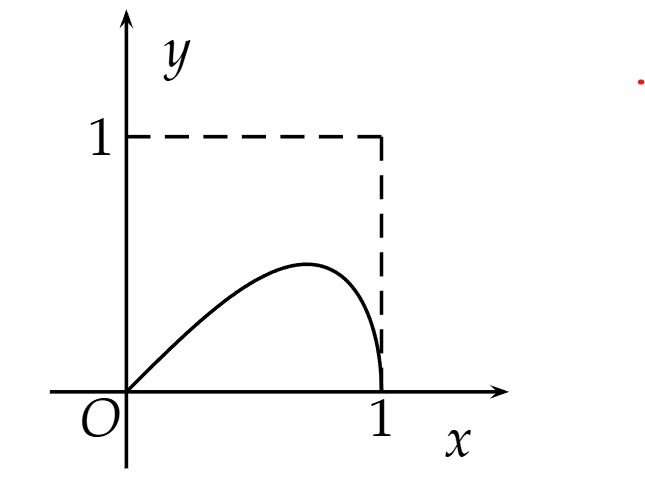

Áp dụng công thức (2.13) ta có:

$S(D) = \int_{0}^{1} \sqrt{x^2 - x^4} \ dx = \frac{1}{3} \ \Rightarrow \ S = \frac{4}{3}$.

#### Trường hợp biên của hình phẳng cho trong hệ toạ độ cực (tính diện tích của miền có dạng hình quạt):

Nếu $S$ giới hạn bởi:  

$$\begin{cases} \varphi = \alpha \\ \varphi = \beta \\ r = r(\varphi) \\ r(\varphi) \in C[\alpha, \beta] \end{cases}$$

thì  

$$S = \frac{1}{2} \int_{\alpha}^{\beta} r^2(\varphi) \ d\varphi \tag{2.16}$$

#### Bài tập 2.2

Tính diện tích hình phẳng giới hạn bởi đường hình tim $r^2 = a^2 \cos 2\varphi$.

**Gợi ý**:

  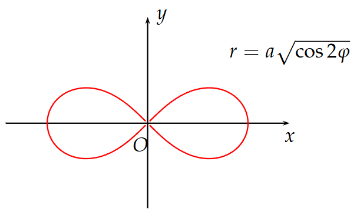

Khảo sát và vẽ đồ thị của đường cong trong toạ độ cực và nhận xét tính đối xứng của hình vẽ ta có:

$$S = 4S(D) = 4 \cdot \frac{1}{2} \int_{0}^{\frac{\pi}{4}} r^{2}(\varphi) \ d\varphi = a^{2}.$$

### 4.2 Tính độ dài đường cong phẳng

#### Trường hợp 1 
Đường cong $AB$ cho bởi phương trình $y = f(x)$

$$AB \begin{cases} y = f(x) \\ a \le x \le b \\ f \in C^{1}[a,b] \end{cases}$$

thì

$$s = \int_{a}^{b} \sqrt{1 + [f'(x)]^2} \tag{2.17}$$

#### Trường hợp 2 
Đường cong $AB$ cho bởi phương trình tham số

$$AB \begin{cases} x = x(t) \\ y = y(t) \\ \alpha \le t \le \beta \\ x(t), y(t) \in C^{1}[\alpha, \beta] \\ x'^{2}(t) + y'^{2}(t) > 0, \quad \forall t \in [\alpha, \beta] \end{cases}$$

thì:

$$s = \int_{\alpha}^{\beta} \sqrt{[x'(t)]^2 + [y'(t)]^2} \, dt \tag{2.18}$$

#### Trường hợp 3
Đường cong $AB$ cho bởi phương trình trong tọa độ cực

$$AB \begin{cases} r = r(\varphi) \\ \alpha \le \varphi \le \beta \\ r(\varphi) \in C^{1}[\alpha, \beta] \end{cases}$$

thì

$$s = \int_{\alpha}^{\beta} \sqrt{r^2(\varphi) + [r'(\varphi)]^2} \, d\varphi \tag{2.19}$$

#### Bài tập 2.1

Tính độ dài đường cong

a) $y = \ln \frac{e^x + 1}{e^x - 1}$ khi $x$ biến thiên từ $1$ đến $2$.

Ta có:

$$1 + y'^{2}(x) = 1 + \left( \frac{e^{x}}{e^{x} + 1} - \frac{e^{x}}{e^{x} - 1} \right)^{2} = \left( \frac{e^{2x} + 1}{e^{2x} - 1} \right)^{2}$$

Áp dụng công thức (2.17):

$$s = \int_{1}^{2} \frac{e^{2x} + 1}{e^{2x} - 1} \, dx \stackrel{t = e^{2x}}{=} \int_{e^{2}}^{e^{4}} \frac{t+1}{2t(t-1)} \, dt = \ln \frac{e^{2} + 1}{e^{2}}$$

b) $\begin{cases} x = a\left(\cos t + \ln \tan \frac{t}{2}\right) \\ y = a \sin t \end{cases}$ khi $t$ biến thiên từ $\frac{\pi}{3}$ đến $\frac{\pi}{2}$.

Áp dụng công thức (2.18):

$$x'^{2}(t) + y'^{2}(t) = a^{2} \cdot \frac{\cos^{2} t}{\sin^{2} t}$$

$$s = a \int_{\pi/3}^{\pi/2} \sqrt{\frac{\cos^{2} t}{\sin^{2} t}} \, dt = a \ln \sqrt{\frac{2}{\sqrt{3}}}$$

### 4.3 Tính thể tích vật thể

**Trường hợp:** Vật thể được giới hạn bởi một mặt cong và hai mặt phẳng $x = a$, $x = b$.  

Giả thiết biết rằng diện tích thiết diện khi cắt bởi mặt phẳng $x = x_0$ là $S(x_0)$, và $S(x)$ khả tích trên $[a, b]$. Khi đó:

$$V = \int_{a}^{b} S(x) \, dx \tag{2.20}$$

#### Bài tập 2.1

Tính thể tích phần chung của hai hình trụ $x^2 + y^2 = a^2$ và $y^2 + z^2 = a^2 \ (a > 0)$.

Do tính đối xứng:

$$V = 8V', \quad V' = V \cap \{x \ge 0, y \ge 0, z \ge 0\}$$

Một điểm $M(x, 0, 0) \in Ox$, qua $M$ dựng thiết diện vuông góc với $Ox$ được hình vuông cạnh $\sqrt{a^2 - x^2}$, nên:

$$S(x) = a^2 - x^2$$

Áp dụng (2.20):

$$V = 8 \int_{0}^{a} (a^2 - x^2) \, dx = \frac{16}{3} a^3$$

#### Bài tập 2.2

Tìm thể tích vật thể giới hạn bởi $z = 4 - y^2$, các mặt phẳng tọa độ và mặt phẳng $x = a$.

$$V = \int_{0}^{a} S(x) \, dx$$

mà:

$$S(x) = \int_{0}^{2} (4 - y^{2}) \, dy = \frac{16}{3}$$

Do đó:

$$V = \frac{16}{3} a$$

**Tính thể tích vật thể tròn xoay**

- **Quay quanh trục $Ox$:**

$$\begin{cases} a \leq x \leq b \\ y = f(x), \quad f \in C[a,b] \end{cases} \quad \Rightarrow \quad V = \pi \int_{a}^{b} f^{2}(x) \, dx \tag{2.21}$$

- **Quay quanh trục $Oy$:**

$$\begin{cases} c \leq y \leq d \\ x = \varphi(y), \quad \varphi \in C[c,d] \end{cases} \quad \Rightarrow \quad V = \pi \int_{c}^{d} \varphi^{2}(y) \, dy \tag{2.22}$$

#### Bài tập 2.3

Tính thể tích khối tròn xoay tạo bởi miền giới hạn  

$y = 2x - x^2$, $y = 0$.

a) Quanh trục $Ox$:

$$V = \pi \int_{0}^{2} (2x - x^2) \, dx$$

b) Quanh trục $Oy$:

$$V = \pi \int_{0}^{1} \left(1 + \sqrt{1 - y}\right)^2 \, dy - \pi \int_{0}^{1} \left(1 - \sqrt{1 - y}\right)^2 \, dy$$

### 4.4 Tính diện tích mặt tròn xoay

Cho hình thang cong giới hạn bởi:

$$\begin{cases} a \leq x \leq b \\ y = 0 \\ y = f(x) \qquad & \text{với } f \in C^1[a, b] \end{cases}$$

Quay hình thang cong $y = f(x)$ quanh trục $Ox$ thì ta được một vật thể tròn xoay.  
Khi đó diện tích xung quanh của vật thể được tính theo công thức:

$$S = 2\pi \int_{a}^{b} |f(x)| \sqrt{1 + f'^2(x)} \ dx$$

Tương tự, nếu quay hình thang cong:

$$\begin{cases} c \leq y \leq d \\ x = 0 \\ x = \varphi(y) \end{cases}$$

với $\varphi \in C^1[c, d]$ quanh trục $Oy$ thì:

$$S = 2\pi \int_{c}^{d} |\varphi(y)| \sqrt{1 + \varphi'^{2}(y)} \ dy$$

#### Bài tập 2.1

Tính diện tích mặt tròn xoay tạo nên khi quay các đường sau:

a) $y = \tan x,\ 0 < x \leq \frac{\pi}{4}$ quanh trục $Ox$.  

b) $\frac{x^2}{a^2} + \frac{y^2}{b^2} = 1$ quanh trục $Oy$ ($a > b$).  

c) $9y^2 = x(3-x)^2,\ 0 \le x \le 3$ quanh trục $Ox$.

a) Áp dụng công thức (2.23) ta có:

$$S = 2\pi \int_{0}^{\frac{\pi}{4}} \tan x \ \sqrt{1 + (1 + \tan^2 x)} \ dx$$

Đặt $t = \tan x$, $dt = (1 + t^2) dx$:

$$S = 2\pi \int_{0}^{1} t \ \sqrt{1 + (1 + t^2)^2} \ \frac{dt}{1 + t^2}$$

Đặt $s = 1 + t^2$, $ds = 2t \ dt$:

$$S = \pi \int_{1}^{2} \frac{\sqrt{1 + s^2}}{s} \ ds$$

Đặt $u = \sqrt{1 + s^2}$, tính toán tiếp:

$$S = \pi \left\{ \sqrt{5} - \sqrt{2} + \frac{1}{2} \left[ \ln \frac{\sqrt{5} - 1}{\sqrt{2} - 1} - \ln \frac{\sqrt{5} + 1}{\sqrt{2} + 1} \right] \right\}$$

b) Nhận xét tính đối xứng của miền và áp dụng công thức (2.24):

$$S = 4\pi \frac{a}{b} \int_{0}^{b} \sqrt{b^{4} + (a^{2} - b^{2})y^{2}} \ dy$$

Đặt $\beta = \frac{b^{4}}{a^{2} - b^{2}}$, ta có:

$$S = 4\pi \frac{a}{b} \sqrt{a^{2} - b^{2}} \int_{0}^{b} \sqrt{y^{2} + \beta} \ dy$$

Sử dụng công thức tích phân:

$$\int \sqrt{y^2 + \beta} \ dy = \frac{1}{2} \left[ y\sqrt{y^2 + \beta} + \beta \ln \left| y + \sqrt{y^2 + \beta} \right| \right]$$

Thay cận $0 \to b$ là ra kết quả.

c) Từ $9y^2 = x(3-x)^2$:

$$18yy' = 3(3-x)(1-x) \quad \Rightarrow \quad y' = \frac{(3-x)(1-x)}{6y}$$

Do đó:

$$y'^2 = \frac{(1-x)^2}{4x}$$

Áp dụng công thức (2.23):

$$S = 2\pi \int_{0}^{3} \frac{\sqrt{x}(3-x)}{3} \cdot \sqrt{1 + \frac{(1-x)^2}{4x}} \ dx$$

Biến đổi tích phân, ta thu được:

$$S = 3\pi$$

#### Nghịch lý sừng Gabriel

Cho vật thể tròn xoay tạo bởi khi xoay miền giới hạn bởi:

$$\begin{cases} x \geq 1 \\ y = 0 \\ y = \frac{1}{x} \\ \end{cases} \quad \text{quanh trục } Ox$$

  

Thể tích:

$$V = \pi \int_{1}^{+\infty} \left( \frac{1}{x} \right)^2 dx = \pi$$

Diện tích mặt:

$$S = 2\pi \int_{1}^{+\infty} \frac{1}{x} \sqrt{1 + \left( -\frac{1}{x^2} \right)^2} \ dx \ge 2\pi \int_{1}^{+\infty} \frac{1}{x} \ dx = +\infty$$

Kết luận: Vật thể này có diện tích mặt **vô hạn**, nhưng thể tích **hữu hạn** bằng $\pi$.

- Nếu muốn sơn toàn bộ bề mặt, cần **vô hạn sơn**.
- Nhưng để đổ đầy bên trong, chỉ cần **$\pi$ đơn vị thể tích sơn**.

# CHƯƠNG 3: HÀM SỐ NHIỀU BIẾN SỐ

## §1. GIỚI HẠN CỦA HÀM SỐ NHIỀU BIẾN SỐ

### 1.1 Giới hạn của hàm số nhiều biến số

Ta nói rằng dãy điểm $\{M_n(x_n, y_n)\}$ dần tới điểm $M_0(x_0, y_0)$ trong $\mathbb{R}^2$ và viết $M_n \to M_0$ khi $n \to +\infty$ nếu $\lim_{n \to +\infty} d(M_n, M_0) = 0$ hay $\lim_{n \to +\infty} x_n = x_0$, $\lim_{n \to +\infty} y_n = y_0$.

#### Định nghĩa 3.33

Cho hàm số $z = f(M) = f(x, y)$ xác định trong một lân cận $V$ nào đó của điểm $M_0(x_0, y_0)$, có thể trừ tại điểm $M_0$. Ta nói rằng hàm số $f(x, y)$ có giới hạn là $L$ khi $M$ dần đến $M_0$ nếu

$$\forall \epsilon > 0, \exists \delta > 0: \text{nếu } d(M, M_0) < \delta \text{ thì } |f(M) - L| < \epsilon.$$

Một cách tương đương, với mọi dãy điểm $M_n(x_n, y_n)$ thuộc lân cận $V$ dần đến $M_0$, ta đều có

$$\lim_{n \to +\infty} f(x_n, y_n) = L.$$

Khi đó ta viết

$$\lim_{(x, y) \to (x_0, y_0)} f(x, y) = L \text{ hoặc } \lim_{M \to M_0} f(M) = L.$$

- Khái niệm giới hạn vô hạn cũng được định nghĩa tương tự như đối với hàm số một biến số.

- Các định lý về giới hạn của tổng, hiệu, tích, thương đối với hàm số một biến số cũng đúng cho hàm số nhiều biến số và được chứng minh tương tự.

#### Nhận xét

- Theo định nghĩa trên, muốn chứng minh sự tồn tại của giới hạn của hàm số nhiều biến số là việc không dễ vì phải chỉ ra $\lim_{n \to +\infty} f(x_n, y_n) = L$ với mọi dãy số $\{x_n \to x_0\}$, $\{y_n \to y_0\}$. Trong thực hành, muốn tìm giới hạn của hàm số nhiều biến số, phương pháp chứng minh chủ yếu là đánh giá hàm số, dùng nguyên lý giới hạn kẹp để đưa về giới hạn của hàm số một biến số.

- Với chiều ngược lại, muốn chứng minh sự không tồn tại giới hạn của hàm số nhiều biến số, ta chỉ cần chỉ ra tồn tại hai dãy $\{x_n \to x_0, y_n \to y_0\}$ và $\{x'_n \to x_0, y'_n \to y_0\}$ sao cho

$$\lim_{n \to +\infty} f(x_n, y_n) \neq \lim_{n \to +\infty} f(x'_n, y'_n)$$

hoặc chỉ ra tồn tại hai quá trình $(x, y) \to (x_0, y_0)$ khác nhau mà $f(x, y)$ tiến tới hai giới hạn khác nhau.

### 1.2 Tính liên tục của hàm số nhiều biến số

- Giả sử hàm số $f(M)$ xác định trong miền $D$, $M_0$ là một điểm thuộc $D$. Ta nói rằng hàm số $f(M)$ liên tục tại điểm $M_0$ nếu

$$\lim_{M \to M_0} f(M) = f(M_0).$$

Nếu miền $D$ đóng và $M_0$ là điểm biên của $D$ thì $\lim_{M \to M_0} f(M)$ được hiểu là giới hạn của $f(M)$ khi $M$ dần tới $M_0$ ở bên trong của $D$.

- Hàm số $f(M)$ được gọi là liên tục trong miền $D$ nếu nó liên tục tại mọi điểm thuộc $D$.

- Hàm số nhiều biến số liên tục cũng có những tính chất như hàm số một biến số liên tục. Chẳng hạn, nếu hàm số nhiều biến số liên tục trong một miền đóng, bị chặn thì nó liên tục đều, bị chặn trong miền ấy, đạt giá trị lớn nhất và giá trị nhỏ nhất trong miền đó.

## §2. ĐẠO HÀM VÀ VI PHẦN

### 2.1 Đạo hàm riêng

- Cho hàm số $f(x, y)$ xác định trong một miền $D$, điểm $M_0(x_0, y_0) \in D$. Nếu cho $y = y_0$, hàm số một biến số $x \mapsto f(x, y_0)$ có đạo hàm tại điểm $x = x_0$ thì đạo hàm đó gọi là đạo hàm riêng của $f$ theo biến $x$ tại $M_0$ và được ký hiệu là $\frac{\partial f}{\partial x}$ hoặc $\frac{\partial}{\partial x} f(x, y)$.

$$\frac{\partial f}{\partial x} = \lim_{\Delta x \to 0} \frac{f(x_0 + \Delta x, y_0) - f(x_0, y_0)}{\Delta x}$$

- Cho hàm số $f(x, y)$ xác định trong một miền $D$, điểm $M_0(x_0, y_0) \in D$. Nếu cho $x = x_0$, hàm số một biến số $y \mapsto f(x_0, y)$ có đạo hàm tại điểm $y = y_0$ thì đạo hàm đó gọi là đạo hàm riêng của $f$ theo biến $y$ tại $M_0$ và được ký hiệu là $\frac{\partial f}{\partial y}$ hoặc $\frac{\partial}{\partial y} f(x, y)$.

$$\frac{\partial f}{\partial y} = \lim_{\Delta y \to 0} \frac{f(x_0, y_0 + \Delta y) - f(x_0, y_0)}{\Delta y}$$

#### Chú ý

Các đạo hàm riêng của các hàm số $n$ biến số (với $n \ge 3)$ được định nghĩa tương tự. Khi cần tính đạo hàm riêng của hàm số theo biến số nào, xem như hàm số chỉ phụ thuộc vào biến đó, còn các biến còn lại là các hằng số và áp dụng các quy tắc tính đạo hàm như hàm số một biến số.

### 2.2 Vi phân toàn phần

- Cho hàm số $z = f(x, y)$ xác định trong miền $D$. Lấy các điểm $M_0(x_0, y_0) \in D$, $M(x_0 + \Delta x, y_0 + \Delta y) \in D$. Biểu thức $\Delta f = f(x_0 + \Delta x, y_0 + \Delta y) - f(x_0, y_0)$ được gọi là số gia toàn phần của $f$ tại $M_0$. Nếu có thể biểu diễn số gia toàn phần dưới dạng

$$\Delta f = A \Delta x + B \Delta y + \alpha \Delta x + \beta \Delta y$$

trong đó $A$, $B$ là các hằng số chỉ phụ thuộc vào $x_0$, $y_0$ còn $\alpha$, $\beta \to 0$ khi $M \to M_0$, thì ta nói hàm số $z$ khả vi tại $M_0$, còn biểu thức $A \Delta x + B \Delta y$ được gọi là vi phân toàn phần của $z = f(x, y)$ tại $M_0$ và được ký hiệu là $dz$.

Hàm số $z = f(x, y)$ được gọi là khả vi trên miền $D$ nếu nó khả vi tại mọi điểm của miền ấy.

- Đối với hàm số một biến số, sự tồn tại đạo hàm tại điểm $x_0$ tương đương với sự khả vi của nó tại $x_0$. Đối với hàm số nhiều biến số, sự tồn tại của các đạo hàm riêng tại $M_0(x_0, y_0)$ chưa đủ để nó khả vi tại $M_0$ (*xem bài tập 3.4*). Định lý sau đây cho ta điều kiện đủ để hàm số $z = f(x, y)$ khả vi tại $M_0$.

#### Định lý 3.50

Nếu hàm số $f(x, y)$ có các đạo hàm riêng trong lân cận của $M_0$ và nếu các đạo hàm riêng đó liên tục tại $M_0$ thì $f(x, y)$ khả vi tại $M_0$ và

$$dz = \frac{\partial f}{\partial x} \Delta x + \frac{\partial f}{\partial y} \Delta y$$

### 2.3 Đạo hàm của hàm số hợp

Cho $D$ là một tập hợp trong $\mathbb{R}^2$ và các hàm số

$$D \stackrel{\varphi}{\to} \varphi(D) \subset \mathbb{R}^2 \stackrel{f}{\to} \mathbb{R}$$

và $F = f \circ \varphi$ là hàm số hợp của hai hàm số $f$ và $\varphi$:

$$F(x, y) = f(u(x, y), v(x, y))$$

#### Định lý 3.51

Nếu $f$ có các đạo hàm riêng $\frac{\partial f}{\partial u}$, $\frac{\partial f}{\partial v}$ liên tục trong $\varphi(D)$ và nếu $u$, $v$ có các đạo hàm riêng $\frac{\partial u}{\partial x}$, $\frac{\partial u}{\partial y}$, $\frac{\partial v}{\partial x}$, $\frac{\partial v}{\partial y}$ trong $D$ thì tồn tại các đạo hàm riêng $\frac{\partial F}{\partial x}$, $\frac{\partial F}{\partial y}$ và

$$\begin{cases} \frac{\partial F}{\partial x} = \frac{\partial f}{\partial u} \frac{\partial u}{\partial x} + \frac{\partial f}{\partial v} \frac{\partial v}{\partial x} \\ \frac{\partial F}{\partial y} = \frac{\partial f}{\partial u} \frac{\partial u}{\partial y} + \frac{\partial f}{\partial v} \frac{\partial v}{\partial y} \end{cases}$$

Công thức trên có thể được viết dưới dạng ma trận như sau:

$$\begin{pmatrix} \frac{\partial F}{\partial x} & \frac{\partial F}{\partial y} \end{pmatrix} = \begin{pmatrix} \frac{\partial f}{\partial u} & \frac{\partial f}{\partial v} \end{pmatrix} \begin{pmatrix} \frac{\partial u}{\partial x} & \frac{\partial u}{\partial y} \\ \frac{\partial v}{\partial x} & \frac{\partial v}{\partial y} \end{pmatrix}$$

trong đó ma trận

$$\begin{pmatrix} \frac{\partial u}{\partial x} & \frac{\partial u}{\partial y} \\ \frac{\partial v}{\partial x} & \frac{\partial v}{\partial y} \end{pmatrix}$$

được gọi là ma trận Jacobi của ánh xạ $\varphi$, định thức của ma trận ấy được gọi là định thức Jacobi của $u$, $v$ với $x$, $y$ và được ký hiệu là $\frac{D(u, v)}{D(x, y)}$.

### 2.4 Đạo hàm và vi phân cấp cao

- Cho hàm số hai biến số $z = f(x, y)$. Các đạo hàm riêng $\frac{\partial f}{\partial x}$, $\frac{\partial f}{\partial y}$ là những đạo hàm riêng cấp một. Các đạo hàm riêng của các đạo hàm riêng cấp một, nếu tồn tại, được gọi là những đạo hàm riêng cấp hai. Có bốn đạo hàm riêng cấp hai được ký hiệu như sau:

$$\begin{cases} \frac{\partial}{\partial x} \left( \frac{\partial f}{\partial x} \right) = \frac{\partial^2 f}{\partial x^2} \\ \frac{\partial}{\partial y} \left( \frac{\partial f}{\partial x} \right) = \frac{\partial^2 f}{\partial y \partial x} \\ \frac{\partial}{\partial x} \left( \frac{\partial f}{\partial y} \right) = \frac{\partial^2 f}{\partial x \partial y} \\ \frac{\partial}{\partial y} \left( \frac{\partial f}{\partial y} \right) = \frac{\partial^2 f}{\partial y^2} \end{cases}$$

Các đạo hàm riêng của các đạo hàm riêng cấp hai, nếu tồn tại, được gọi là các đạo hàm riêng cấp ba, v.v.

#### Định lý 3.52 (Schwarz)

Nếu trong một lân cận $U$ nào đó của điểm $M_0(x_0, y_0)$, hàm số $z = f(x, y)$ có các đạo hàm riêng $\frac{\partial^2 f}{\partial y \partial x}$, $\frac{\partial^2 f}{\partial x \partial y}$ và nếu các đạo hàm riêng ấy liên tục tại $M_0$ thì $\frac{\partial^2 f}{\partial y \partial x} = \frac{\partial^2 f}{\partial x \partial y}$ tại $M_0$.

- Xét hàm số $z = f(x, y)$, vi phân toàn phần của nó $dz = \frac{\partial f}{\partial x} dx + \frac{\partial f}{\partial y} dy$, nếu tồn tại, cũng là một hàm số với hai biến số $x$, $y$. Vi phân toàn phần của $dz$, nếu tồn tại, được gọi là vi phân toàn phần cấp hai của $z$ và được ký hiệu là $d^2z$. Ta có công thức:

$$d^2z = \frac{\partial^2 f}{\partial x^2} dx^2 + 2 \frac{\partial^威 \partial y \partial x} dx dy + \frac{\partial^2 f}{\partial y^2} dy^2$$

### 2.5 Đạo hàm theo hướng - Gradient

#### Định nghĩa 3.34

Cho $f(x, y, z)$ là một hàm số xác định trong một miền $D \subset \mathbb{R}^3$ và $\vec{l} = (l_1, l_2, l_3)$ là một vector đơn vị bất kỳ trong $\mathbb{R}^3$. Giới hạn, nếu có,

$$\lim_{t \to 0} \frac{f(M_0 + t \vec{l}) - f(M_0)}{t}$$

được gọi là đạo hàm của hàm số $f$ theo hướng $\vec{l}$ tại $M_0$ và được ký hiệu là $\frac{\partial f}{\partial \vec{l}}(M_0)$.

- Nếu $\vec{l}$ không phải là vector đơn vị thì giới hạn trên có thể được thay bằng

$$\lim_{t \to 0} \frac{f(x_0 + t \cos \alpha, y_0 + t \cos \beta, z_0 + t \cos \gamma) - f(x_0, y_0, z_0)}{t}$$

trong đó $\cos \alpha$, $\cos \beta$, $\cos \gamma$ là các cosin chỉ phương của $\vec{l}$.

- Nếu $\vec{l}$ trùng với vector đơn vị $\vec{i}$ của trục $Ox$ thì đạo hàm theo hướng $\vec{l}$ chính là đạo hàm riêng theo biến $x$ của hàm $f$:

$$\frac{\partial f}{\partial \vec{l}}(M_0) = \frac{\partial f}{\partial x}(M_0)$$

Vậy đạo hàm riêng theo biến $x$ chính là đạo hàm theo hướng của trục $Ox$. Tương tự, $\frac{\partial f}{\partial y}$, $\frac{\partial f}{\partial z}$ là các đạo hàm của $f$ theo hướng của trục $Oy$ và $Oz$. Định lý sau đây cho ta mối liên hệ giữa đạo hàm theo hướng và đạo hàm riêng:

#### Định lý 3.53

Nếu hàm số $f(x, y, z)$ khả vi tại điểm $M_0(x_0, y_0, z_0)$ thì tại $M_0$ có đạo hàm theo mọi hướng $\vec{l}$ và ta có:

$$\frac{\partial f}{\partial \vec{l}}(M_0) = \frac{\partial f}{\partial x}(M_0) \cos \alpha + \frac{\partial f}{\partial y}(M_0) \cos \beta + \frac{\partial f}{\partial z}(M_0) \cos \gamma$$

trong đó $(\cos \alpha, \cos \beta, \cos \gamma)$ là cosin chỉ phương của $\vec{l}$.

Cho $f(x, y, z)$ là hàm số có các đạo hàm riêng tại $M_0(x_0, y_0, z_0)$. Người ta gọi gradient của $f$ tại $M_0$ là vector:

$$\vec{\text{grad}} f(M_0) = \left( \frac{\partial f}{\partial x}(M_0), \frac{\partial f}{\partial y}(M_0), \frac{\partial f}{\partial z}(M_0) \right)$$

#### Định lý 3.54

Nếu $\vec{l}$ là một vector đơn vị và hàm số $f(x, y, z)$ khả vi tại $M_0$, thì tại đó ta có:

$$\frac{\partial f}{\partial \vec{l}}(M_0) = \vec{\text{grad}} f \cdot \vec{l}$$

#### Chú ý

$\frac{\partial f}{\partial \vec{l}}(M_0)$ thể hiện tốc độ biến thiên của hàm số $f$ tại $M_0$ theo hướng $\vec{l}$. Từ công thức $\frac{\partial f}{\partial \vec{l}}(M_0) = \vec{\text{grad}} f \cdot \vec{l} = |\vec{\text{grad}} f| |\vec{l}| \cos(\vec{\text{grad}} f, \vec{l})$, ta có $\left| \frac{\partial f}{\partial \vec{l}}(M_0) \right|$ đạt giá trị lớn nhất bằng $|\vec{\text{grad}} f| |\vec{l}|$ nếu $\vec{l}$ có cùng phương với $\vec{\text{grad}} f$. Cụ thể:

- Theo hướng $\vec{l}$, hàm số $f$ tăng nhanh nhất tại $M_0$ nếu $\vec{l}$ có cùng phương, cùng hướng với $\vec{\text{grad}} f$.
- Theo hướng $\vec{l}$, hàm số $f$ giảm nhanh nhất tại $M_0$ nếu $\vec{l}$ có cùng phương, ngược hướng với $\vec{\text{grad}} f$.

### 2.6 Hàm ẩn - Đạo hàm của hàm số ẩn

- Cho phương trình $F(x, y) = 0$, trong đó $F: U \to \mathbb{R}$ là một hàm số có các đạo hàm riêng liên tục trên tập mở $U \subset \mathbb{R}^2$ và $\frac{\partial F}{\partial y}(x_0, y_0) \neq 0$. Khi đó, phương trình $F(x, y) = 0$ xác định một hàm số ẩn $y = y(x)$ trong một lân cận nào đó của $x_0$ và có đạo hàm:

$$y'(x) = -\frac{\frac{\partial F}{\partial x}}{\frac{\partial F}{\partial y}}$$

- Tương tự, cho phương trình $F(x, y, z) = 0$, trong đó $F: U \to \mathbb{R}$ là một hàm số có các đạo hàm riêng liên tục trên tập mở $U \subset \mathbb{R}^3$ và $\frac{\partial F}{\partial z}(x_0, y_0, z_0) \neq 0$. Khi đó, phương trình $F(x, y, z) = 0$ xác định một hàm số ẩn $z = z(x, y)$ trong một lân cận nào đó của $(x_0, y_0)$ và có các đạo hàm:

$$\frac{\partial z}{\partial x} = -\frac{\frac{\partial F}{\partial x}}{\frac{\partial F}{\partial z}}, \quad \frac{\partial z}{\partial y} = -\frac{\frac{\partial F}{\partial y}}{\frac{\partial F}{\partial z}}$$

## §3. CỰC TRỊ CỦA HÀM SỐ NHIỀU BIẾN SỐ

### 3.1 Cực trị tự do

#### Định nghĩa 3.35

Cho hàm số $z = f(x, y)$ xác định trong một miền $D$ và $M_0(x_0, y_0) \in D$. Ta nói rằng hàm số $f(x, y)$ đạt cực trị tại $M_0$ nếu với mọi điểm $M$ trong lân cận nào đó của $M_0$ nhưng khác $M_0$, hiệu số $f(M) - f(M_0)$ có dấu không đổi.

- Nếu $f(M) - f(M_0) > 0$ trong một lân cận nào đó của $M_0$, thì $M_0$ được gọi là điểm cực tiểu của hàm số $f$ tại $M_0$.
- Nếu $f(M) - f(M_0) < 0$ trong một lân cận nào đó của $M_0$, thì $M_0$ được gọi là điểm cực đại của hàm số $f$ tại $M_0$.

Trong phần tiếp theo, chúng ta sử dụng các ký hiệu sau:

$$p = \frac{\partial f}{\partial x}(M), \quad q = \frac{\partial f}{\partial y}(M), \quad r = \frac{\partial^2 f}{\partial x^2}(M), \quad s = \frac{\partial^2 f}{\partial x \partial y}(M), \quad t = \frac{\partial^2 f}{\partial y^2}(M)$$

#### Định lý 3.55

Nếu hàm số $f(x, y)$ đạt cực trị tại $M$ và tại đó các đạo hàm riêng $p = \frac{\partial f}{\partial x}(M)$, $q = \frac{\partial f}{\partial y}(M)$ tồn tại, thì các đạo hàm riêng ấy bằng không.

#### Định lý 3.56

Giả sử hàm số $z = f(x, y)$ có các đạo hàm riêng đến cấp hai liên tục trong một lân cận nào đó của $M_0(x_0, y_0)$. Giả sử tại $M_0$ ta có $p = q = 0$, khi đó:

1. Nếu $s^2 - rt < 0$, thì $f(x, y)$ đạt cực trị tại $M_0$. Đó là cực tiểu nếu $r > 0$, là cực đại nếu $r < 0$.
2. Nếu $s^2 - rt > 0$, thì $f(x, y)$ không đạt cực trị tại $M_0$.

#### Chú ý

Nếu $s^2 - rt = 0$, thì chưa kết luận được điều gì về điểm $M_0$, nó có thể là cực trị hoặc không. Trong trường hợp này, ta sử dụng định nghĩa để xét xem $M_0$ có phải là cực trị hay không bằng cách xét hiệu $f(M) - f(M_0)$. Nếu nó có dấu xác định trong một lân cận nào đó của $M_0$, thì $M_0$ là cực trị; ngược lại thì không.

#### Ví dụ:

Tìm cực trị của các hàm số sau:

a) $z = x^2 + xy + y^2 + x - y + 1$

b) $z = x + y - x e^y$

c) $z = 2x^4 + y^4 - x^2 - 2y^2$

d) $z = x^2 + y^2 - e^{-(x^2 + y^2)}$

**Chứng minh**

a) Xét hệ phương trình:

$$\begin{cases} p = \frac{\partial z}{\partial x} = 2x + y + 1 = 0 \\ q = \frac{\partial z}{\partial y} = x + 2y - 1 = 0 \end{cases} \Leftrightarrow \begin{cases} x = -1 \\ y = 1 \end{cases}$$

Vậy ta có $M(-1, 1)$ là điểm tới hạn duy nhất.

Ta có: $A = \frac{\partial^2 z}{\partial x^2}(M) = 2$, $B = \frac{\partial^2 z}{\partial x \partial y}(M) = 1$, $C = \frac{\partial^2 z}{\partial y^2}(M) = 2$. Do đó, $B^2 - AC = 1 - 4 = -3 < 0$. Vì $A > 0$, hàm số đạt cực tiểu tại $M$.

b) Xét hệ phương trình:

$$\begin{cases} p = \frac{\partial z}{\partial x} = 1 - e^y = 0 \\ q = \frac{\partial z}{\partial y} = 1 - x e^y = 0 \end{cases} \Leftrightarrow \begin{cases} x = 1 \\ y = 0 \end{cases}$$

Vậy hàm số có điểm tới hạn duy nhất $M(1, 0)$. Ta có:

$$A = \frac{\partial^2 z}{\partial x^2}(M) = 0, B = \frac{\partial^2 z}{\partial x \partial y}(M) = -1, C = \frac{\partial^2 z}{\partial y^2}(M) = -1.$$

Do đó, $B^2 - AC = 1 > 0$. Hàm số không có cực trị tại $M$.

c) Xét hệ phương trình:

$$\begin{cases} \frac{\partial z}{\partial x} = 8x^3 - 2x = 0 \\ \frac{\partial z}{\partial y} = 4y^3 - 4y = 0 \end{cases} \Leftrightarrow \begin{cases} x(4x^2 - 1) = 0 \\ y(y^2 - 1) = 0 \end{cases} \Leftrightarrow \begin{cases} x = 0 \text{ hoặc } x = \frac{1}{2} \text{ hoặc } x = -\frac{1}{2} \\ y = 0 \text{ hoặc } y = 1 \text{ hoặc } y = -1 \end{cases}$$

Vậy các điểm tới hạn của hàm số là:

$$M_1(0, 0), \quad M_2(0, 1), \quad M_3(0, -1), \quad M_4\left(\frac{1}{2}, 0\right), \quad M_5\left(\frac{1}{2}, 1\right), \\ \quad M_6\left (\frac{1}{2}, -1\right), \quad M_7\left(-\frac{1}{2}, 0\right), \quad M_8\left(-\frac{1}{2}, 1\right), \quad M_9\left(-\frac{1}{2}, -1\right)$$

Ta có: $\frac{\partial^2 z}{\partial x^2} = 24x^2 - 2$, $\frac{\partial^2 z}{\partial x \partial y} = 0$, $\frac{\partial^2 z}{\partial y^2} = 12y^2 - 4$.

- Tại $M_1(0, 0)$: $A = -2$, $B = 0$, $C = -4$, $B^2 - AC = -8 < 0$. Vì $A < 0$, $M_1$ là điểm cực đại với $z = 0$.

- Tại $M_2(0, 1)$, $M_3(0, -1)$: $A = -2$, $B = 0$, $C = 8$, $B^2 - AC = 16 > 0$. Do đó, $M_2$, $M_3$ không phải là điểm cực trị.

- Tại $M_4\left(\frac{1}{2}, 0\right)$, $M_7\left(-\frac{1}{2}, 0\right)$: $A = 4$, $B = 0$, $C = -4$, $B^2 - AC = 16 > 0$. Do đó, $M_4$, $M_7$ không phải là điểm cực trị.

- Tại $M_5\left(\frac{1}{2}, 1\right)$, $M_6\left(\frac{1}{2}, -1\right)$, $M_8\left(-\frac{1}{2}, 1\right)$, $M_9\left(-\frac{1}{2}, -1\right)$: $A = 4$, $B = 0$, $C = 8$, $B^2 - AC = -32 < 0$. Vì $A > 0$, $M_5$, $M_6$, $M_8$, $M_9$ là các điểm cực tiểu với giá trị $z = -\frac{9}{8}$.

d) Xét hệ phương trình:

$$\begin{cases} \frac{\partial z}{\partial x} = 2x + 2x e^{-(x^2 + y^2)} = 0 \\ \frac{\partial z}{\partial y} = 2y + 2y e^{-(x^2 + y^2)} = 0 \end{cases} \Leftrightarrow \begin{cases} x = 0 \\ y = 0 \end{cases}$$

Vậy $M(0, 0)$ là điểm tới hạn duy nhất. Xét:

$$\frac{\partial^2 z}{\partial x^2} = 2 + 2 e^{-(x^2 + y^2)} - 4x^2 e^{-(x^2 + y^2)}$$

$$\frac{\partial^2 z}{\partial x \partial y} = -4xy e^{-(x^2 + y^2)}$$

$$\frac{\partial^2 z}{\partial y^2} = 2 + 2 e^{-(x^2 + y^2)} - 4y^2 e^{-(x^2 + y^2)}$$

Tại $M(0, 0)$: $A = 4$, $B = 0$, $C = 4$, $B^2 - AC = -16 < 0$. Vì $A > 0$, hàm số đạt cực tiểu tại $M$.

### 3.2 Cực trị có điều kiện

Cho tập mở $U \subset \mathbb{R}^2$ và hàm số $f: U \to \mathbb{R}$. Xét bài toán tìm cực trị của hàm số $f(x, y)$ khi các biến $x$, $y$ thỏa mãn phương trình:

$\varphi(x, y) = 0$

Ta nói rằng tại điểm $(x_0, y_0) \in U$ thỏa mãn điều kiện $\varphi(x_0, y_0) = 0$, hàm $f$ có cực đại tương đối (tương ứng cực tiểu tương đối) nếu tồn tại một lân cận $V \subset U$ sao cho $f(x, y) \leq f(x_0, y_0)$ (tương ứng $f(x, y) \geq f(x_0, y_0)$) với mọi $(x, y) \in V$ thỏa mãn điều kiện $\varphi(x, y) = 0$. Điểm $(x_0, y_0)$ được gọi là cực trị có điều kiện của hàm số $f(x, y)$, còn điều kiện $\varphi(x, y) = 0$ được gọi là điều kiện ràng buộc của bài toán. Nếu trong một lân cận của $(x_0, y_0)$, từ hệ thức $\varphi(x, y) = 0$, ta xác định được hàm số $y = y(x)$, thì rõ ràng $(x_0, y(x_0))$ là cực trị địa phương của hàm số một biến số $g(x) = f(x, y(x))$. Như vậy, trong trường hợp này, bài toán tìm cực trị ràng buộc được đưa về bài toán tìm cực trị tự do của hàm số một biến số. Ta xét bài toán sau đây:

Tìm cực trị có điều kiện:

a) $z = \frac{1}{x} + \frac{1}{y}$ với điều kiện $\frac{1}{x^2} + \frac{1}{y^2} = \frac{1}{a^2}$

b) $z = xy$ với điều kiện $x + y = 1$

**Chứng minh**

a) Đặt $x = \frac{a}{\sin t}$, $y = \frac{a}{\cos t}$, ta có $\frac{1}{x^2} + \frac{1}{y^2} = \frac{1}{a^2}$. Khi đó:

$$z = \frac{1}{x} + \frac{1}{y} = \frac{\sin t}{a} + \frac{\cos t}{a}$$

Ta có:

$$\frac{dz}{dt} = \frac{\cos t}{a} - \frac{\sin t}{a} = \frac{\sqrt{2}}{a} \sin \left( \frac{\pi}{4} - t \right) = 0 \Leftrightarrow t = \frac{\pi}{4} \text{ hoặc } t = \frac{5\pi}{4}$$

- Với $t = \frac{\pi}{4}$: $x = \sqrt{2}a$, $y = \sqrt{2}a$, hàm số đạt cực tiểu và $z_{\text{min}} = \frac{\sqrt{2}}{a}$.
- Với $t = \frac{5\pi}{4}$: $x = -\sqrt{2}a$, $y = -\sqrt{2}a$, hàm số đạt cực đại và $z_{\text{max}} = -\frac{\sqrt{2}}{a}$.

b) Từ điều kiện $x + y = 1$, ta suy ra $y = 1 - x$. Vậy $z = xy = x(1 - x)$. Dễ dàng nhận thấy hàm số $z = x(1 - x)$ đạt cực đại tại $x = \frac{1}{2}$ và $z_{\text{max}} = \frac{1}{4}$.

Tuy nhiên, không phải lúc nào cũng tìm được hàm số $y = y(x)$ từ điều kiện $\varphi(x, y) = 0$. Do đó, bài toán tìm cực trị có điều kiện không phải lúc nào cũng đưa được về bài toán tìm cực trị tự do. Trong trường hợp đó, ta dùng phương pháp Lagrange được trình bày dưới đây.

#### Định lý 3.57 (Điều kiện cần để hàm số đạt cực trị có điều kiện)

Giả sử $U$ là một tập mở trong $\mathbb{R}^2$, $f: U \to \mathbb{R}$ và $(x_0, y_0)$ là điểm cực trị của hàm $f$ với điều kiện $\varphi(x, y) = 0$. Hơn nữa, giả thiết rằng:

a. Các hàm $f(x, y)$, $\varphi(x, y)$ có các đạo hàm riêng liên tục trong một lân cận của $(x_0, y_0)$.

b. $\frac{\partial \varphi}{\partial y}(x_0, y_0) \neq 0$.

Khi đó, tồn tại một số $\lambda_0$ cùng với $x_0$, $y_0$ tạo thành nghiệm của hệ phương trình sau (đối với $\lambda$, $x$, $y$):

$$\begin{cases} \frac{\partial \phi}{\partial x} = 0 \\ \frac{\partial \phi}{\partial y} = 0 \\ \frac{\partial \phi}{\partial \lambda} = 0 \end{cases} \Leftrightarrow \begin{cases} \frac{\partial f}{\partial x}(x, y) + \lambda \frac{\partial \varphi}{\partial x}(x, y) = 0 \\ \frac{\partial f}{\partial y}(x, y) + \lambda \frac{\partial \varphi}{\partial y}(x, y) = 0 \\ \varphi(x, y) = 0 \end{cases}$$

với $\phi(x, y, \lambda) = f(x, y) + \lambda \varphi(x, y)$, được gọi là hàm Lagrange.

Định lý trên chính là điều kiện cần của cực trị có ràng buộc. Giải hệ phương trình trên, ta thu được các điểm tới hạn. Giả sử $M(x_0, y_0)$ là một điểm tới hạn ứng với giá trị $\lambda_0$. Ta có:

$$\phi(x, y, \lambda_0) - \phi(x_0, y_0, \lambda_0) = f(x, y) + \lambda_0 \varphi(x, y) - f(x_0, y_0) - \lambda_0 \varphi(x_0, y_0) = f(x, y) - f(x_0, y_0)$$

Nên nếu $M$ là một điểm cực trị của hàm số $\phi(x, y, \lambda_0)$, thì $M$ cũng là điểm cực trị của hàm số $f(x, y)$ với điều kiện $\varphi(x, y) = 0$. Muốn xét xem $M$ có phải là điểm cực trị của hàm số $\phi(x, y, \lambda_0)$ hay không, ta có thể sử dụng Định lý 3.56 hoặc tính vi phân cấp hai:

$$d^2 \phi(x_0, y_0, \lambda_0) = \frac{\partial^2 \phi}{\partial x^2}(x_0, y_0, \lambda_0) dx^2 + 2 \frac{\partial^2 \phi}{\partial x \partial y}(x_0, y_0, \lambda_0) dx dy + \frac{\partial^2 \phi}{\partial y^2}(x_0, y_0, \lambda_0) dy^2$$

trong đó $dx$ và $dy$ liên hệ với nhau bởi hệ thức:

$$\frac{\partial \varphi}{\partial x}(x_0, y_0) dx + \frac{\partial \varphi}{\partial y}(x_0, y_0) dy = 0$$

hay:

$$dy = -\frac{\frac{\partial \varphi}{\partial x}(x_0, y_0)}{\frac{\partial \varphi}{\partial y}(x_0, y_0)} dx$$

Thay biểu thức này của $dy$ vào $d^2 \phi(x_0, y_0, \lambda_0)$, ta có:

$$d^2 \phi(x_0, y_0, \lambda_0) = G(x_0, y_0, \lambda_0) dx^2$$

Từ đó suy ra:

- Nếu $G(x_0, y_0, \lambda_0) > 0$, thì $(x_0, y_0)$ là điểm cực tiểu có điều kiện.
- Nếu $G(x_0, y_0, \lambda_0) < 0$, thì $(x_0, y_0)$ là điểm cực đại có điều kiện.

#### Ví dụ:

Tìm cực trị có điều kiện của hàm số $z = \frac{1}{x} + \frac{1}{y}$ với điều kiện $\frac{1}{x^2} + \frac{1}{y^2} = \frac{1}{a^2}$.

**Chứng minh**

Xét hàm số Lagrange $\phi(x, y, \lambda) = \frac{1}{x} + \frac{1}{y} + \lambda \left( \frac{1}{x^2} + \frac{1}{y^2} - \frac{1}{a^2} \right)$. Từ hệ phương trình:

$$\begin{cases} \frac{\partial \phi}{\partial x} = -\frac{1}{x^2} - \frac{2\lambda}{x^3} = 0 \\ \frac{\partial \phi}{\partial y} = -\frac{1}{y^2} - \frac{2\lambda}{y^3} = 0 \\ \frac{\partial \phi}{\partial \lambda} = \frac{1}{x^2} + \frac{1}{y^2} - \frac{1}{a^2} = 0 \end{cases}$$

ta thu được các điểm tới hạn là $M_1(a\sqrt{2}, a\sqrt{2})$ ứng với $\lambda_1 = -\frac{a}{\sqrt{2}}$, $M_2(-a\sqrt{2}, -a\sqrt{2})$ ứng với $\lambda_2 = \frac{a}{\sqrt{2}}$. Ta có:

$$d^2 \phi = \frac{\partial^2 \phi}{\partial x^2} dx^2 + 2 \frac{\partial^2 \phi}{\partial x \partial y} dx dy + \frac{\partial^2 \phi}{\partial y^2} dy^2 = \left( \frac{2}{x^3} + \frac{6\lambda}{x^4} \right) dx^2 + \left( \frac{2}{y^3} + \frac{6\lambda}{y^4} \right) dy^2$$

Từ điều kiện $\frac{1}{x^2} + \frac{1}{y^2} - \frac{1}{a^2} = 0$, suy ra $-\frac{2}{x^3} dx - \frac{2}{y^3} dy = 0$, nên $dy = -\frac{y^3}{x^3} dx$. Thay vào biểu thức $d^2 \phi$, ta có:

- Tại $M_1(a\sqrt{2}, a\sqrt{2})$: $d^2 \phi(M_1) = -\frac{\sqrt{2}}{4a^3} (dx^2 + dy^2) = -\frac{2\sqrt{2}}{4a^3} dx^2 < 0$, nên $M_1$ là điểm cực đại có điều kiện.
- Tại $M_2(-a\sqrt{2}, -a\sqrt{2})$: $d^2 \phi(M_2) = \frac{\sqrt{2}}{4a^3} (dx^2 + dy^2) = \frac{2\sqrt{2}}{4a^3} dx^2 > 0$, nên $M_2$ là điểm cực tiểu có điều kiện.

### 3.3 Giá trị lớn nhất - Giá trị nhỏ nhất

Giả sử $f: A \to \mathbb{R}$ là hàm số liên tục trên tập hợp đóng $A \subset \mathbb{R}^2$. Khi đó, $f$ đạt giá trị lớn nhất và giá trị nhỏ nhất trên $A$. Để tìm các giá trị này, ta cần tìm giá trị của hàm số tại tất cả các điểm tới hạn trong miền $A$, cũng như tại các điểm mà đạo hàm riêng không tồn tại, sau đó so sánh các giá trị này với các giá trị của hàm trên biên $\partial A$ của $A$ (tức là xét cực trị có điều kiện).